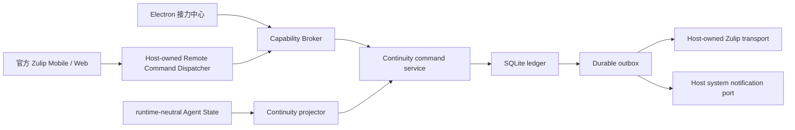

# SciForge Continuity 多客户端接力 v1 架构冻结

> 状态：PR 0 设计冻结候选；代码侧完成后仍须维护者确认。
>
> 产品目标：让用户通过 SciForge Electron、官方 Zulip 手机端和 Zulip Web 方便地访问和接力同一个任务。
>
> Zulip REST、字段、feature/config、typed error、fixture 与官方链接的唯一事实源是 [Zulip 官方能力核验](./continuity-zulip-official-capability-audit.zh-CN.md)。验收见 [AC-01～AC-17](./continuity-multi-client-v1-acceptance.zh-CN.md)，分阶段实现见 [PR 0～PR 8 执行计划](./continuity-multi-client-v1-execution-plan.zh-CN.md)。

## 1. 产品边界

v1 是“桌面权威、Zulip 跨端投影”的单人多端接力能力，不是新的聊天系统。

- Electron 主进程是唯一 AgentRuntime 执行端和 Continuity 写入端；本地 SQLite 是唯一 Continuity 事实源。
- Zulip 只承担官方手机/Web 消息入口、可重建任务状态投影和条件通知，不执行 Agent，也不保存权威任务状态。
- Electron 离线时，Zulip 仍显示最后一次已投影状态；期间命令不实时执行。Electron 重启后先 history catch-up，证明连续后才处理一次。
- v1 不建设独立 Bridge、常驻云端 Agent、自研移动 App/Web、多人 RBAC、团队协作中心或跨设备已读同步。
- v1 不包含“减少用户与 Agent 的交互次数”。
- 只允许用户明确 link 的任务创建外部投影；默认不向 Zulip 导出本地任务。

## 2. 权威性与 canonical path



每项能力只有一条生产路径：

- 桌面动作和 `/sf` 写命令都进入同一个 Capability Broker、同一个 Continuity command service、同一个 ledger/receipt/outbox。
- Agent 状态只从 runtime-neutral Agent State contract 进入同一个 reducer；snapshot、backfill、replay 和 live 不复制状态机。
- Zulip 入站 live/history 进入同一个 durable ingest；出站 card、回执、提醒只来自同一个 outbox worker。
- Host 只提供通用 SDK contract、可信 actor 推导、provider transport、系统通知和导航端口；不按 `sciforge.continuity`、task 类型或 Zulip topic 写特例。
- 不新增 Continuity 专用 IPC、第二个 Zulip client/poll loop、即时回复旁路、第二个 provider registry 或兼容转发层。

## 3. Domain package 所有权

功能所有权单元固定为 `@sciforge/domain-continuity`，module ID 为 `sciforge.continuity`。同一 package/version 拥有 backend、可选 renderer、schema、migration、repository、projector、command service、decision/event/receipt/outbox、`/sf` 语义、card renderer 和测试，并使用显式 `./main`、`./renderer` 入口及标准 manifest/generated composition。

Domain package 只依赖 `@sciforge/domain-sdk` 与其他 package 的公共合同，禁止导入 Host 私有 `src/main`、`src/renderer`、`src/shared`、`@shared` 或 `@renderer`。Host 不维护 central feature map、domain-ID switch 或 Continuity 专属配置分支。

通用端口分工：

| 端口 | Host 责任 | Domain 责任 |
|---|---|---|
| Agent State | runtime-neutral snapshot/replay/live/control、typed gap/unsupported | task projection、业务状态与 command saga |
| Remote Messaging | 凭据、唯一 transport、preflight、live/history/send/edit、typed outcome | binding、watermark、parser、receipt、outbox、card |
| Capability Broker | audience/scope/OCC/idempotency/audit/resource handle | capability definition、唯一 handler、SQLite revision |
| System Notification / Workbench | 原生通知、通用 command activation、打开 runtime/thread | notification intent、task 选择和接力中心 UI |

## 4. 事实、投影与持久性

SQLite 逻辑表至少包含 `tasks`、`events`、`decisions`、`bindings`、`runtime_source_receipts`、`command_receipts`、`outbox`、`workspace_bindings`、`continuity_meta` 和 provider-target ingress 状态。启用 WAL、foreign keys、显式 migration 和 fail-closed future/corrupt database 处理。

`ContinuityTask` 与 `(runtimeId, threadId)` 一一对应。任务语义版本从 `v1` 开始；Git checkpoint/commit 是独立成果引用。Zulip card、索引和 reminder 都是可删除、可重建的投影，不能反向覆盖 SQLite。

一次纯本地业务修改在一个事务中完成 receipt/digest/revision/state 校验、event append、task projection、decision、outbox intent 和 receipt settle。任何网络或 Runtime 调用都在事务外，以持久 saga 收敛。

Event queue 只提供临时实时唤醒，不是持久历史。queue ID/event ID 不得作为 provider-target durable history watermark；SQLite event ledger 和 Zulip message history 各自承担其持久语义。

## 5. 二十八项冻结决策

以下默认值是 v1 合同，不留给实现 Agent选择。

| ID | 冻结决策 |
|---|---|
| D-01 | Task 身份：首次观察 `(runtimeId, threadId)` 时生成随机 UUID；数据库唯一约束保证一一对应。数据库丢失不承诺恢复旧 taskId。 |
| D-02 | Workspace 身份：本机生成 opaque UUID；规范化 workspace root 仅存本机私有映射，远程 payload 永不包含 root。 |
| D-03 | 顶层状态优先级：`failed/cancelled/completed > blocked > waiting_approval > waiting_input > running > queued`；attention 保留全部同时待办。 |
| D-04 | semantic revision：新 task 为 `v1`；status、Goal、Todo 语义、attention、Decision、versionRefs、active binding 改变时 `+1`；投递、重试、卡片布局、诊断、已读不递增。 |
| D-05 | Event cursor：SQLite 使用全局单调 sequence，API 编码 `ledgerInstanceId + sequence` 并保持 opaque；v1 不裁剪 event。snapshot 在同一读事务返回 projection 与 head；events 只返回 `cursor > after`。 |
| D-06 | Runtime 去重：持久唯一键 `(runtimeId, threadId, sourceSequence)`；snapshot/backfill/replay/live 共用 reducer。 |
| D-07 | Payload digest：strict schema 解析后递归稳定键排序，digest 覆盖 action/schema/task/actor principal/binding generation/expected revision/规范化 payload，算法 SHA-256。 |
| D-08 | OCC 命令：Zulip 写命令显式含 `--at vN`，`status/tasks` 不需要；Broker option 是唯一 expectedRevision，payload 不存第二份。approval/input 必含 attention 短 ID；服务端不得偷读最新 revision 后补齐。 |
| D-09 | Delivery retry：使用 `deliveryId + expectedDeliveryRevision`，不改变 task semantic revision。 |
| D-10 | Runtime saga：Tx A 完成授权、receipt/digest/revision/state 校验并直接写 `delivering`；事务外调用 Runtime；Tx B 写 `delivered/rejected/uncertain`。重启发现 `delivering` 一律转 `uncertain` 并 fail closed。 |
| D-11 | Outbox 所有权：PR 3 建表/repository/state/claim；PR 5 接 desktop notification；PR 6 接 provider/history；PR 7 接 uncertain reconciliation。外部调用均在事务外。 |
| D-12 | Binding：Host channel 配置拥有 allowed principal，Continuity binding 只引用 target/channel。用户选择已配置目标后 link，每 task 新 topic；重复 link 幂等，unlink 停用并保留审计/历史 card。 |
| D-13 | Actor：Host 从 immutable sender ID 推导。provider 无法可信区分 Mobile/Web，`sourceClient` 固定使用通用 `zulip`，不猜客户端。 |
| D-14 | Card 乱序：intent 带 `resultingRevision`；claim 时合并/跳过旧 revision，旧重试不得覆盖新 card。 |
| D-15 | Uncertain marker：每个投递有稳定 opaque delivery marker；raw Markdown 往返格式必须由获授权 private test channel 的真实 probe 冻结。probe 完成前 reconciliation 保持 blocker，不猜隐藏格式。 |
| D-16 | 脱敏：字段 allowlist、长度上限、结构化错误优先；正则 secret redaction 只是最后防线，禁止先序列化全部再脱敏。 |
| D-17 | 通知偏好：v1 固定高信号默认规则，不新增没有消费者的 notification preference API；偏好管理延后。 |
| D-18 | 消息分片：task card 与命令回执保持有界单消息；不发送完整模型输出，不建设通用分片协议。 |
| D-19 | Zulip 可见性：目标必须为 bot 已订阅、`invite_only=true`、`is_web_public=false` 且允许 named topic 的 channel；metadata 缺失或 unknown 时 fail closed。private channel 其他成员仍可读，桌面须提示。 |
| D-20 | 桌面通知：保留 `notifications.turnComplete` 可见偏好；旧 completion dedupe 在 PR 5 原子迁移到唯一 notification worker 并删除旧生产路径；attention/blocked/failed/completed 每 event 一个稳定 ID。at-most-once；重启发现 notification `delivering` 转不可重试 `uncertain`，接受极小漏发窗口以避免重复。 |
| D-21 | Task resource：`kind=continuity.task`、`resourceId=taskId`、audience `ui/system`；授权后签发短期进程内 handle。所有 task 写成功返回 SQLite 已提交新 semantic revision；handle/token 不持久化、不进入 Zulip。 |
| D-22 | Agent 端口：Agent State 只替换状态读取；保留唯一 `agentExecution` 高层执行端口、ordered awaited before/after-turn hook 和 typed artifact port。hook 结果有界；Host 按序发布 `version_ref_available`；artifact 禁止 `unknown[]`。 |
| D-23 | Renderer 实时性：唯一合同为 `snapshot + opaque cursor + events(after)`；overlay 可见/有订阅者时 1 秒有界 polling，gap 后重取 snapshot，隐藏/卸载停止。ready handshake 后才 drain 有界 navigation buffer；reload/window replacement 重置 generation。 |
| D-24 | Remote 启动门：activation 只注册 handler，不等待 provider；唯一 lifecycle/recovery union 驱动 `provider-ready → history catch-up → handler-ready → drain live → outbox`。catch-up 完成前 remote write fail closed，无轮询/即时回复旁路。 |
| D-25 | Delivery resource：独立 `kind=continuity.delivery` 与 delivery revision；授权后 `open-delivery` 签发短期 handle。retry/confirm/reconcile 不伪造 task revision，成功返回 SQLite 已提交 delivery revision。 |
| D-26 | Remote ingress watermark：属于 provider target/channel，不属于单 task binding。claimed receipt 或 ignored audit 与 target watermark 同事务提交。未授权 sender 在 task/binding/receipt 访问前静默 ignored，只用 opaque target/message order 推进并累计有界计数，不存 raw body/sender。 |
| D-27 | Zulip preflight：link 前和每次 provider-ready 按唯一官方能力核验读取 feature/config、bot subscription、visibility/topic policy、history permission/baseline、effective retention、长度、edit policy，并证明 history 分页完整。send/history/named topic/private subscription 不满足时禁止 link/write；edit 不可用时 replacement card。三类 gap 独立；证据不足 `history_gap_unknown`；任何 gap 均不推进 watermark。 |
| D-28 | Zulip 通知：card send/edit 只投影状态，不承诺 Push。高信号提醒必须独立消息并个人 mention authorized user；Push 取决于用户通知设置、设备权限和自托管 Mobile Push Notification Service，必须真机验证，API 200/消息可见均不是 Push 证据。 |

## 6. 命令、资源与授权

v1 命令固定为：

```text
/sf tasks
/sf status
/sf continue --at v7 <指令>
/sf decide --at v7 <决定> --reason <理由>
/sf approve --at v7 <attention短ID>
/sf reject --at v7 <attention短ID> <理由>
/sf input --at v7 <attention短ID> <回答>
```

Card/index 必须按当前状态生成可完整复制的命令；用户不拼 `vN` 或 attention ID。过期 revision 返回 `revision_conflict`、安全最新摘要和可复制的新命令，绝不自动改写后执行。

授权顺序固定：Host 先验证 configured target 与 immutable sender ID；未授权 sender 静默 ignored，并在任何 task/binding/receipt repository 访问之前结束业务处理。通过 Host 授权后才推导 actor、解析 binding、签发 resource handle、调用 Broker；handler 执行前再次校验 binding generation/授权，防撤权竞态。无权与 task 不存在同形、无 direct send、零 task 泄漏。

入站 command ID 由 provider principal、binding generation 和 immutable provider message ID 稳定派生；同 ID 同 payload 返回原结果，同 ID 改 payload 返回 `idempotency_conflict`。普通非 `/sf` 消息只有精确满足旧 RemoteChannel stream/topic 才是 `legacy-eligible`，不得被 history 重放为 Agent prompt。

## 7. 生命周期与恢复

启动顺序固定：

1. 打开 package-owned 数据目录并 migration。
2. 打开 ledger，把遗留 `delivering` 转 `uncertain`。
3. 建立 Agent State live buffer/subscription。
4. inventory/snapshot/backfill/replay 到 source watermark，按 source sequence drain buffer。
5. 加载 task/binding/provider watermark 和可安全恢复 outbox，尚不接收 remote command。
6. provider-ready 后关闭 remote write，建立 live gate，从 durable target watermark 做 raw Markdown history catch-up；完整算法见官方能力核验。PR 6 不核对 uncertain；PR 7 安装后才做 marker reconciliation。
7. history 连续性证明后启用 remote handler 并 drain 去重 live buffer。
8. 最后启动 provider outbox、桌面观察与 notification worker。

关闭时先停止新入站，再停止/等待 worker 到安全点，最后关闭数据库。数据库关闭后不得接收命令。

三类明确 gap 是 `history_gap_plan_limited`、`history_gap_retention`、`history_gap_subscription_boundary`；不能互换，也不能由 `found_oldest=true` 或 `history_limited=false` 排除其他原因。证据不足一律 `history_gap_unknown`，保存有界诊断、冻结 target 全部 binding 的 remote write、不猜原因、不推进 watermark。

## 8. Outbox 与投影替换

Provider delivery 状态为：

```text
pending → delivering → delivered
                     ↘ retry_scheduled
                     ↘ uncertain
                     ↘ failed
```

只有 provider 明确限流或 transport 可证明未发送才自动重试；timeout、连接重置、响应缺失和未知服务端结果进入 `uncertain`。PR 7 通过同一 history path 查稳定 marker：唯一匹配可收敛 delivered；多匹配 failed diagnostic；无匹配仍 uncertain。人工 confirm/retry 需要 delivery resource/revision、重复风险确认和追加审计 event。

Card edit 被禁止、超时或 not-found 时，创建唯一 replacement intent，并原子更新 canonical message ref。旧 card 只保留历史，不接受后续投影；并发 worker 必须由 ledger 保证只创建一张 replacement。

## 9. 安全与数据最小化

- 生产 realm 只允许 HTTPS；开发 HTTP 只允许严格 loopback。
- 凭据只由 Host secret store 管理，不进入 domain、Task/Event/Decision/Outbox、日志、诊断或 fixture。
- 远程 allowlist 仅含 taskId、状态、`vN`、有界 Goal/Todo、attention 短 ID、Decision 摘要、version ref、更新时间、同步健康和可复制命令。
- 禁止发送 workspace 路径、secret、session、reasoning、assistant delta、完整模型输出或原始工具日志。
- actor、command ID、task/delivery revision、时间与结果形成追加审计链；Decision 只能 supersede，不能覆盖删除。

## 10. v1 退出边界

v1 完成必须满足 [AC-01～AC-17](./continuity-multi-client-v1-acceptance.zh-CN.md)。任何未完成的真实 Zulip marker/edit/push probe 必须明确为 blocker；缺少 Android 或 iOS 真机时，该平台只能标“尚未验收/不在本次支持声明”。未来若需要桌面关闭时继续执行、多人共享或独立 Web/App，应作为 v2 重新设计，不得在 v1 中预埋双轨。
