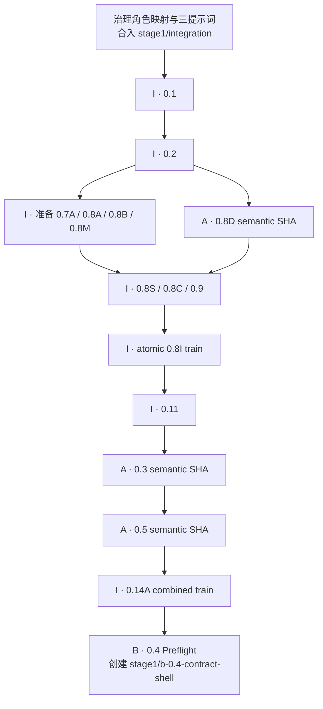

# SciForge Stage1：B 开始开发前的 A/I 实施与合入顺序

> 目标：把仓库从当前 Gate 0 规划基线推进到允许开发者 B 创建 `stage1/b-0.4-contract-shell` 并执行 Task `0.4` 的状态。
>
> 本文是执行顺序与 handoff runbook，不是第二份任务合同。Task 的完整行为、验收条件、`dependsOn` 和 evidence 要求以 active OpenSpec [`tasks.md`](../openspec/changes/demand-driven-workflow-evolution-stage1/tasks.md) 为准。

## 1. 固定角色与调度入口

Stage1 有两名人类负责人、三个相互隔离且不可混用的 Codex 执行身份：

| Owner role | 人类责任人 / Codex 执行身份 | 负责范围 | Coding Agent 提示词 |
|---|---|---|---|
| `[A]` | 开发者 A / 独立 `[A]` 身份 | Create Loop Catalog/runtime 领域语义；Task `0.8D` 是唯一明确的包外例外 | [`stage1-create-loop-coding-agent-task.zh-CN.md`](prompts/stage1-create-loop-coding-agent-task.zh-CN.md) |
| `[B]` | 开发者 B / 独立 `[B]` 身份 | Workflow Evolution 领域语义 | [`stage1-workflow-evolution-coding-agent-task.zh-CN.md`](prompts/stage1-workflow-evolution-coding-agent-task.zh-CN.md) |
| `[I]` | 开发者 B / 独立 `[I]` 身份 | Host/SDK/Broker/CI/generator/integration、root lock、generated outputs、cross-package harness 和 combined train | [`stage1-integration-coding-agent-task.zh-CN.md`](prompts/stage1-integration-coding-agent-task.zh-CN.md) |

开发者 B 是 `[B]` 与 `[I]` 的共同人类责任人，但两者必须作为两个独立 Codex 执行身份运行，不共享对话上下文、权限、authorship、分支、commit 或 evidence。一个 Coding Agent 对话、分支和 commit 只能有一个 Owner role：

```text
[A] → stage1/a-<task>-<topic>
[B] → stage1/b-<task>-<topic>
[I] → stage1/i-<task>-<topic>
train → stage1/i-train-<task>
```

每次只给 Coding Agent 一个且仅一个与提示词 Owner 匹配的 Task ID。完成一个 task 后结束该对话；相邻 task、combined train 或 Owner 切换必须另开对话并重新验证 integration base。

## 2. 总体顺序



`0.10/0.10R` 是从 `0.8I` 开始的并行 `[I]` 基础 lane。它们阻塞后续 `0.12/0.15` 和 P1/P2 production merge，但不是 Task `0.4` 的直接 `dependsOn`，因此没有画入 B `0.4` 的最短解锁链。

## 3. Step 0 — 合入治理文档与 Agent 调度修订

Owner：`[I]`

### 输入

- 已审定的责任与执行身份映射：开发者 A 管理独立 `[A]`，开发者 B 管理相互隔离的 `[B]` 与 `[I]`；
- active OpenSpec、执行指南和三份 Owner-specific Coding Agent 提示词。

### 必须完成

- 所有权威文件一致区分两名人类责任人和 `[A]`/`[B]`/`[I]` 三个独立 Codex 执行身份；
- `[B]` 与 `[I]` 明确要求独立对话、分支和 commits，共享人类责任人不传递权限或 authorship；
- `[I]` 对 `[B]` 产物的校验只是技术集成 evidence，不替代独立的人类审批；
- A/B/I 三份提示词分别只接受对应 Owner 的单一 Task ID；
- 不修改任何 Task ID、Owner 标签、`dependsOn`、checkbox 或领域合同；
- `git diff --check` 通过。

### 合入

治理修订必须先 review 并合入 `stage1/integration`。后续 A/I Coding Agent 的 integration base 必须包含该 immutable governance SHA；未提交或仅存在于聊天中的角色映射不能作为调度依据。

### 退出 evidence

```text
Governance semantic SHA:
Merged stage1/integration SHA:
Changed governance files:
Role-mapping audit result:
git diff --check result:
```

## 4. Step 1 — I 完成 Task `0.1`

Owner：`[I]`

提示词：

```text
完整读取 docs/prompts/stage1-integration-coding-agent-task.zh-CN.md，
不使用其他对话的记忆，按“任务模式”执行 Task 0.1。
先做只读 Preflight；只有 READY_TO_IMPLEMENT 才继续。
```

### 前置

- governance SHA 已合入 `stage1/integration`；
- 当前 worktree 无 authoritative dirty blocker；
- Agent 从最新 verified integration base 建 `stage1/i-0.1-<topic>`。

### 交付

- 受保护的 `stage1/integration`；
- mentor upstream fetch-only；
- 精确 Node 22 patch 与 npm 版本；
- baseline SHA、命令和 combined-train 流程记录。

### 合入规则

Task `0.1` 验证通过后合入 `stage1/integration`。外部 branch protection 无法验证或设置时必须 `BLOCKED`，不能用文档声明代替真实保护状态。

### 退出 evidence

```text
0.1 semantic/train SHA:
Merged stage1/integration SHA:
Branch-protection evidence:
Node/npm versions:
Commands and exact results:
```

## 5. Step 2 — I 完成 Task `0.2`

Owner：`[I]`

### 前置

- `0.1` immutable SHA 已合入并通过 ancestry 检查。

### 交付

- 普通 merge-PR CI；
- `npm ci` 和精确 toolchain assertion；
- lint、typecheck、test、build、generation drift；
- 禁止普通 PR 调用 upstream Release；
- blocking `npm run license:policy-check`；
- versioned allow/deny/notice rules 与 negative fixtures。

### 合入规则

使用独立 `stage1/i-0.2-<topic>`，验证通过后合入 `stage1/integration`。不得在同一 Agent 对话中继续执行 `0.7A` 或其他 foundation task。

### 退出 evidence

```text
0.1 dependency SHA:
0.2 semantic/train SHA:
Merged stage1/integration SHA:
CI and license negative-fixture results:
```

## 6. Step 3 — I 准备前四个 foundation producers

Owner：`[I]`

分别使用四个单任务对话和分支：

```text
0.7A
0.8A
0.8B
0.8M
```

### 调度规则

每次使用 I 提示词，并将 `<Task ID>` 替换成当前唯一任务：

```text
完整读取 docs/prompts/stage1-integration-coding-agent-task.zh-CN.md，
不使用其他对话的记忆，按“任务模式”执行 Task <Task ID>。
先验证 0.1/0.2 和当前 task 的全部 dependsOn；
只形成该 task 的 immutable producer，不单独 merge、activate 或 ship。
```

### 交付边界

| Task | 交付重点 | 禁止 |
|---|---|---|
| `0.7A` | Host canonical workspace identity、SDK `ComputeReservationV1` | domain-owned workspace copy或 payload override |
| `0.8A` | 唯一 confirmation-required Broker flow | old/generic/caller-confirmation parallel path |
| `0.8B` | `CapabilityReadinessReaderV1`、provider provenance 与 canonical readiness evidence | caller/payload 伪造 readiness 或 provenance |
| `0.8M` | strict Manifest V2、13-package metadata、unsigned inventory generator | 单独 merge、签名、领域行为迁移 |

### 退出 evidence

```text
0.7A producer SHA:
0.8A producer SHA:
0.8B producer SHA:
0.8M producer SHA:
Common integration base SHA:
Owned-path audits:
Focused command results:
```

## 7. Step 4 — A 完成 Task `0.8D`

Owner：`[A]`

提示词：

```text
完整读取 docs/prompts/stage1-create-loop-coding-agent-task.zh-CN.md，
不使用其他对话的记忆，按“任务模式”执行 Task 0.8D。
先验证 0.1/0.2 已合入；只有 READY_TO_IMPLEMENT 才继续。
```

### 前置

- `0.1`、`0.2` 已合入；
- 从相同的 foundation integration base 建 `stage1/a-0.8D-<topic>`。

### 交付

- 仅修复 `git-checkpoints.restore` 指定的成功 envelope；
- 保留 inner destructive result；
- outer Broker metadata 使用合同要求的 `changed:false`；
- same-live-process response-loss replay 至多一次真实 restore；
- restart 拒绝旧 authorization/result。

### 禁止

- Manifest V2、ACL、purpose、generated output 或 durable restore protocol 变更；
- 把 `0.8D` 混入 I mechanical commit；
- 单独 merge、activate 或 ship。

### 退出 evidence

```text
0.8D semantic SHA:
Integration base SHA:
Owned-path audit:
Source/packaged real-Broker results:
```

A 将 exact immutable `0.8D` SHA 交给 I；I 不得 squash-rewrite 或修补。

## 8. Step 5 — I 准备 `0.8S`、`0.8C`、`0.9`

Owner：`[I]`

分别使用三个单任务对话。

### 依赖顺序

```text
0.8S ← immutable 0.8M
0.8C ← 0.8A + 0.8M + exact A-owned 0.8D
0.9  ← 按 tasks.md 验证前置 producer 后执行
```

### 交付

- `0.8S`：purpose-aware keyring、release input、provenance、sequence、isolated signer evidence；
- `0.8C`：全仓 outbound edges、target ACL 和 purpose metadata migration；
- `0.9`：manifest-owner-bound invoker、唯一 `LiveChildRegistrarV1` 与受保护 child/lease lifetime。

三者只形成 immutable producers，不单独 merge、activate 或 ship。

### 退出 evidence

```text
0.8S producer SHA and signer evidence:
0.8C producer SHA:
0.9 producer SHA:
Verified dependency ancestry:
```

## 9. Step 6 — I 原子合入 Task `0.8I`

Owner：`[I]`

分支：`stage1/i-train-0.8I`

### 必须集成的 exact producers

```text
0.7A
0.8A
0.8B
0.8M
0.8S
0.8D
0.8C
0.9
```

### 固定过程

1. 验证八个 SHA 的 commit object、共同/预期 base、ancestry、owner 和 paths；
2. 原样集成八个 producers，尤其逐字节保持 `0.8D`；
3. 添加一个独立 mechanical commit，只包含 task 允许的 lock/generated/composition/signature outputs；
4. 运行 source/packaged、Broker、signing、provenance、generation second-run zero-diff 和 CI；
5. 开发者 A 与开发者 B 作为两名人类责任人 review combined diff；
6. 只有 combined `0.8I` train 合入 `stage1/integration`。

任何 producer 单独合入、semantic SHA 变化、签名 parent/sequence/provenance 不匹配或 generator 暴露语义错误，都必须停止并返回对应 owner。

### 退出 evidence

```text
Eight exact producer SHAs:
Mechanical commit SHA:
0.8I combined train SHA:
Merged stage1/integration SHA:
Signing/provenance evidence:
Source/packaged results:
Second-run zero-diff result:
Reviews:
```

## 10. Step 7 — I 完成 Task `0.11`

Owner：`[I]`

### 前置

- atomic `0.8I` 已合入。

### 交付

- generic Agent operation/profile API；
- 唯一 `RequestRebuildRecipeV1`；
- Host token-allocation tombstone；
- adapter acceptedness contract；
- operation principals、status/cancel/reconcile 与 bounded result-delivery contract；
- raw retention `NONE` 的 generic contract。

### 边界

- 不实现真实 provider；
- 不启用 B Builder/Verifier；
- 不注册 B production projection；
- 不把 `0.11P/0.11S/0.11A` readiness 当作本 task 已完成。

验证后将 `0.11` 合入 `stage1/integration`。

### 退出 evidence

```text
0.8I dependency SHA:
0.11 producer/train SHA:
Merged stage1/integration SHA:
Generic Agent contract tests:
```

## 11. Step 8 — A 完成 Task `0.3`

Owner：`[A]`

### 前置

- `0.8I + 0.11` 已合入；
- 从该 exact integration SHA 建 `stage1/a-0.3-<topic>`。

### 交付

- 唯一 `@sciforge/domain-create-loop/catalog-contract` source；
- public `./catalog-contract` export；
- strict V1 Catalog public contract、descriptors、ACL、purpose、receipts/errors；
- Create Loop package/module 按合同从 `1.0.0` 升到 `1.1.0`；
- nested tests/typecheck。

### 禁止

- Catalog storage/runtime；
- V1 compatibility 或 unsigned export；
- B、Host、generated、root lock 或 checkbox 修改；
- semantic branch 单独合入。

### 退出 evidence

```text
0.8I dependency SHA:
0.11 dependency SHA:
0.3 semantic SHA:
Public export/source digest:
Focused tests/typecheck:
Owned-path audit:
```

## 12. Step 9 — A 完成 Task `0.5`

Owner：`[A]`

### 前置

- exact `0.3` semantic SHA 已验证；
- 使用独立 `stage1/a-0.5-<topic>` 或 task 合同允许的精确 stacked branch。

### 交付

- canonical bytes/digests；
- Catalog policy、proposal normalization、binding topology；
- action/disposition authority、operation-owner namespace；
- pending/replay-reservation recovery matrix；
- opaque B evidence attestation fields、receipts/errors；
- provisioning、two-Candidate CAS、rollback 和 Agent-free Anchor fixtures。

### 合入规则

`0.3`、`0.5` 只交付 A-owned immutable semantic SHAs，不单独合入。A 将两个 exact SHAs、focused evidence 和 public-contract digests 一并交给 I。

### 退出 evidence

```text
0.3 semantic SHA:
0.5 semantic SHA:
Stacked ancestry:
Fixture/digest evidence:
Focused commands:
```

## 13. Step 10 — I 原子合入 Task `0.14A`

Owner：`[I]`

分支：`stage1/i-train-0.14A`

### 前置

- `0.1`、`0.2`、`0.8I`、`0.11` 已合入；
- A 的 exact `0.3 + 0.5` semantic SHAs 有效且 ancestry 正确；
- 两个 A commits 只修改 A-owned paths；
- Create Loop package/module version 与 `./catalog-contract` export 符合合同。

### 固定过程

1. 原样集成 A 的 `0.3 + 0.5` semantic commits；
2. 添加一个独立 I-owned mechanical commit；
3. mechanical diff 只包含 public-export binding、capability docs、lock、composition、signed inventory output 和 task 要求的 evidence；
4. 运行 source/packaged export、digest、generation second-run zero-diff 和 CI；
5. A、B review combined diff；
6. combined `0.14A` train 合入 `stage1/integration`。

I 不得在 train 上修改 A contract、fixtures、version 或领域语义。

### 退出 evidence

```text
0.3 semantic SHA:
0.5 semantic SHA:
Mechanical commit SHA:
0.14A combined train SHA:
Merged stage1/integration SHA:
Create Loop ./catalog-contract export/digest:
Source/packaged results:
Second-run zero-diff result:
Reviews:
```

## 14. Step 11 — B 的 `0.4` 开工 Preflight

Owner：`[B]`

到此才允许启动 B 提示词：

```text
完整读取 docs/prompts/stage1-workflow-evolution-coding-agent-task.zh-CN.md，
不使用其他对话的记忆，按“任务模式”执行 Task 0.4。
先做只读 Preflight；只有 READY_TO_IMPLEMENT 才继续编码。
```

### 必须验证

```text
Governance SHA:
0.1 SHA:
0.2 SHA:
0.8M producer SHA:
0.8I combined train SHA:
0.11 SHA:
0.3 semantic SHA:
0.5 semantic SHA:
0.14A combined train SHA:
Current stage1/integration SHA:
Create Loop ./catalog-contract export/digest:
```

每个 SHA 必须通过：

```bash
git cat-file -e <sha>^{commit}
git merge-base --is-ancestor <sha> stage1/integration
```

同时满足：

- 当前 worktree 无 authoritative dirty blocker；
- `./catalog-contract` 在当前 integration 真实存在并可由 source/package export 解析；
- Task `0.4` 的 `0.8M + 0.14A` direct dependencies 已合入；
- 当前 branch 从 exact verified integration base 建立；
- B branch 不携带 I-owned mechanical/generated/lock diff。

全部通过后才创建或使用：

```text
stage1/b-0.4-contract-shell
```

## 15. B `0.4` 开工不代表什么

允许 author `0.4` 只表示 B 可以建立零贡献 contract shell，不表示：

- `0.4` 或 `0.6` 已完成或已合入；
- B pure P2 development gate 已关闭；
- P1/P2 production 可以 merge；
- `0.10/0.10R`、`0.12`、`0.14B`、`0.14I` 或 `0.15` 已完成；
- real Agent provider、Publisher、Candidate 或 Promotion 路径已激活。

后续开发门仍要求 `0.14A + 0.4 + 0.6`；production merge 仍等待 `0.15`、`2.1/2.2` 和 `tasks.md` 的完整依赖。

## 16. 阻塞与升级

遇到以下情况停止当前 task：

- 依赖/evidence SHA 缺失、无法验证或不在预期 ancestry；
- authoritative OpenSpec、contract、fixture、release input 或 matrix 有未提交修改；
- dirty worktree 与 task Owned paths 重叠；
- A/B semantic commit 含 I-owned shared/generated 修改；
- I train 需要修改 A/B 领域语义才能通过；
- generator、matrix、package constants 或 OpenSpec 不一致；
- signing parent、sequence、provenance、key usage 或 signer evidence 不完整；
- source/packaged real path 不存在，只能靠 fake/direct handler 声称通过。

报告 blocker 时明确：

```text
Blocking task:
Blocking fact:
Missing/invalid SHA:
Conflicting source:
Affected owner: [A] | [B] | [I]
Smallest required correction:
Files changed before stop:
```

不得 stash/reset/覆盖其他人的修改，不得在 stop 前顺手提交部分实现。
