# Design: Demand-driven Workflow evolution Stage1

## Context

The current Create Loop domain is the canonical node-workflow implementation and already owns its editor, runtime, state, capabilities, scheduling, webhook handling, and lifecycle. It must remain the only Workflow execution implementation.

Its present state model is not a release model:

- `WorkflowV1` contains graph definition, enablement, timestamps, status, messages, and run history.
- The persisted settings revision advances for ordinary saves and execution-history updates.
- `runWorkflow(workflowId)` resolves mutable state at call time.
- pending human approvals are held in an in-memory map and are rejected on runtime shutdown.

The Stage1 product contract requires immutable releases, a stable Anchor that remains available while a Candidate is repaired, durable waiting states, independent verification, explicit promotion, stale-Candidate rejection, replay, and rollback. These concerns have two different owners and therefore require two packages.

## Goals

- Make the exact Workflow definition used for verification, promotion, replay, and stable service cryptographically identifiable.
- Keep stable Anchor service available while Candidate work fails or restarts.
- Make all long-lived requirement, document, gate, receipt, and promotion state recoverable after process or application restart.
- Keep Create Loop responsible for Workflow artifacts and execution mechanics.
- Keep Workflow Evolution responsible for requirement lifecycle, routing, evidence, and promotion decisions.
- Let the two packages evolve independently through a small public capability seam.
- Preserve one Capability Broker path and one Create Loop execution engine.

## Non-Goals

- Autonomous modification of SciForge source code.
- Real B_teacher discovery or distillation.
- Model training or reinforcement learning.
- Multiple controller-active Candidate leases in one workspace or population search. Create Loop may retain multiple immutable Candidate artifacts for audit and stale-write defense.
- Unattended production promotion.
- A general solution for every scientific domain.
- Broad or unrelated Domain SDK, Agent Host, Capability Broker, or domain-package refactoring beyond the explicitly enumerated Gate 0 prerequisites below.
- A compatibility alias or dual runtime for the mutable Workflow production path.

The generic platform prerequisites are one fail-closed foundation, not Workflow Evolution exceptions:

1. `WorkspaceIdentityV1` and the SDK-owned `ComputeReservationV1` establish the one opaque workspace key and one acyclic compute-reservation wire contract before either domain database or provider exists.
2. Strict `DomainPackageManifestV2`, the complete thirteen-package `sciforge.official` release cohort, the closed existing-keyring Ed25519 distribution envelope, deterministic protected release signing, complete accepted member-security state, canonical target-neutral export descriptors, Capability Broker V2, the repository-wide existing-system-caller migration, exact owner ACLs, the closed `DOMAIN_MANIFEST | HOST_CORE` provider-provenance union, Host-derived readiness evidence, and the A-owned Git Checkpoints baseline repair must activate together. The exact eight semantic producers 0.7A, 0.8A, 0.8B, 0.8M, 0.8S, 0.8D, 0.8C, and 0.9 are non-mergeable separately and land only as atomic train 0.8I plus one mechanical generated/lock commit.
3. Capability children and Workspace Publisher children share one Host-private `LiveChildRegistrarV1` with exactly `OPEN -> CLOSING_SUCCESS -> SETTLED` and `OPEN -> REVOKING -> SETTLED`. Protected database commits use `enterCommit()` and audit publication uses `enterPublish()` as typed facades over its one lease-entry transition. Leaving `OPEN` atomically closes registration and unentered-lease admission; every registered attempt must be contained and every acquired lease released before settlement.
4. Manifest dependency topology and owner-bound invokers must come from one verified signed Manifest V2 graph. `module.version` is exactly the package version; dependencies use closed numeric release-SemVer intervals plus exact required export descriptors; definition or descriptor digest drift requires a higher package/module SemVer; every outbound system call is a package-owned signed edge cross-checked against the target ACL/purpose. One durable package lifecycle uses inert attempt-scoped activation staging, one durable revisioned authoritative `PublishedPackageSnapshotV1`, one graph lifecycle commit lock, signed generic resource declarations, and Host-owned durable resource claims. Main and renderer consumers privately stage, atomically apply/withdraw, and reconnect from that projection. The Host alone owns `PackageLifecycleRecoveryContractV1`; restricted train 0.10R rewires the audited existing registrations, children, subscriptions, timers, workers, `HOST_NETWORK_LISTENER` resources, durable leases, and process-local disposers to its fixed primitives without changing domain behavior. No package recovery program, central domain switch, inferred caller graph, string dependency, numeric-priority lifecycle fallback, or parallel teardown path exists.
5. Agent Execution must expose an operation-principal-bound operation contract: each domain owner persists the complete durable non-raw request-rebuild recipe/frozen dependencies while the Host stores only recipe ID/digest and immutable request/profile/reservation bindings. The two other durable records remain distinct: a Host token-allocation tombstone and the production adapter's pre-send acceptedness tombstone. Independent pre-P4 task 0.11P qualifies one exact real provider scope, legal/technical zero-retention evidence, signed-statement or official-challenge proof, live revocation, no-retry transport, credential-vault plan, and supported platform matrix. Sole producer 0.11S creates only the static purpose-scoped KMS/HSM-signed configuration/attestation-policy/trust-root/revocation-authority bundle bound to `qualificationRecordDigest`; it never signs live attestation, nonce, response, freshness evidence, or `verifiedAt`. Only afterwards does 0.11A ship normal root runtime dependency `@sciforge/agent-operation-adapter` with profile `ATTESTED_EPHEMERAL_V1`, fresh runtime attestation/revocation before credential/tombstone/raw access, OS-vault credential resolution, a single-shot destroy-on-completion worker, verified protected buffers, and protected real-provider source/packaged evidence. Persistent Codex, Claude, FullTrace, and session-history lanes are unsupported rather than fallback choices.
6. Workspace export must use the one durable Host publisher and one shipped native package. The canonical registrar is complemented by one per-operation execution fence and a non-evicting single-flight within the sole Main process, so concurrent fresh confirmations/resumes have one filesystem/native winner. A `CLAIMED` nonce-path object is untrusted and no-touch; final publication occurs only after durable `PUBLISHING`, and only that lineage may reconcile success after proving a regular, non-reparse, single-link exact fenced final plus nonce-path absence. Closed receipt/read-result allowlists expose only generalized failure classes and never Host-private diagnostics or occupancy evidence. No domain-owned, JavaScript, path-check/rename, or developer-machine binary fallback is allowed.

These platform changes contain no Workflow Evolution action-ID switch or domain-state semantics. Their gates are intentionally separate: the basic foundation controls P1/P2 production merge; 0.11P/0.11S/0.11A control real-Agent P4 activation; and 0.7B controls P6 publication. Pure B Ledger/FSM/reducer/policy/projection/local-fake work may develop after the frozen A contract and B shell/fixtures, but cannot register, merge, activate, or claim production evidence before its named gate. Different hidden thread IDs, prompt instructions, temporary workspaces, or mocked native calls are not substitutes.

## Decisions

### 1. Split ownership by domain

Create Loop owns:

- canonical Workflow definition normalization;
- immutable releases and catalog revisions;
- Candidate artifacts;
- Anchor pointer and generation;
- Candidate policy validation;
- the single execution engine;
- current-binding stable, release-pinned evidence, draft-preview, and isolated Candidate execution;
- CAS writes and rollback mechanics.

Workflow Evolution owns:

- Requirement, Coverage, GapKind, and run lifecycle;
- `RequirementSpecV1`, `ChangeSpecV1`, and `VerificationReportV1` revisions;
- durable state, gates, attempts, decisions, and audit events;
- Teacher policy;
- durable Agent attempts, Controller-side active Candidate leases, and the trusted sealed-test harness;
- Builder and independent Verifier orchestration;
- the deterministic decision to request a Create Loop mutation;
- product UI for evolution runs.

The Host owns only generic package activation, Capability Broker policy, Agent execution ports, and existing extension points. It contains no Workflow Evolution ID switch.

### 2. Use a dedicated Create Loop public catalog contract

Create Loop adds the one public export:

```text
@sciforge/domain-create-loop/catalog-contract
```

It contains only:

- IDs and immutable value types;
- strict input/output schemas;
- capability contract descriptors;
- pure canonicalization helpers or test vectors when they are part of the wire contract.

It does not export the store, service, runner, Electron objects, or mutable runtime.

Workflow Evolution may import this public contract. Its single production `WorkflowCatalogPort` adapter invokes the descriptors through `DomainMainSystemCapabilityInvoker`. Tests use an in-memory fake implementing the same narrow port; no second production service path exists.

The Gate 0 V1 type inventory is singular and executable:

| Owner | Public export | Strict V1 types / cross-package representation |
| --- | --- | --- |
| Host/SDK | `@sciforge/domain-sdk/host` and `@sciforge/domain-sdk/contract` | The Host export owns bound `WorkspaceIdentityV1`, closed `CapabilityProviderProvenanceV1`, `CapabilityReadinessRequestV1`, `CapabilityReadinessReaderV1`, `CapabilityReadinessEvidenceBodyV1`, `CapabilityReadinessEvidenceV1`, durable `WorkspacePublisherV1` request/lookup/state/receipt types, and the generic `RequestRebuildRecipeV1` Agent-operation boundary; the SDK contract solely owns cross-domain `ComputeReservationV1` |
| Create Loop (A) | `@sciforge/domain-create-loop/catalog-contract` | Catalog/Release/binding/Candidate/Anchor/pending/operation/evaluation/Promotion/rollback contracts; A owns both `CatalogErrorCodeV1` and `CatalogFailureClassV1` plus their action-specific mapping fixtures |
| Workflow Evolution (B) | `@sciforge/domain-workflow-evolution/contract` | `RequirementSpecV1`, `ChangeSpecV1`, `VerificationReportV1`, `PromotionDecisionV1`, `WorkspaceEvolutionPolicyV1`, `ModelPriceTableV1`, `RunBudgetDecisionV1`, `VerifierInputEnvelopeV1`, `ReplayInputEnvelopeV1`, `SealedSuiteReceiptV1`, Run/Attempt/Gate/Operation enums and adjacency constants; B imports, and never redefines, the A-owned Catalog error types and SDK-owned reservation type |

Every serialized domain value above uses its closed V1 schema and carries `schemaVersion=1` unless an exact field set below deliberately versions through its V1 type and containing envelope (for example `CapabilityReadinessEvidenceBodyV1`). Port interfaces are versioned by their public V1 export rather than serialized as values. Unknown/unversioned values and unknown fields fail closed. A SHALL NOT import B's contract. A-owned preparation/finalization/abort inputs and receipts carry only opaque `verificationReportId`, `verificationReportDigest`, `promotionDecisionId`, and `promotionDecisionDigest` attestation fields, then preserve those exact values. B proves their Ledger meaning; A validates only the public input shape, owner/current grant, its own Catalog evidence, and exact digest binding.

`ComputeReservationV1` is one closed SDK wire object containing exactly `kind="COMPUTE_RESERVATION_V1"`, `schemaVersion=1`, `reservationId`, `workspaceIdentityDigest`, `operationOwnerScope`, `budgetScopeId`, `budgetScopeRevision`, `actionId`, `operationId`, `reservedRequestBodyDigest`, `runBudgetDecisionId`, `runBudgetDecisionDigest`, `modelPriceTableId`, `modelPriceTableDigest`, `maxModelCalls`, `maxInputTokens`, `maxOutputTokens`, `maxCostUsdMicros`, `maxActiveComputeMs`, `maxConcurrentOperations`, and `reservationDigest`. `reservedRequestBodyDigest` hashes only the strict request body before the reservation envelope is attached; `reservationDigest` hashes the validated reservation while excluding only itself. This one-way binding prevents a request/reservation digest cycle. A and B import the SDK validator, canonicalizer, and accepted/rejected vectors directly and never re-export or copy the schema.

The P0 contract starts with these workspace-scoped action IDs. `— (forbidden)` means the strict descriptor must omit `allowedSystemOwnerScopes`; a descriptor with `system` audience must instead contain the listed non-empty ACL.

| Action ID | Effect | Approval | Audience | Allowed system owner scopes |
| --- | --- | --- | --- | --- |
| `create-loop.catalog.read-anchor` | `read` | none | UI, agent | — (forbidden) |
| `create-loop.catalog.read-catalog` | `read` | none | UI, agent | — (forbidden) |
| `create-loop.catalog.read-snapshot` | `read` | none | system | Workflow Evolution |
| `create-loop.catalog.get-release` | `read` | none | UI, agent | — (forbidden) |
| `create-loop.catalog.get-candidate` | `read` | none | system | Workflow Evolution |
| `create-loop.catalog.read-operation` | `read` | none | UI, agent, system | Create Loop and Workflow Evolution, each only in its own operation namespace |
| `create-loop.catalog.read-pending-promotion` | `read` | none | system | Workflow Evolution |
| `create-loop.catalog.provision` | `destructive` | confirmation | UI | — (forbidden) |
| `create-loop.catalog.stage-candidate` | `workspace-write` | none | system | Workflow Evolution |
| `create-loop.catalog.close-candidate` | `workspace-write` | none | system | Workflow Evolution |
| `create-loop.catalog.evaluate` | `workspace-write` | none | system | Workflow Evolution |
| `create-loop.catalog.cancel-evaluation` | `workspace-write` | none | system | Workflow Evolution |
| `create-loop.catalog.execute-bound-service` | `external-write` | confirmation | UI, agent | — (forbidden) |
| `create-loop.catalog.dispatch-bound-service` | `external-write` | none | system | Create Loop |
| `create-loop.catalog.prepare-promotion` | `destructive` | confirmation | system | Workflow Evolution |
| `create-loop.catalog.finalize-promotion` | `destructive` | confirmation | system | Workflow Evolution |
| `create-loop.catalog.abort-promotion` | `destructive` | confirmation | system | Workflow Evolution |
| `create-loop.catalog.rollback` | `destructive` | confirmation | system | Workflow Evolution |

Workflow Evolution starts with:

| Action ID | Effect | Approval | Audience | Allowed system owner scopes |
| --- | --- | --- | --- | --- |
| `workflow-evolution.submit-requirement` | `workspace-write` | confirmation | UI | — (forbidden) |
| `workflow-evolution.get-run` | `read` | none | UI, system | Workflow Evolution |
| `workflow-evolution.list-pending-gates` | `read` | none | UI, system | Workflow Evolution |
| `workflow-evolution.recheck-platform-gate` | `workspace-write` | none | UI, system | Workflow Evolution |
| `workflow-evolution.clarify-requirement` | `workspace-write` | none | UI | — (forbidden) |
| `workflow-evolution.resolve-resource-gate` | `workspace-write` | none | UI | — (forbidden) |
| `workflow-evolution.record-promotion-decision` | `workspace-write` | confirmation | UI | — (forbidden) |
| `workflow-evolution.execute-promotion` | `destructive` | confirmation | UI | — (forbidden) |
| `workflow-evolution.open-rollback-recovery` | `workspace-write` | confirmation | UI | — (forbidden) |
| `workflow-evolution.execute-rollback` | `destructive` | confirmation | UI | — (forbidden) |
| `workflow-evolution.cancel-run` | `destructive` | confirmation | UI | — (forbidden) |
| `workflow-evolution.export-audit` | `external-write` | confirmation | UI | — (forbidden) |

The frozen manifest owner scopes behind the human-readable table labels are exactly `sciforge.create-loop` and `sciforge.workflow-evolution`. No display name, package version, action prefix, or payload string is an owner identity.

Every mutating Catalog input contains a stable `operationId`. Create Loop computes the strict request digest and persists idempotency under `(workspaceId, OperationOwnerScopeV1, actionId, operationId)`. `OperationOwnerScopeV1` is Host-derived and restart-stable: stable manifest `moduleId` for system callers, stable authenticated user/OS principal for UI, and a Host-minted durable operation principal for Agent. An Agent mutation without such a principal fails before lookup/dispatch; audience-wide fallback is forbidden. The same principal may call `read-operation` only for its own namespace/action. The value is also passed as the Broker delivery idempotency key for correlation, but the Broker cache is not durable and the ID is never an authorization grant.

Every mutating Workflow Evolution capability input similarly contains a stable `commandId`, current expected Run revision where a Run already exists, and strict request digest. The Host derives restart-stable `CommandOwnerScopeV1` from the authenticated UI/OS principal or stable system `moduleId`; payload cannot supply it. The Ledger persists `(workspaceId, CommandOwnerScopeV1, actionId, commandId)` and its immutable response. Owner/audience checks occur before command lookup; exact same-owner replay returns that response, while a different digest or cross-owner lookup fails with zero writes and no existence disclosure.

`system` audience does not bypass effect policy or approval; it only identifies the caller class. The Host constructs a separate system invoker for each activated lifecycle owner from manifest identity; an input field cannot spoof it. `SystemOwnerScopeV1` and system `OperationOwnerScopeV1` use the manifest's stable `moduleId`, not `moduleVersion`, so restart reconciliation survives package upgrades; version remains audit metadata only. A strict descriptor with `system` audience is invalid without a non-empty `allowedSystemOwnerScopes`; a descriptor without `system` audience is invalid if that field is present. Every B-facing Catalog system action—`read-snapshot`, `get-candidate`, `read-pending-promotion`, `stage-candidate`, `close-candidate`, `evaluate`, `cancel-evaluation`, `prepare-promotion`, `finalize-promotion`, `abort-promotion`, and `rollback`—accepts only the frozen Workflow Evolution lifecycle owner. `dispatch-bound-service` accepts only Create Loop. `read-operation` accepts the A and B lifecycle owners for their own namespace and same-principal UI/Agent reads as described below; it never crosses `OperationOwnerScopeV1`. Workflow Evolution's system reads and platform-gate recheck accept only Workflow Evolution. Every provider rejects another owner before operation lookup or state access. The table is the exact ACL matrix exercised by the real provider suite.

Broker V2 is a repository-wide schema migration, not a rule applied only to new Stage1 descriptors. Before V2 activation, the integration owner inventories every existing descriptor with `system` audience and every manifested caller. Each descriptor either removes an unused `system` audience or declares a non-empty exact `allowedSystemOwnerScopes` list derived from those audited callers; wildcard, default, action-prefix inference, and “all domains” values are invalid. The migration must preserve and test the existing `project-dag -> evidence-dag.view` call with only the manifested Project DAG owner allowed. It must also migrate `git-checkpoints.restore -> version-control.restore`: the outer descriptor grants the exact namespaced purpose `sciforge.version-control.restore`, the inner descriptor requires that same purpose, and the inner system ACL contains exactly manifest caller `sciforge.git-checkpoints`; the inner provider retains immutable `HOST_CORE` provenance for `sciforge.version-control` without a fabricated manifest. Source and packaged tests cover each named positive chain plus wrong owner, wrong workspace, wrong purpose, direct inner call, expired scope, detached child, payload/factory provenance override, and an unlisted existing system caller. V2 cannot ship while any existing system descriptor or caller remains on the old implicit policy.

The caller side is equally closed. Every strict Manifest V2 carries a sorted `outboundSystemCapabilities` array, including an explicit empty array. Each edge binds exact action ID, target provider module ID, and either `none/null` or `inherit-current-action` plus one exact purpose. The signed-inventory generator cross-checks each edge against the exact target descriptor's `system` audience, `allowedSystemOwnerScopes`, and required purpose; an ACL alone never invents caller authority. Host owner-bound invokers admit only exact verified edges. A factory, payload, action prefix, runtime scan, compatibility allowlist, or Host default cannot add or widen a caller edge.

Task 0.8D is the sole named domain-semantic exception inside the foundation train. The existing workspace-scoped outer `git-checkpoints.restore` had a successful inner destructive restore but then violated the outer Broker success envelope by claiming a caller-bound changed-resource revision that it did not return. A's immutable repair preserves the successful destructive output and returns outer Broker metadata `changed:false`; this means only that the outer action advances no caller-bound resource revision, not that the workspace was unchanged. Real source and packaged Broker tests must prove that the success no longer fails `changed_resource_required` and that mismatched digests or real failures still fail closed. I integrates that commit byte-for-byte and may add only surrounding V2 metadata.

Every top-level descriptor whose exact retained `approval` is `confirmation` uses one Host-orchestrated path, regardless of `ui | agent` audience, effect, or `global | workspace | resource` scope. When the authenticated caller channel is established, bootstrap returns only closed `{contractVersion:2, creationScope}`; that Host-minted opaque scope is bound only to the current process epoch, channel/principal, audience, and caller owner, and is correlation rather than permission. Target workspace/resource identity is derived and bound separately per entry by `ProtectedInvocationScopeBindingV1`. The canonical client creates one stable lowercase UUIDv4 `requestId` per initiation and retains the same scope and ID for exact retries. The only creation operation is `createOrGetProtectedInvocation({contractVersion:2, creationScope, requestId, actionId, request})`, where request is exactly `{input, resource?, expectedRevision?}`. Generic invoke, preload/IPC, the Agent-tool bridge, renderer confirmation data, caller booleans, and the old destructive/external-write-only route all reject `approval=confirmation` before protected lookup.

Every live registry registration has one Host-minted, non-serializable `providerRegistrationId` bound to its retained provenance, descriptor version/effect/approval, schemas, handler, and lifecycle resource. On first creation the Host validates that exact registration and authenticated audience, derives the private `GLOBAL | WORKSPACE | RESOURCE` target binding, and uses `(processEpoch, authenticatedCallerChannel, creationScope, requestId)` as the sole creation key. It stores the complete canonical request plus caller-comparison and provider-dispatch bindings, mints the invocation ID/reference/private challenge, durably registers the entry as a provider lifecycle/admission resource in `AWAITING_CONFIRMATION`, and only then opens the trusted Host preview. An exact create retry returns the same `ProtectedInvocationCreateAckV1`; a mismatched action/request returns only `PROTECTED_INVOCATION_REQUEST_MISMATCH` without disclosing the original entry.

The closed entry FSM is `AWAITING_CONFIRMATION -> DENIED | EXPIRED | CANCELLED | FAILED | DISPATCHING`, `DISPATCHING -> IN_FLIGHT | CANCELLING | FAILED`, `IN_FLIGHT -> CANCELLING | SUCCEEDED | FAILED | OUTCOME_UNKNOWN`, and `CANCELLING -> CANCELLED | SUCCEEDED | FAILED | OUTCOME_UNKNOWN`. The trusted Host surface alone records `APPROVE | DENY`; confirmation atomically revalidates both immutable tuples and the exact still-live provider registration, consumes one private receipt, and dispatches only the stored request. `cancelProtectedInvocation`, exact create retry, `readProtectedInvocation(reference)`, and same-live-process `replayProtectedInvocation(reference)` all observe the same non-evicting entry and never create, confirm, or redispatch another effect. Provider quiescence first closes admission, cancels or contains every bound entry, waits for terminal resource release, and never lets a replacement registration adopt an old confirmation. Restart invalidates the creation scope, request retry, reference, invocation, challenge, receipt, and result before lookup; continuation requires explicit fresh initiation and only the capability's durable reconciliation path.

`create-loop.catalog.execute-bound-service` never accepts an arbitrary `releaseId`. A manual or Agent caller supplies a stable logical `bindingId` and `expectedGeneration`; Create Loop resolves that binding from the current stable Anchor, verifies exposure plus exact Catalog/Release/definition/`WorkflowExecutionPolicyBindingV1` digests, and before any node runs verifies `AgentProfileEnforcementReceiptV1` when applicable. After execution, `StableBindingExecutionReceiptV1` binds actual runtime/profile/usage evidence and mismatch cannot be reported as success. `create-loop.catalog.dispatch-bound-service` is reserved for the Create Loop lifecycle owner and a pre-existing, user-approved schedule/webhook binding. It additionally requires the frozen trigger/event identity and durable dispatch idempotency key. Neither action can resolve a provisional Catalog, an unbound Release, or a stale binding generation.

A persisted `PromotionDecisionV1` is a business fact, never a Host grant. `record-promotion-decision` writes only that decision and cannot invoke Catalog writes. An approval moves the Run to its authorization wait. A rejection is consumed by the deterministic Controller through the ordinary approval-free saga: it records a `close-candidate(REJECTED)` intent, awaits A's matching terminal receipt, then commits the Run terminal state and releases the lease; an unknown close enters `RECOVERY_REQUIRED`. Rejection neither uses nor creates Promotion authorization. `execute-promotion` and `execute-rollback` must synchronously `await` the matching destructive Create Loop operations inside their currently approved outer handler and use `inherit-current-action`.

The descriptor approval value remains the legal enum `confirmation`; inheritance is a separate runtime constraint. The Create Loop public contract exports distinct namespaced authorization-purpose constants for provisional Promotion and finalized rollback. An outer B descriptor declares at most one singular `grantedAuthorizationPurpose`; each protected inner A descriptor declares exactly one `requiredAuthorizationPurpose`. These fields are registered contract metadata and cannot be supplied or overridden by payload or invoke options. `execute-promotion` grants only the Promotion purpose; `execute-rollback` grants only rollback.

The live `InheritedAuthorizationChainV1` tuple is explicit rather than collapsing all owners into one value: `outerProviderOwnerScope=sciforge.workflow-evolution`, `innerCallerOwnerScope=sciforge.workflow-evolution`, `innerProviderOwnerScope=sciforge.create-loop`, exact `workspaceIdentity`, outer/inner action and outer invocation IDs, `effect=destructive`, the one purpose, a Host-minted live token, and Host process epoch. Registry composition preserves each descriptor's provider owner provenance. Child registration requires the inner descriptor's purpose to equal the outer descriptor's single granted purpose and all tuple fields to match their expected roles. Approval for `cancel-run` or any other action cannot authorize Catalog writes, and a tuple from a prior process epoch cannot be revived.

Commit authorization is linearizable, not a check-then-act boolean. The Broker owns one Host-private `LiveChildRegistrarV1` for both capability and publication children. `OPEN` alone admits registration and lease entry; successful handler return atomically selects `CLOSING_SUCCESS`, while throw/cancel/revoke selects `REVOKING`, and the first closing transition wins. Either closing transition shuts both admissions in one operation, contains every unentered child, and reaches `SETTLED` only after every registered process attempt is terminal and every acquired lease is released. Registrar terminality contains only the current attempt and never fabricates a durable Catalog or publication outcome.

The A provider's `enterCommit()` and the publisher's `enterPublish()` are fixed typed facades over the registrar's same Host-private lease-entry transition, not separate liveness flags, mutexes, or closure state machines. A acquires its lease immediately before a protected SQLite transaction and holds it through COMMIT/rollback. At the same injected boundary, successful-return-first enters `CLOSING_SUCCESS`, denies `enterCommit()`, and yields zero protected writes; commit-entry-first records the lease, then successful return waits for COMMIT/rollback, terminal containment, and release. Throw/cancel/revoke follows the same two-order rule through `REVOKING`. Publication receives the analogous successful-return-first versus publish-entry-first matrix. A plain live check followed by an unguarded COMMIT or publish is forbidden.

### 3. Use workspace-scoped, immutable Catalog objects

The core objects are:

| Object | Required identity and content | Mutation rule |
| --- | --- | --- |
| `WorkflowDefinitionV1` | graph, nodes, edges, prompts, model/runtime requests, tool references, and budget requests; no execution authority | value object |
| `WorkflowExecutionPolicyBindingV1` | the sole policy version/digest, allowed call modes, runtime/model/profile identity and digest, tool/file/network/env/opaque-secret-reference scopes, and hard budgets | immutable value; no secret bytes |
| `WorkflowReleaseV1` | `releaseId`, `workflowId`, optional parent, definition/digest, exact execution-policy binding/digest, creation metadata | append-only |
| `WorkflowServiceBindingV1` | stable logical binding ID, exact Release, manual/agent/schedule/webhook exposure, route/trigger identity, execution-policy-binding digest and opaque secret references; no independent policy/profile override | immutable inside one Catalog revision; the logical ID remains stable when a revision rebinds it |
| `WorkflowCatalogRevisionV1` | `catalogRevisionId`, optional parent, frozen Workflow-to-Release map and service bindings, `catalogDigest` | append-only |
| `ProposedWorkflowReleaseV1` | normalized proposed definition/body and parent intent, but no official Release ID | embedded Candidate value; never callable |
| `CatalogPatchV1` / `ServiceBindingPlanV1` | exact base mapping, `EXTEND_EXISTING` rebinding or `CREATE_NEW` manual-only binding plan, route/trigger uniqueness, no exposure expansion | embedded Candidate values |
| `WorkflowCandidateV1` | mode, exact base Catalog/generation, optional base release, proposed release value, exact execution-policy binding/digest, bounded Catalog/binding plan, request/change/evidence/body digests | append-only artifact; activity/attempt state exists only in the Evolution Ledger; Catalog outcomes are immutable receipts |
| `AnchorPointerV1` | workspace, stable Catalog revision, `generation`, optional bounded `PendingPromotionV1` reservation | only through canonical prepare/finalize/abort/rollback CAS |

`WorkflowDefinitionV1` excludes:

- runs, node results, last status/message, and run timestamps;
- enabled/callable service state;
- editor update timestamps;
- secret values;
- database paths and runtime objects.

Secret bindings are references only. A Release never contains credential bytes.

Service enablement is not discarded or kept in mutable draft state. It is represented by `WorkflowServiceBindingV1` and included in the Catalog digest. Mutable operational cursors such as `nextRunAt`, last-run status, and delivery counters live in separate Create Loop runtime state and remain pinned to binding, Catalog revision, Release, and generation identities.

`EXTEND_EXISTING` requires an exact base release and preserves the existing exposure, execution-policy-binding digest, secret references, route, and trigger while rebinding the same logical binding ID to the successor Release. `CREATE_NEW` must not claim an existing base release and may propose only a new manual-only binding. Its route/trigger identity must be unique and it has no Agent, scheduler, or webhook exposure. Platform, resource, and policy gaps cannot create either mode.

Catalog topology is closed: every binding names one `workflowId`, and its `releaseId` must equal that Workflow's canonical mapping in the same Catalog. `EXTEND_EXISTING` replaces exactly one Workflow mapping and rebinds the complete existing binding set for that Workflow to the same successor Release while keeping every other binding field and every unrelated mapping/binding byte-identical. `CREATE_NEW` adds exactly one new Workflow mapping and one unique manual-only binding. A patch cannot leave mixed old/new Releases for one Workflow or modify an unrelated Workflow.

There is one execution authority, not a precedence list. `WorkflowDefinitionV1` may request model/runtime/tool/budget behavior but grants none. `WorkflowCandidateV1` contains one canonical `WorkflowExecutionPolicyBindingV1`; authorized preparation copies the exact value/digest into the official `WorkflowReleaseV1`; each `WorkflowServiceBindingV1` references that same digest and cannot override it. Provisioning, staging, evaluation, preparation, and stable execution all validate the exact same binding. Any mismatch with the Candidate, Release, service binding, request, Host enforcement receipt, or terminal execution receipt fails closed; no current default or looser fallback is substituted.

Candidate Promotion cannot silently expand service exposure. `EXTEND_EXISTING` may rebind only the already-frozen service bindings to the proposed Release; any new or changed exposure requires a separate explicit user-confirmed service-binding change outside Stage1 Candidate automation. `CREATE_NEW` becomes manually callable only after the user explicitly confirms `execute-promotion`; adding Agent/schedule/webhook exposure remains outside Stage1. The binding plan and absence of escalation are part of Candidate policy and Promotion evidence.

Builder output is not a Catalog artifact. B's Controller strictly parses `CandidateProposalV1`, derives all authoritative workspace/base/generation/mode/attempt/supersession/operation/request/change/execution-policy-binding/service-exposure/evidence fields, and submits only the normalized proposal and derived intent. A independently normalizes the proposed body, computes its digest, revalidates the exact policy binding and binding topology, and atomically writes Candidate plus validation receipt and optional predecessor disposition. An invalid proposal, policy failure, stale base, or idempotency conflict creates no Candidate or disposition.

Candidate terminal disposition is exactly:

```text
SUPERSEDED | PROMOTED | REJECTED | CANCELLED | FAILED | STALE | ABORTED
```

At most one terminal disposition exists. Exact retries return the original receipt; a conflicting close is a zero-write failure. Finalization records `PROMOTED` in the same A-owned transaction as Anchor advancement. Abort records `ABORTED` in the same A-owned transaction as removal of the matching pending reservation.

Disposition authority is action-specific: `stage-candidate` may write `SUPERSEDED` only while atomically staging its named successor; `finalize-promotion` alone may write `PROMOTED`; `abort-promotion` alone may write `ABORTED`; approval-free `close-candidate` accepts only `REJECTED | CANCELLED | FAILED | STALE`.

All disposition transactions serialize with the workspace Anchor and Candidate rows. Preparation rechecks that the Candidate has no disposition. Once any `PendingPromotionV1` exists, approval-free stage/close returns `PENDING_PROMOTION_PRESENT` with zero Candidate/Catalog/disposition writes, so it cannot cancel, fail, stale, or supersede the pending Candidate. Only the matching protected finalize/abort transaction may assign its disposition while advancing/removing pending state. Prepare-vs-close and prepare-vs-supersede races are tested in both atomic orders.

### 4. Freeze one digest algorithm in P0

Digests use strict schema validation followed by RFC 8785 JSON Canonicalization Scheme bytes and SHA-256 lowercase hexadecimal.

Canonical JSON rules:

- validate through the strict versioned schema before hashing;
- use RFC 8785 property ordering and JSON number serialization without Unicode normalization;
- preserve array order because graph and policy arrays may be semantic;
- normalize JSON numbers with the frozen test vectors, including an explicit rule for `-0`;
- reject `undefined`, non-finite numbers, unknown keys, functions, host objects, and secret values;
- exclude the digest field itself and non-semantic creation metadata;
- include schema version and every behavior-affecting field;
- publish byte-level test vectors containing the accepted/rejected input, canonical string, UTF-8 bytes, digest, schema version, and rejection code;
- use the same public vectors in both packages to prove equality across serialization, an independent process, and restart boundaries. Workflow Evolution does not implement a second canonicalizer.

Release IDs and Catalog revision IDs are opaque identities, not substitutes for digests.

### 5. Use separate package-owned SQLite stores

Create Loop owns:

```text
<userData>/domains/create-loop/catalog.sqlite
```

Workflow Evolution owns:

```text
<userData>/domains/workflow-evolution/ledger.sqlite
```

Both databases partition records by workspace identity, enable foreign keys, use explicit schema versions, and perform short transactions. They never share tables, connections, or direct file access.

The existing Create Loop `state.json` may remain the editor/settings/draft store during the implementation sequence, but it is not a Catalog or Ledger source. Stage1 does not silently import it into the Catalog. Any legacy-data migration requires a separate explicit compatibility decision.

`WorkspaceIdentityV1` is a Gate 0 Host contract. It is derived from an existing directory's validated absolute real path and stable platform directory identity, with platform case and symlink-alias handling. The Host resolves it before capability or lifecycle-Host dispatch, binds it to caller context, and rejects any payload, factory, option, environment, or path attempt to override workspace, owner, provider provenance, or canonical path before lookup. A and B treat the result as an opaque workspace key; neither package partitions data by independently normalized path text. Replacing the directory object at the same path creates a different identity. Source and packaged alias/restart tests prove that every spelling of one directory reaches the same Catalog, Ledger, grant scope, Agent/Catalog/publication operation namespace, and Candidate lease without disclosing the canonical path.

Opaque identity does not require B to recover a raw path. Gate 0 adds the one generic Host `WorkspacePublisherV1.publishNewFile` and owner/workspace-scoped `readPublication`. Stage1 accepts exactly one validated filename directly beneath the workspace root: no `/`, `\`, alternate separator, empty/dot/parent segment, drive/device prefix, NUL, device name, or nested path. Nested publisher targets and movable-parent ancestry are outside Stage1; there is no component walk, `linkat`, parent-move claim, or string-path fallback.

`workflow-evolution.export-audit` is a confirmation-approved `external-write` action that grants only `sciforge.workspace-publisher.export-audit`. The canonical registrar verifies the same Host-derived owner/workspace/action/purpose/process epoch and registers the publication child before publication lookup, byte copying, temp creation, or native dispatch. Payload, options, persisted state, an old invocation, or a receipt can neither supply the purpose nor recreate the live scope.

After canonical child registration, the publisher acquires one atomic expected-revision execution fence keyed by `(WorkspaceIdentityV1, OperationOwnerScopeV1, publicationId)` and the current durable operation revision. A Host transaction binds the winner to a Host-generated publisher execution-attempt ID and current process epoch before any publication-state transition or native filesystem call. This fence is concurrency control only: it does not authorize a write, mint confirmation, replace the registrar, or add another publication FSM.

The application retains its existing single-Main-process ownership boundary and rejects a packaged second instance before publisher initialization. Inside that sole Main process, one non-evicting per-key single-flight admits exactly one execution-fence winner among concurrent fresh confirmations or resumes. Every loser makes zero filesystem/native calls and, only after the winner settles, may read and adopt its durable state under current authority. A process crash ends the local single-flight; a later sole Main process may take over only with a fresh matching confirmation, a newly registered canonical child, current authority, durable reconciliation, and an expected-revision CAS. A live-epoch fence is never stolen, timed out, or LRU-evicted; bounded-capacity exhaustion fails new execution closed.

Publication is durably idempotent under `(WorkspaceIdentityV1, OperationOwnerScopeV1, publicationId)`. Its strict request digest covers `{schemaVersion:1, publicationId, relativePath, mediaType, contentDigest}`; the bytes must match the digest but are never persisted, cached, logged, traced, or placed in the operation record. In the same atomic transaction that first creates `IN_PROGRESS/CLAIMED`, the Host persists the namespace, request digest, and one unpredictable namespace-unique active `tempNonce`; `CLAIMED` is always nonce-present, the nonce is never rotated, and no native temp create may occur before that COMMIT. The native port receives only that persisted nonce and the retained root handle and cannot mint another candidate. Stable temp identity is absent in `CLAIMED`, required in `TEMP_STAGED` and `PUBLISHING`, while `publishAttemptId` exists only after `PUBLISHING`.

The Host must prove the exact nonce path and final name absent before exclusive create. If any object already occupies the nonce path while the durable phase is only `CLAIMED`, that object has no trusted identity and is strictly no-touch: the Host never opens it for write, truncates it, adopts it, relinks it, renames it, deletes it, or signs it as success, regardless of type, link count, or matching digest. An authoritative conflict records Host-private `TEMP_IDENTITY_CONFLICT` but exposes only public `PUBLICATION_FAILED`; ambiguous identity/type/absence records durable `OUTCOME_UNKNOWN` but exposes only `OUTCOME_UNCERTAIN`. Only the handle returned by this process's successful exclusive create may be written and flushed. While that handle remains bound, the Host re-proves regular/non-reparse/single-link identity and digest, then commits `TEMP_STAGED` with the exact nonce and stable identity.

The pre-staging kill matrix covers claim-COMMIT-before-create, after exclusive create, after the first byte, after flush, after identity read, and immediately before `TEMP_STAGED` COMMIT. Every restart remains `IN_PROGRESS/CLAIMED` with the original nonce, but only claim-COMMIT-before-create may resume, and only when both nonce path and final are authoritatively absent. Every post-create `CLAIMED` window leaves an existing untrusted path and therefore fails closed without filesystem mutation. Recovery never enumerates, globs, prefix-scans, guesses, selects a newest temp, rotates the nonce, or creates a second active temp.

For final publication, the registered child must first win canonical `enterPublish()`. Immediately before any native no-replace call, an expected-revision transaction held under the matching publisher execution fence must again prove root-handle-relative/no-follow that the staged temp is the exact regular, non-reparse, single-link identity/digest and the final is absent; only then may it move the exact operation `TEMP_STAGED -> PUBLISHING` and bind a Host-generated `publishAttemptId`, registered child attempt, publisher execution attempt/process epoch, nonce, stable temp identity, digest, and final name while the current process still holds the non-serializable lease. CAS, fence, identity, type, link-count, digest, or final-absence failure makes zero native publish calls. The lease and publisher execution fence remain held through native publication, final proof, supported root durability flush, and durable success-receipt or terminal failure-state commit. Successful-return/revoke-first denies lease entry, produces no final, and leaves the operation before `PUBLISHING`; lease-first makes outer settlement wait. `PUBLISHING` is a durable external-write fence, while the per-operation execution fence is separate concurrency control; neither replaces the canonical registrar.

The durable lookup state is `NOT_FOUND | IN_PROGRESS | SUCCEEDED | FAILED | CANCELLED | OUTCOME_UNKNOWN`, with internal `IN_PROGRESS` phase `CLAIMED | TEMP_STAGED | PUBLISHING`; public results flatten those phases. Closed `WorkspacePublicationReceiptV1` contains exactly `schemaVersion`, `publicationId`, `requestDigest`, `relativePath`, `mediaType`, `contentDigest`, Host-computed `byteLength`, and `phase:"SUCCEEDED"`. Closed `WorkspacePublicationPublicResultV1` has only three shapes: `NOT_FOUND` with schema/version/publication ID; `CLAIMED | TEMP_STAGED | PUBLISHING | SUCCEEDED | CANCELLED` with the request allowlist; or `FAILED | OUTCOME_UNKNOWN` with that allowlist plus the sole generalized `failureClass`. `FAILED` exposes only `REQUEST_REJECTED | PUBLICATION_FAILED`; `OUTCOME_UNKNOWN` exposes only `OUTCOME_UNCERTAIN`. Unknown fields, nested private results, arbitrary metadata, timestamps, owner/workspace identity, and alternate error/details objects fail serialization.

`readPublication` is authorized in the exact caller namespace and never transitions state, inspects/mutates bytes, acquires an execution fence, enters a lease, flushes, or signs a receipt. Neither it nor `publishNewFile` may return Host-private `tempNonce`, platform file identity, publisher execution-attempt ID/epoch/revision, `publishAttemptId`, native/root handle, canonical workspace path, registrar child/lease identity, exact diagnostic code, or private absence/occupancy/type/link evidence through a result, thrown text, IPC, event, caller-visible log, or alternate channel. A final present while lineage is only `CLAIMED` or `TEMP_STAGED` is a private conflict/unknown outcome even when it has the same bytes or identity; those phases can never become success. Only durable `PUBLISHING` lineage, under a fresh matching confirmation, newly acquired canonical lease, and matching publisher execution fence, may continue when the final is absent and the exact staged identity remains. Immediate completion and crash reconciliation use the same root-handle-relative no-follow proof: the final must be regular, non-reparse, single-link, and exactly match the fenced identity/digest, and the exact nonce path must be absent before root flush and `SUCCEEDED` COMMIT. Any type, link-count, identity, digest, or nonce-presence drift maps only to the generalized public failure class. Terminal failure/cancel/unknown never redispatches, and no recovery creates a second final, alternate name, overwrite, nonce, or temp.

The sole physical implementation is the Node-API ABI 8 package `@sciforge/workspace-publisher-native` at `packages/workspace-publisher-native`, included as a root production workspace dependency and shipped outside ASAR. macOS uses root-handle-relative `renameatx_np(..., RENAME_EXCL)`, Linux uses `renameat2(..., RENAME_NOREPLACE)`, and Windows uses retained-root-handle `SetFileInformationByHandle(FileRenameInfoEx)` with fail-if-exists and reparse-safe identity checks. The native final entrypoint requires both the current canonical lease and matching durable `PUBLISHING` fence; `CLAIMED` and `TEMP_STAGED` have no final-publish entrypoint. Missing symbols, unsupported filesystem semantics, ABI/architecture mismatch, or inability to prove exclusive publication fails closed. The package's `files`, externalization, `asarUnpack`, build/rebuild/prebuild selection, and `beforePack`/`afterPack` probes are contractual. Release CI builds and executes real load/no-overwrite probes for macOS arm64/x64 in isolated staging roots, Windows x64, and Linux x64; source-tree or developer-machine binary fallback is forbidden.

Gate 0 also adds the owner/workspace-bound `CapabilityReadinessReaderV1`. `CapabilityProviderProvenanceV1` is exactly `{kind:"DOMAIN_MANIFEST", moduleId, moduleVersion, definitionDigest} | {kind:"HOST_CORE", moduleId, moduleVersion, definitionDigest}`, retained from generated manifest composition or an immutable Host-core definition. Each definition digest is lowercase SHA-256 over RFC 8785 canonical JSON UTF-8 bytes of its versioned serializable definition body, excluding only its own digest and all handlers/factories/runtime values. Generation rejects duplicate action/provider IDs, mutable core definitions, and digest mismatch. Factory, payload, option, environment, action prefix, package name, and mutable registry labels cannot supply or replace provenance.

Both `CapabilityReadinessRequestV1` and `CapabilityReadinessEvidenceBodyV1` are exactly `{schemaVersion:1, entries}`. Each duplicate-free UTF-8-byte-lexically sorted entry contains exactly `actionId`, `descriptorContractVersion`, `inputSchemaVersion`, `inputSchemaDigest`, `outputSchemaVersion`, `outputSchemaDigest`, `enforcementProfileVersion`, `enforcementProfileDigest`, `enabled`, `providerModuleId`, `providerProvenanceKind`, and `providerDefinitionDigest`; the profile fields are either a matching non-null version/digest pair or `null`/`null`. The evidence digest is lowercase SHA-256 over RFC 8785 canonical JSON UTF-8 bytes of the complete versioned body. The Host returns current discoverable evidence: a missing action is omitted, a disabled action has `enabled:false`, and any contract/schema/profile/provenance drift returns its current value. Exact equality alone resolves the Platform Gate; absence, disablement, or drift is `STILL_BLOCKED`, never a fabricated sentinel or partial success.

P1 provides one explicit, UI-confirmed `provision` action accepting `InitialCatalogProvisionV1`: 1–5 strict `InitialWorkflowReleaseInputV1` values and 1–5 `InitialServiceBindingPlanV1` values, with at least one binding for every in-request Release and no dangling binding. Initial Releases have no parent. The action validates the entire batch, freezes every Release/binding, and creates one initial Catalog, Anchor, `CatalogOperationReceiptV1`, and `InitialCatalogProvisionReceiptV1` in one idempotent SQLite transaction. It never scans or silently imports `state.json`, and B does not journal or own provisioning. At least one Agent-free, policy-valid Anchor fixture is provisioned through this canonical action before P3.

Manifest V2 separates package discovery from release-channel enrollment. Task 0.8M migrates all thirteen currently discovered manifests—Anchored Comments, Biology Room, Browser Preview, Change Inspector, Create Loop, Evidence DAG, Git Checkpoints, Life Science Preview, Paper Radar, Project DAG, Remote SSH, Terminal, and Visual Review—to the one strict `DomainPackageManifestV2` with `contractVersion:2`. Every manifest's `module.version` exactly equals its ordinary `package.json` version and every manifest carries a canonical sorted `outboundSystemCapabilities` array, including explicit empty arrays. There is no V1/V2 union, upgrader, default adapter, legacy string-dependency branch, or alternate source/packaged graph.

All thirteen current manifests declare package-owned `distribution { channelId:"sciforge.official", defaultInstalled:true, defaultEnabled:true }`. Therefore `sciforge.official` is the complete current release cohort: thirteen members before Workflow Evolution and fourteen after its identically defaulted manifest is added. Those cardinalities are migration acceptance facts derived from metadata, never Host constants. Release configuration selects only `channelId`, never includes/excludes package identities or carries a count. Release cohort and product taxonomy remain separate: Create Loop, Visual Review, Change Inspector, Terminal, Anchored Comments, and Git Checkpoints remain the six existing Workbench packages; Workflow Evolution becomes the seventh Workbench package; the other seven current cohort members retain their existing classification and all capabilities, panels, toolbars, previews, lifecycle hooks, and other visible contributions.

The distribution artifact is one closed `SignedDistributionInventoryEnvelopeV1` containing exactly `kind="SIGNED_DISTRIBUTION_INVENTORY_V1"`, `schemaVersion=1`, `keyId`, fixed algorithm `Ed25519`, canonical `body`, and `signature`. Its closed body contains exactly `kind="DISTRIBUTION_INVENTORY_BODY_V1"`, `schemaVersion=1`, exact `releaseId`, `buildId`, selected `channelId`, a positive safe-integer `inventorySequence`, and canonical sorted member bindings. Its signature input is the exact ASCII bytes `SciForge.SignedDistributionInventoryV1`, one `0x00`, and the body's RFC 8785 canonical JSON UTF-8 bytes.

Generation and verification migrate the one existing keyring to strict `OfficialVerificationKeyV2`. Each key has exactly one immutable usage—`official-extension-package | distribution-inventory | agent-provider-trust-bundle`—and the legacy material remains byte-for-byte extension-only. A sequence-bearing `ACTIVE` key admits candidates only for its exact usage and interval; retirement changes it to `VERIFY_ONLY` with a frozen maximum, which can reverify only exact previously accepted bytes in that interval and can never admit a newly presented artifact. Distribution and Agent bundle keys use distinct IDs and public-key fingerprints. Gaps, overlaps, usage changes, duplicate material, permissive V1 fallback, or a future artifact signed by `VERIFY_ONLY` fail closed.

Expected release metadata comes only from immutable `HostReleaseProvenanceV1`: exact release/build/channel, application version, semantic-train tree digest, and its canonical provenance digest. Source CI receives the read-only provenance pinned to the immutable parent; packaged runtime receives the code-signing-bound resource. Settings, environment, command line, inventory, package, or adjacent file cannot override it. The verifier authenticates provenance first and supplies those expected release/build/channel values to signature verification, so transplanting a valid envelope from another build fails before member parsing.

Sole release-signing producer 0.8S consumes a checked closed `DistributionInventoryReleaseInputV1` containing exactly `schemaVersion`, `releaseId`, `buildId`, `channelId`, positive `inventorySequence`, and `keyId`—never a member list/count/rule, signature, or key material. A protected controller explicitly allocates and records the next per-channel sequence; generators never infer or auto-increment it. Ordinary PR CI deterministically derives the unsigned body and exact domain-separated signature bytes twice from the immutable semantic-parent tree, authenticated provenance, and release input, verifies all bindings, and proves zero diff without a production private key.

Only a non-exportable exact-usage key held by a KMS, HSM, or equivalently isolated signing service may sign. The build/controller principal and signer principal are distinct. The signer never fetches, checks out, executes, builds, tests, or inspects repository/package code and accepts no repository URL, commit, archive, path, command, member list, or mutable configuration; it accepts only exact usage/key ID, the canonical signature-input bytes plus their digest, body digest, and an immutable protected evidence reference already binding provenance, release input, parent tree, and sequence. It independently checks key eligibility, recomputes both digests, and returns only signature plus signer receipt. Signature/envelope output lands in one mechanical child whose parent is the semantic train and contains no semantic edit; final CI recomputes from the recorded parent/provenance/input and rejects drift. Every inventory-changing train needs a new explicit release input and protected evidence or is `NO_GO`.

Before package-state reconciliation or construction, the Host transactionally persists `AcceptedDistributionSecurityStateV1`: highest sequence/body digest, exact verified signed-envelope/body bytes, authenticated provenance digest and release tuple, accepting key usage/revision/eligibility interval, a retained monotonic binding for every package ever accepted, and permanent bidirectional package-name/module-ID tombstones. Each retained binding carries its highest accepted version, definition digest, complete export-descriptor digest bindings, and source sequence/body digest; removal never deletes that evidence or identity mapping. On startup the Host reparses and re-verifies retained bytes through the same purpose-aware keyring and historical `VERIFY_ONLY` rule, recomputes provenance/body/member bindings, and only then performs monotonic comparison. Lower sequence, same-sequence drift, wrong provenance tuple, wrong-usage/revoked/ineligible key, invalid signature, package version rollback, same-version definition/export drift, or identity reuse fails closed across restart without trusting a digest alone.

Each inventory member binds standard package name, stable module ID, the exact equal module/package version, manifest definition digest, closed dependencies, outbound edges, defaults, and one target-neutral `CanonicalContractExportDescriptorV1` for every public contract export. The descriptor binds canonical sorted contract exports plus canonical implementation- and type-surface digests; source and packaged pipelines independently regenerate those models but carry identical descriptor bytes. Raw TypeScript-versus-bundle comparison, source-map substitution, tree-shaking drift, and target-specific descriptor rewriting are invalid. The nine existing packages whose ordinary package version is still `0.1.0` rise to `1.0.0` to preserve their visible manifest compatibility version. Create Loop changes its signed export surface in 0.3 and therefore raises both package and module from exactly `1.0.0` to `1.1.0` before regeneration. Relative to the retained accepted state, every later definition or bound export-descriptor change requires a numerically higher canonical release SemVer; same-version drift and rollback fail.

At Gate 0, Workflow Evolution is a valid zero-contribution package at package/module version `1.0.0`, with strict Manifest V2, legal `package.json`, `./definition`, zero-contribution `./main`, tests/typecheck, an ordinary production dependency on `@sciforge/domain-create-loop`, and imports only the signed public `@sciforge/domain-create-loop/catalog-contract` subpath. Its closed runtime dependency is exactly package `@sciforge/domain-create-loop`, numeric release-SemVer interval `[1.0.0, 2.0.0)`, and `requiredContractExports:["./catalog-contract"]`. Its sorted outbound edges enumerate every B-to-A system call: ordinary reads, stage/close/evaluate/cancel/operation calls use `none/null`, while prepare/finalize/abort/rollback use `inherit-current-action` with the one exact exported purpose. It has no production capability, lifecycle, database, renderer, or fallback until its later package train. Task 2.1 changes B's signed zero-contribution definition and raises B from `1.0.0` to `1.1.0`; task 8.3 adds its first renderer/`./renderer` definition-export surface and raises it to `1.2.0`, which the same unmerged 8.5 semantic train and protected 8.6 signing/integration train must preserve without an I-authored version or semantic change.

The original six Workbench packages remain independently installable/enableable/removable and retain no runtime dependency edges among themselves. Workflow Evolution alone depends on Create Loop. Task 0.10 owns the one versioned durable package-state controller: it persists each standard package name's user choices `installed` and `enabled` independently from Host-derived effective availability, creates and migrates state transactionally and idempotently, and reconciles only against the verified signed inventory. Fresh state takes all thirteen defaults before Workflow Evolution and all fourteen afterwards. Upgrade preserves all thirteen existing package choices and contributions and initializes only the never-seen Workflow Evolution member. It never re-enables Create Loop to satisfy Workflow Evolution and never overwrites a later explicit Workflow Evolution disable.

Dependency graph nodes/edges use package names; runtime ownership uses each package's unique stable `moduleId`. Numeric release-SemVer validation is exactly `minimum <= module.version < maximumExclusive`; required exports must exist and their loaded source/packaged digests must match the signed binding. One effective active set requires `installed && enabled` plus a valid complete dependency/version/definition/export closure. A durably enabled package with an unavailable dependency keeps that choice but reports `DEPENDENCY_UNAVAILABLE`. The same effective set gates construction, discovery, registration, invocation, signed system invokers, events, rendering, readiness, background work, and every generated contribution kind; an unavailable package has zero factory, handler, invoker, surface, subscription, registration, or resource.

Source and packaged composition consume the same verified inventory and one graph, reject missing/unsigned/non-bundled/duplicate/version-incompatible/definition-mismatched/export-missing/export-mismatched/cyclic dependencies and duplicate module IDs, activate `main.runtime-lifecycle` dependencies first, and dispose in exact reverse order. Simultaneously ready lifecycle nodes tie-break by ascending UTF-8 bytes of stable `moduleId`; numeric contribution priority cannot override or tie-break lifecycle order, while renderer and other contribution kinds keep their own ordering contracts over the same effective package set.

Every effective package uses the one durable lifecycle FSM:

```text
INACTIVE -> ACTIVATING
ACTIVATING -> ACTIVE | QUIESCING
ACTIVE -> QUIESCING
QUIESCING -> DISPOSING | TEARDOWN_FAILED
DISPOSING -> INACTIVE | TEARDOWN_FAILED
TEARDOWN_FAILED -> QUIESCING
```

`INACTIVE -> ACTIVATING` first atomically creates one durable `PackageLifecycleAttemptV1`. The Host mints a non-reusable `lifecycleAttemptId`, binds the exact signed package/module/version/definition/export set, current Host `processEpoch`, and monotonic attempt revision, and uses expected-revision CAS for every transition. Taking execution or recovery ownership updates the owner epoch in that same transaction. Teardown retry keeps the same attempt ID; a later activation creates a new one.

Only `ACTIVATING` may construct and register the package into one Host-private attempt-scoped staging container. Every staged capability, main/renderer/readiness/event contribution, subscription, worker, timer, child, and resource is inert or paused, externally undiscoverable/uninvokable/unrendered, and unable to admit background or external work. Construction may not start unregistered autonomous effects. A resource that can survive or affect state outside the process first commits an attempt-scoped durable claim, then uses Host-mediated staged acquisition. The Host freezes the complete staged set; any construction, validation, registration, or final-publish failure exposes nothing and enters the same `QUIESCING` cleanup path.

The lifecycle controller owns one durable, immutable, revisioned `PublishedPackageSnapshotV1` per published package. It binds the Host-allocated package-monotonic `snapshotRevision`, package/module/version, lifecycle attempt ID/revision and epoch, definition/export digests, exact provider snapshot bindings, signed lifecycle-resource declarations, complete Main/renderer contribution projections, and canonical snapshot digest. The durable `ACTIVATING -> ACTIVE` transaction inserts that complete revision and makes it the sole current authoritative package projection. Main and renderer registries are revision-checked materialized caches, never separate sources of membership, visibility, or lifecycle truth.

Before final publication, Main and every currently connected targeted renderer privately resolve and stage the complete candidate revision and return exact current-epoch `STAGED` acknowledgements with matching revision/digest. Under the one graph lifecycle commit lock, dependent activation rereads every authoritative provider revision, revalidates the dependent's signed binding, frozen staging, declarations/claims, and acknowledgements, then transactionally commits `ACTIVATING -> ACTIVE` plus the complete snapshot. Only after that commit does the Host issue a revision-bound publish token; each staged consumer atomically replaces the whole package projection and returns `APPLIED`. Main application is required for readiness. A disconnected renderer exposes nothing until it reconnects with a new Host-minted connection epoch, discards every prior local revision, stages the current complete projection, rechecks currentness, applies it, and acknowledges. No eager import, partial contribution publish, renderer-specific lifecycle, or stale prior-epoch token is allowed.

Quiescence takes the same graph lock, closes the authoritative admission gate, clears current projections in reverse topological order, and commits `ACTIVE -> QUIESCING` before local withdrawal. Main and still-live renderer consumers atomically remove the matching complete revision and return `WITHDRAWN`; stale references must acquire-check the authoritative attempt/snapshot and matching local applied revision. A terminated/disconnected renderer has no surviving registry, but a still-live consumer without withdrawal acknowledgement is nonzero resource evidence. Only after canonical child/authorization barriers, all required withdrawals, and every declared resource reaching zero may the Host enter `DISPOSING`.

Manifest V2 packages declare only a sorted closed set of generic `PackageLifecycleResourceDeclarationV1` values. The allowed resource types are exactly `HOST_CONTRIBUTION_REGISTRATION | HOST_REGISTRAR_CHILD | HOST_EVENT_SUBSCRIPTION | HOST_TIMER | HOST_WORKER | HOST_NETWORK_LISTENER | HOST_DURABLE_LEASE | PROCESS_LOCAL_DISPOSER`; a declaration names no handler, script, command, class, cleanup export, method, or package-specific algorithm. The Host alone owns the singular versioned `PackageLifecycleRecoveryContractV1`, which maps those types to fixed snapshot removal, registrar drain, unsubscribe, timer/worker cancel-and-join, Host-created network-listener close/drain/absence proof, durable-lease release/absence proof, or bounded process-local disposer handling.

Before any declared acquisition the Host transactionally records one attempt-scoped `PackageLifecycleResourceClaimV1` with the Host-minted resource identity, state/revision, owning epoch, and generic cleanup token/digest. Undeclared, direct, over-limit, unclaimed, or arbitrary-payload acquisition fails before the effect; a claim clears only after the exact Host primitive proves the resource stopped, drained, released, or absent. Task 0.8M only adds signed declarations and classifies existing process-local disposers. Separately reviewed 0.10R is the complete five-package restricted train that replaces each audited existing registration, child, subscription, timer, worker, `HOST_NETWORK_LISTENER`, durable/external lease, and process-local acquisition with its declared Host primitive and pre-acquisition claim without changing handler contracts, business policy, domain state, retry semantics, or user-visible outcome. If an existing resource cannot be represented by the fixed primitives, the train is `NO_GO`; I cannot invent Host or package recovery callbacks.

Before lifecycle initialization the Host must hold exclusive single-Main-process ownership and authoritatively prove the prior owner ended; a changed epoch alone is insufficient. Startup publishes no prior-epoch contribution and normalizes exactly: prior `INACTIVE` remains; prior `ACTIVATING` or `ACTIVE` clears any prior snapshot and enters `QUIESCING`; prior `QUIESCING` is taken over by CAS for the same attempt; prior `DISPOSING` becomes `TEARDOWN_FAILED`; prior `TEARDOWN_FAILED` remains until exact Host recovery-contract/declaration bindings and exclusive retry ownership validate. The Host then recovers from retained declarations and claims without activating or importing domain code.

A disposer/recovery throw, hang, timeout, process crash, nonzero claim, missing still-live consumer withdrawal, or lost acknowledgement durably enters or remains `TEARDOWN_FAILED`. Admission stays closed and neither dependency replacement nor reactivation is allowed. The only retry keeps the same attempt, traverses `TEARDOWN_FAILED -> QUIESCING`, reruns the same Host-generic reconciliation, and reaches `DISPOSING -> INACTIVE` only after zero resources and exact acknowledgement are proved. It never skips state, starts concurrent disposal, invokes package cleanup after restart, or selects compatibility cleanup. Reactivation revalidates durable choices, retained signed-inventory security state, graph, versions, definition/export descriptors, outbound edges, declarations/claims, and package-to-module mapping. No domain-ID switch, alternate graph, package-count list, package-specific recovery branch, or second FSM exists.

### 6. Make cross-package changes a recoverable saga

There is no cross-database transaction.

For every mutating Catalog request, Workflow Evolution:

1. commits a durable command intent, stable `operationId`, strict request digest, recovery mode, and resume state to its Ledger;
2. invokes the Create Loop capability;
3. stores the immutable Catalog receipt and resulting IDs/digests;
4. advances the state in the same Ledger transaction as the receipt.

Create Loop exposes owner-checked `read-operation`. Its durable namespace is `(workspaceId, OperationOwnerScopeV1, actionId, operationId)` and its lookup result is exactly:

```text
NOT_FOUND | IN_PROGRESS | SUCCEEDED | FAILED | CANCELLED | OUTCOME_UNKNOWN
```

`SUCCEEDED` and `FAILED` include the immutable receipt or error record. Repeating the same `operationId` and payload returns the original result; reusing the ID with a different request digest fails with zero writes. The Broker's in-memory idempotency cache is not this domain guarantee.

For database-only Catalog actions, operation claim, mutation, and terminal operation receipt commit in one SQLite transaction. A crash before COMMIT therefore leaves authoritative `NOT_FOUND`; a crash after COMMIT yields the terminal receipt. It cannot leave an orphan `IN_PROGRESS`, a committed Catalog change with an unknown receipt, or a separate dispatch. Controlled/external execution persists its operation before downstream dispatch; `OUTCOME_UNKNOWN` is reserved for those effects whose downstream outcome cannot be proven.

On restart, Workflow Evolution performs lookup before any retry:

- approval-free `stage-candidate`, `close-candidate`, `cancel-evaluation`, and `evaluate` in `ANCHOR_TRIAL` or `CANDIDATE_PRIVATE` may retry with the same `operationId` only after authoritative pre-dispatch `NOT_FOUND` and any required disposable-workspace cleanup. For a compute-bearing operation, the exact request and `ComputeReservationV1` remain held and the fenced redispatch must reuse both; `NOT_FOUND` is not a release event;
- `POST_PROMOTION_REPLAY` is excluded from that background rule: `NOT_FOUND` moves to `WAITING_PROMOTION_AUTHORIZATION`, retains the prebound reservation as `HELD_PENDING_REPLAY`, and only a fresh `execute-promotion` may dispatch the exact replay or authorize abort; the Host must derive `LIVE_APPROVED_OUTER_CONTROLLER` from that current outer invocation before the otherwise approval-free evaluation dispatch;
- a committed result is copied into the Ledger without repeating the action;
- `IN_PROGRESS` or `OUTCOME_UNKNOWN` enters `RECOVERY_REQUIRED` and never dispatches a second operation;
- a destructive prepare/finalize/abort/rollback operation with `NOT_FOUND` never retries in the background. The run enters its exact authorization-wait state and requires a new relevant UI confirmation;
- no persisted decision, invocation ID, serialized context, Markdown, or mutable UI state is treated as authorization or proof of success.

External calls never run while a SQLite transaction is open.

### 7. Keep one execution engine

Create Loop extracts one internal engine whose input is a frozen definition, execution policy, workspace, and input payload.

Call modes are explicit:

- **draft preview**: non-service editor operation, not promotion evidence;
- **stable bound-service execution**: `bindingId + expectedGeneration` resolves only through the current stable Anchor, then pins the exact Catalog/Release/definition/`WorkflowExecutionPolicyBindingV1` digests; UI/Agent use `execute-bound-service`, and Create Loop-owned scheduler/webhook dispatch uses `dispatch-bound-service`;
- **controlled evaluation**: the system-only `evaluate` action pins both `ControlledEvaluationModeV1` and `ControlledEvaluationPurposeV1`. Allowed pairs are `ANCHOR_TRIAL/COVERAGE_TRIAL`; `CANDIDATE_PRIVATE` with `CANDIDATE_PUBLIC_ACCEPTANCE | CANDIDATE_REGRESSION | CANDIDATE_SCIENTIFIC | CANDIDATE_SEALED`; and `POST_PROMOTION_REPLAY/PROMOTION_REPLAY`. The first two non-sealed groups require Host-derived `STANDARD_CONTROLLER`, sealed requires `TRUSTED_SEALED_HARNESS`, and replay requires `LIVE_APPROVED_OUTER_CONTROLLER` derived only from a current matching Promotion outer invocation. It also pins exact Release/Candidate/input/execution-policy-binding digests.

Controlled evaluation may write only its disposable evidence workspace. Its frozen policy rejects every external-write/destructive node, connector, tool, network mutation, production database/instrument action, and uncontrolled environment/secret access before dispatch. Model inference without external mutation may be used only within the frozen budget. A requirement that needs real external effects cannot be smuggled through evaluation; it routes to a resource/policy gate or an explicit user-approved service path.

The complete mode enum is frozen in P0, but enablement is phased and every unenabled mode fails closed. A may implement `ANCHOR_TRIAL` in 4.2, but B's real production dispatch in 4.3 requires provider/readiness gate 3.11A and that exact A fixture SHA. P4 may contain Candidate contracts and implementation code, but `CANDIDATE_PRIVATE` and its production route remain unavailable until atomic task 5.10 proves routing, FIFO lease, cancellation, Agent, staging, evaluation, and recovery through the real combined source/packaged path. P5 may implement `POST_PROMOTION_REPLAY` behind fail-closed exposure, but only the A/B activation commits 7.14C/7.14D merged atomically by 7.15 enable replay/promotion/recovery routes. Before the generic Agent profile/operation gate passes, every executable P3 fixture is schema-proven to contain no AI Agent atom. Any definition containing an AI Agent atom—controlled or stable—fails closed until the Host-enforced Agent platform path is active and its `AgentProfileEnforcementReceiptV1` plus terminal `AgentExecutionReceiptV1` match the bound `WorkflowExecutionPolicyBindingV1`.

Renderer, Agent, scheduler, and webhook stable-service callers migrate to stable binding execution before provisional Promotion is enabled. After caller migration and regression verification, the mutable `workflowId` production action and any forwarding/fallback path are deleted. There is no permanent dual execution path.

### 8. Use a durable Evolution state machine

The Ledger stores state directly. Run, Attempt, Gate, and Operation state machines have explicit V1 enums, versioned adjacency tables, expected revisions, terminal sets, reason codes, and recovery rules. An unknown FSM version or illegal/stale transition fails closed with zero writes.

`RunStateV1` is:

```text
non-terminal:
RECEIVED
EVALUATING_COVERAGE
EXECUTING_ANCHOR
WAITING_CLARIFICATION
WAITING_RESOURCE
WAITING_PLATFORM
BUILDING_CANDIDATE
VERIFYING
WAITING_PROMOTION
WAITING_PROMOTION_AUTHORIZATION
PROMOTING
REPLAYING
WAITING_FINALIZE_AUTHORIZATION
FINALIZING
WAITING_ABORT_AUTHORIZATION
ABORTING_PROMOTION
WAITING_ROLLBACK_AUTHORIZATION
ROLLING_BACK
CANCELLING
RECOVERY_REQUIRED

terminal:
COMPLETED
REJECTED
CANCELLED
POLICY_BLOCKED
FAILED
STALE
ROLLED_BACK
ROLLBACK_FAILED
```

Requirement freeze, Gap creation, and repair-required are committed facts on documents/attempts, not duplicate Run states. `Coverage` remains unset while a possible Anchor is being tried. Only the transaction that stores an authoritative pinned receipt, every passed MUST acceptance, and zero prohibited side effects may set `COVERED` and `COMPLETED`.

```mermaid
stateDiagram-v2
    [*] --> RECEIVED
    RECEIVED --> EVALUATING_COVERAGE: freeze RequirementSpecV1
    EVALUATING_COVERAGE --> WAITING_CLARIFICATION: AMBIGUOUS
    WAITING_CLARIFICATION --> EVALUATING_COVERAGE: clarified revision
    EVALUATING_COVERAGE --> EXECUTING_ANCHOR: matching frozen Release; Coverage unset
    EXECUTING_ANCHOR --> COMPLETED: trial proves COVERED
    EXECUTING_ANCHOR --> BUILDING_CANDIDATE: proven PARTIAL / WORKFLOW_DELTA
    EVALUATING_COVERAGE --> BUILDING_CANDIDATE: expressible NOT_COVERED / NEW_WORKFLOW
    EVALUATING_COVERAGE --> WAITING_RESOURCE: RESOURCE_GAP
    EVALUATING_COVERAGE --> WAITING_PLATFORM: PLATFORM_CAPABILITY_GAP
    EVALUATING_COVERAGE --> POLICY_BLOCKED: POLICY_BLOCKED
    WAITING_RESOURCE --> EVALUATING_COVERAGE: resolved evidence
    WAITING_PLATFORM --> EVALUATING_COVERAGE: canonical registry recheck
    EXECUTING_ANCHOR --> EVALUATING_COVERAGE: snapshot drift
    BUILDING_CANDIDATE --> BUILDING_CANDIDATE: Candidate ready; Attempt ready
    BUILDING_CANDIDATE --> VERIFYING: verification started
    BUILDING_CANDIDATE --> EVALUATING_COVERAGE: stale base settled
    BUILDING_CANDIDATE --> RECOVERY_REQUIRED: unknown work
    VERIFYING --> BUILDING_CANDIDATE: new bounded repair Attempt
    VERIFYING --> WAITING_PROMOTION: passed
    VERIFYING --> FAILED: known fatal + close receipt
    VERIFYING --> RECOVERY_REQUIRED: unknown evidence
    WAITING_PROMOTION --> REJECTED: persisted rejection + matching close receipt
    WAITING_PROMOTION --> RECOVERY_REQUIRED: rejection close unknown
    WAITING_PROMOTION --> WAITING_PROMOTION_AUTHORIZATION: approved decision persisted
    WAITING_PROMOTION_AUTHORIZATION --> PROMOTING: PREPARE + current confirmation
    WAITING_PROMOTION_AUTHORIZATION --> REPLAYING: REPLAY_OR_ABORT + replay choice
    WAITING_PROMOTION_AUTHORIZATION --> ABORTING_PROMOTION: REPLAY_OR_ABORT + abort choice
    PROMOTING --> REPLAYING: provisional CAS reserved; stable Anchor unchanged
    PROMOTING --> WAITING_PROMOTION_AUTHORIZATION: prepare NOT_FOUND / zero-write retry
    PROMOTING --> STALE: generation mismatch only
    PROMOTING --> RECOVERY_REQUIRED: outcome unknown
    REPLAYING --> WAITING_PROMOTION_AUTHORIZATION: replay NOT_FOUND / REPLAY_OR_ABORT
    REPLAYING --> FINALIZING: provisional replay passed
    REPLAYING --> ABORTING_PROMOTION: replay failed; current grant alive
    REPLAYING --> WAITING_FINALIZE_AUTHORIZATION: replay passed after current grant ended
    REPLAYING --> WAITING_ABORT_AUTHORIZATION: replay failed after current grant ended
    REPLAYING --> RECOVERY_REQUIRED: replay outcome unknown
    WAITING_FINALIZE_AUTHORIZATION --> FINALIZING: new Promotion-purpose confirmation
    WAITING_FINALIZE_AUTHORIZATION --> ABORTING_PROMOTION: explicit operator abandonment under new Promotion confirmation
    WAITING_ABORT_AUTHORIZATION --> ABORTING_PROMOTION: new Promotion-purpose confirmation
    FINALIZING --> COMPLETED: stable Anchor CAS finalized
    FINALIZING --> WAITING_FINALIZE_AUTHORIZATION: zero-write retry
    FINALIZING --> RECOVERY_REQUIRED: finalize outcome unknown
    ABORTING_PROMOTION --> FAILED: provisional reservation aborted
    ABORTING_PROMOTION --> WAITING_ABORT_AUTHORIZATION: zero-write retry
    ABORTING_PROMOTION --> RECOVERY_REQUIRED: abort outcome unknown
    WAITING_ROLLBACK_AUTHORIZATION --> ROLLING_BACK: new destructive confirmation
    ROLLING_BACK --> ROLLED_BACK: receipt committed
    ROLLING_BACK --> WAITING_ROLLBACK_AUTHORIZATION: zero-write retry
    ROLLING_BACK --> ROLLBACK_FAILED: known failure
    ROLLING_BACK --> RECOVERY_REQUIRED: outcome unknown
```



`AttemptStateV1` is:

```text
CREATED | BUILDING | STAGED | EXECUTING | READY_FOR_VERIFICATION | VERIFYING |
VERIFIED | REPAIRABLE_FAILED | FAILED | CANCELLED | EXECUTION_UNKNOWN
```

The last five states are terminal for that Attempt. Repair creates `attemptNo + 1`; it never edits an Attempt or Candidate in place. Exhausting the exact Gate 0 total Attempt limit deterministically produces `RunState=FAILED` and `failureCode=REPAIR_LIMIT_EXHAUSTED`. An unknown or superseded Attempt can never become verification or promotion evidence, even if a late result arrives.

`GateStateV1` is `OPEN | RESOLVED | CANCELLED`; `GateKindV1` is exactly `CLARIFICATION | RESOURCE | PLATFORM`. A Gate never reopens, and a partial unique index permits at most one open Gate per run. `PromotionDecisionV1` plus the explicit `WAITING_PROMOTION*` states model Promotion; Promotion and current Host authorization are deliberately not Gate records.

`workflow-evolution.recheck-platform-gate` is the only production exit from `WAITING_PLATFORM`. Its payload identifies only the Run, exact open Gate, expected Run revision, and `commandId`; it cannot assert that a capability exists. The handler calls public `CapabilityReadinessReaderV1` with the Gate's frozen entries covering action ID, descriptor contract version, input/output schema version and digest, nullable profile version/digest, enabled state, provider module, provenance kind, and provider definition digest, then compares the returned Host-derived current `CapabilityReadinessEvidenceV1`. Exact equality atomically resolves the Gate and returns to `EVALUATING_COVERAGE`; a missing/disabled/drifted mismatch returns `STILL_BLOCKED` without resolving it. UI may request the recheck, and the Workflow Evolution owner may schedule it, but neither caller supplies evidence or provenance.

`OperationStateV1` is:

```text
INTENT_RECORDED | IN_FLIGHT | CANCEL_REQUESTED |
SUCCEEDED | FAILED | CANCELLED | OUTCOME_UNKNOWN
```

Every operation records `operationId`, kind, request digest, recovery mode, resume state, dispatch count, state, and receipt/error/handle where known. Agent dispatch without a durable authoritative handle becomes `OUTCOME_UNKNOWN`; its Attempt becomes `EXECUTION_UNKNOWN`; the Run becomes `RECOVERY_REQUIRED`; automatic retry and late-result adoption are prohibited.

Cancellation from a waiting state may atomically close the Gate and enter `CANCELLED` only when there is no active Candidate, pending Promotion, or unresolved destructive operation. Active safe work, an empty held Candidate lease, and every Run with an active Candidate first enter `CANCELLING`. `cancel-evaluation` uses a stable cancellation operation ID and target evaluation ID and returns authoritative `CANCELLED`, terminal, or `OUTCOME_UNKNOWN`. After all active operations are authoritatively contained, a Candidate-bearing Run must record and await `close-candidate(CANCELLED)`; only its matching terminal receipt permits `Run=CANCELLED` and lease release. A missing or unknown close enters `RECOVERY_REQUIRED` and retains the lease. A Run with no Candidate may enter `CANCELLED` after operation containment and records `NO_CANDIDATE_STAGED` when releasing a build lease.

Every first/retry `prepare-promotion` dispatch and every pre-pending cancellation proof enters one B Controller dispatch fence keyed by exact workspace, Run, and B Operation identity. Controller, reconciler, restart, timer, and command paths may not bypass it. The dispatch side re-reads the exact Run/Operation/reservation revisions and digests and holds the fence until canonical Broker child registration fails before handler dispatch or that registered child reaches contained settlement. The mutually exclusive cancellation side re-reads the same Ledger facts, performs current owner/workspace `read-operation` and `read-pending-promotion`, and commits or rejects abandonment while still holding the fence; observations taken outside it are invalid proof.

The only pre-pending Promotion exception is therefore `HELD_PREPARE_RETRY`. Cancel-first freezes and terminalizes the `INTENT_RECORDED` prepare before releasing the fence, records zero usage/query, and releases the reservation exactly once, so a later dispatcher cannot register or dispatch. Child-registration-first makes cancellation wait for canonical child settlement, retain the reservation, and reduce only current authoritative provider state; it cannot abandon. A forced two-order fixture proves reservation release and prepare dispatch are mutually exclusive. Its killable real-process matrix exits before and after the cancel-side COMMIT, after child registration but before final handler handoff, and after handoff but before A claim/handler execution; restart through the same coordinator must prove at most one A handler handoff, no duplicate prepare mutation, and exactly one retained-or-released reservation outcome. With no Candidate a valid cancel may also release an empty lease; with a Candidate it enters `CANCELLING` and journals the exact close intent, then waits for A's receipt. Once pending exists, prepare was claimed/committed, or prepare/replay/finalize/abort is in flight, unknown, or mismatched, `cancel-run` returns `NON_CANCELLABLE_SAFETY_PHASE` with zero writes.

A `ROLLBACK_RECOVERY` Run may be cleanly cancelled only in `WAITING_ROLLBACK_AUTHORIZATION` before any rollback dispatch intent, B Operation, Catalog claim, inherited child, ambiguous result, or committed result has ever existed. After any such boundary—including after a zero-write result returns it to the wait—it is non-cancellable and must reconcile or receive a fresh authorized retry. Only the pristine pre-intent cancellation can satisfy the guarded tuple-reopen rule; a permanent `ROLLBACK_FAILED` tuple never reopens. All pending, replay, finalize, abort, rolling-back, and destructive-recovery states otherwise reject cancellation with zero writes.

Workflow Evolution enforces one controller-active Candidate lease per workspace with a transactional unique constraint. A Run enters `BUILDING_CANDIDATE` before attempting the lease. The race winner sets `candidateLeaseHeld=true` and creates the initial `CREATED` Attempt in one transaction; the loser remains `BUILDING_CANDIDATE` with `candidateLeaseHeld=false`, `activeCandidateId=null`, no Attempt/Operation/reservation, and zero Agent/evaluation/Catalog dispatch. Waiting order is persisted FIFO by `(createdAt ASC, runId ASC)`. After startup and after each lease-release commit, one package-fenced event-driven scan conditionally claims the oldest still-eligible waiter and creates its initial Attempt in the same transaction; stale/cancelled/already-claimed rows are skipped, and polling, a busy loop, or a second scheduler is forbidden.

The winner holds the lease until the Candidate-bearing Run has an A-owned terminal disposition receipt or, if no Candidate was ever staged, all operations are terminal and B commits a `NO_CANDIDATE_STAGED` release event. Create Loop may retain multiple immutable Candidate artifacts from history or provider-level stale-CAS fixtures; it does not mirror B's lease state. A repair stages a new immutable Candidate with `supersedesCandidateId` and atomically records the predecessor's immutable `SUPERSEDED` disposition; terminal work without a successor uses the idempotent `close-candidate` action. Cancel racing a waiting-row claim is resolved by the same Run-revision transaction: cancel-first produces no Attempt or lease, claim-first enters the ordinary containment protocol.

`RunKindV1` is `EVOLUTION | ROLLBACK_RECOVERY`. An Evolution run starts in `RECEIVED`. A no-Candidate Evolution run may end as `COMPLETED`, `POLICY_BLOCKED`, `FAILED`, or `CANCELLED` once its own operations are settled. A Candidate-bearing Evolution run cannot become terminal until the matching A-owned disposition receipt commits; a provisional Promotion must be finalized or safely aborted. A later regression of a finalized Anchor uses the sole `workflow-evolution.open-rollback-recovery` entrypoint: a confirmed UI action validates a finalized PromotionReceipt, idempotently creates or returns the one run bound to `(workspaceId, promotionReceiptId, failedGeneration)` directly in `WAITING_ROLLBACK_AUTHORIZATION`, and performs no Catalog call. A partial unique constraint permits at most one non-terminal recovery Run for that tuple. It cannot target an arbitrary revision, and a tuple already proven `ROLLED_BACK` or closed by an authoritative permanent `ROLLBACK_FAILED` can never open again; only a prior cleanly `CANCELLED` recovery with no ambiguous/committed rollback may be reopened by a distinct confirmation. Rollback has no Candidate lease and Create Loop rejects it whenever any pending Promotion exists.

`WAITING_PROMOTION_AUTHORIZATION` carries a strict `PromotionContinuationPhaseV1=PREPARE | REPLAY_OR_ABORT`. `PREPARE` means no pending reservation exists; `REPLAY_OR_ABORT` means the matching pending reservation exists and replay is authoritatively `NOT_FOUND`. This prevents cancellation or retry code from treating the two safety states as equivalent.

Gate 0 freezes a strict `RunEventV1` discriminated union. A consumed operation event contains its kind/ID, authoritative `read-operation` state (`NOT_FOUND | IN_PROGRESS | SUCCEEDED | FAILED | CANCELLED | OUTCOME_UNKNOWN`), optional terminal receipt digest and business outcome, and exactly one `CatalogFailureClassV1` for a known unsuccessful result:

```text
STALE_GENERATION | POLICY_BLOCKED | VALIDATION_REJECTED |
AUTHORIZATION_REQUIRED | RETRYABLE_ZERO_WRITE | PENDING_PROMOTION_PRESENT |
PENDING_MISMATCH | IDENTITY_OR_DIGEST_CONFLICT | PERMANENT_FAILURE
```

`CatalogErrorCodeV1` and `CatalogFailureClassV1` are both owned and exported by A's `@sciforge/domain-create-loop/catalog-contract`; B imports those exact types and executable action/code/class fixtures and never copies or redefines them. The reducer never branches on exception text or a generic boolean. A maps every terminal error code to one class; an unknown/malformed pair, a class disallowed for that action, a missing required receipt, or any impossible combination is quarantined as `IDENTITY_OR_DIGEST_CONFLICT`. `IN_PROGRESS` keeps the B Operation `IN_FLIGHT`; `OUTCOME_UNKNOWN` makes it terminal `OUTCOME_UNKNOWN`; every terminal known result and its Run/Attempt effect commit together. `resumeReducerState/context` is only reducer context: reconciliation re-emits the authoritative typed event through the same matrix, rather than jumping directly to a stored state.

The generated reducer fixture is total over every allowed action/result/class/mode tuple. Its required dispositions are:

| Catalog action / mode | Authoritative observation | Required B disposition |
| --- | --- | --- |
| `stage-candidate` | `SUCCEEDED` | consume the exact Candidate receipt and continue the stored Attempt transition |
| `stage-candidate` | `STALE_GENERATION` | close the currently staged predecessor as `STALE` when one exists, then return to `EVALUATING_COVERAGE` |
| `stage-candidate` | `POLICY_BLOCKED` | obtain the required terminal close receipt when a Candidate exists, then `POLICY_BLOCKED` |
| `stage-candidate` | `VALIDATION_REJECTED` or `PERMANENT_FAILURE` | obtain the required terminal close receipt when a Candidate exists, then `FAILED` |
| `stage-candidate` | `PENDING_PROMOTION_PRESENT` or `IDENTITY_OR_DIGEST_CONFLICT` | `RECOVERY_REQUIRED`; retain the active Candidate lease |
| `close-candidate` | `SUCCEEDED` | consume the matching disposition receipt and only then apply the stored target event and release the lease when terminal |
| `close-candidate` | any terminal failure class, malformed receipt, `IN_PROGRESS`, or `OUTCOME_UNKNOWN` | `RECOVERY_REQUIRED`; retain the active Candidate lease |
| non-replay `evaluate` | `SUCCEEDED` with valid business receipt | consume the exact controlled-evaluation outcome |
| non-replay `evaluate` | `STALE_GENERATION` | close the current Candidate as `STALE` when applicable, then return to `EVALUATING_COVERAGE` |
| non-replay `evaluate` | `POLICY_BLOCKED` | close the current Candidate when applicable, then `POLICY_BLOCKED` |
| non-replay `evaluate` | `VALIDATION_REJECTED` or `PERMANENT_FAILURE` | close the current Candidate when applicable, then `FAILED` |
| non-replay `evaluate` | `IDENTITY_OR_DIGEST_CONFLICT`, unexpected pending state, malformed receipt, `IN_PROGRESS`, or `OUTCOME_UNKNOWN` | `RECOVERY_REQUIRED`; retain any active lease |
| non-replay `evaluate` while `CANCELLING` | any allowed authoritative terminal success/failure/cancel receipt | remain `CANCELLING`; consume it only as containment, never as verification or Promotion evidence |
| replay `evaluate` | authoritative pass/fail business receipt with matching pending/reservation | pass enters finalize or its authorization wait; fail enters abort or its authorization wait according to the current live scope |
| replay `evaluate` | `STALE_GENERATION`, `POLICY_BLOCKED`, `VALIDATION_REJECTED`, or `PERMANENT_FAILURE` with exact matching pending/reservation | treat as authoritative replay failure and enter abort or its authorization wait; never finalize |
| replay `evaluate` | provider operation `NOT_FOUND` with exact pending/reservation | keep `HELD_PENDING_REPLAY` and enter `WAITING_PROMOTION_AUTHORIZATION(REPLAY_OR_ABORT)` |
| replay `evaluate` | pending/reservation mismatch, `IDENTITY_OR_DIGEST_CONFLICT`, malformed receipt, `IN_PROGRESS`, or `OUTCOME_UNKNOWN` | `RECOVERY_REQUIRED`; neither finalize nor abort |
| `cancel-evaluation` | authoritative contained/terminal receipt | consume the stored cancellation continuation |
| `cancel-evaluation` | any terminal failure class, malformed receipt, `IN_PROGRESS`, or `OUTCOME_UNKNOWN` | `RECOVERY_REQUIRED`; retain any active Candidate lease |
| `prepare-promotion` | `SUCCEEDED` with exact pending/reservation | `REPLAYING` |
| `prepare-promotion` | provider operation `NOT_FOUND` for an exact never-in-flight request, with no pending | keep the same request/reservation as `HELD_PREPARE_RETRY` and enter `WAITING_PROMOTION_AUTHORIZATION(PREPARE)` |
| `prepare-promotion` | terminal `AUTHORIZATION_REQUIRED` or `RETRYABLE_ZERO_WRITE`, with proven zero write and no pending | release that terminal Operation's reservation exactly once and enter `WAITING_PROMOTION_AUTHORIZATION(PREPARE)`; a later confirmed new Operation gets a new reservation |
| `prepare-promotion` | `STALE_GENERATION` | release a terminal zero-write prepare reservation, obtain the matching `STALE` close receipt, then `STALE` |
| `prepare-promotion` | `POLICY_BLOCKED` | release a terminal zero-write prepare reservation, obtain the matching close receipt, then `POLICY_BLOCKED` |
| `prepare-promotion` | `VALIDATION_REJECTED` or `PERMANENT_FAILURE` | release a terminal zero-write prepare reservation, obtain the matching close receipt, then `FAILED` |
| `prepare-promotion` | `PENDING_PROMOTION_PRESENT`, pending mismatch, `IDENTITY_OR_DIGEST_CONFLICT`, malformed receipt, `IN_PROGRESS`, or `OUTCOME_UNKNOWN` | `RECOVERY_REQUIRED`; do not release a reservation whose write/outcome is not proven |
| `finalize-promotion` | `SUCCEEDED` with exact pending/receipt | `COMPLETED` |
| `finalize-promotion` | provider operation `NOT_FOUND`, `AUTHORIZATION_REQUIRED`, `RETRYABLE_ZERO_WRITE`, or another A-proven zero-write terminal failure while the exact pending remains intact | `WAITING_FINALIZE_AUTHORIZATION`; a fresh Promotion confirmation may retry finalize or explicitly abandon through abort |
| `finalize-promotion` | pending mismatch, `IDENTITY_OR_DIGEST_CONFLICT`, malformed receipt, `IN_PROGRESS`, or `OUTCOME_UNKNOWN` | `RECOVERY_REQUIRED` |
| `abort-promotion` | `SUCCEEDED` with exact pending/receipt | `FAILED` with Candidate `ABORTED` and replay reservation released exactly once |
| `abort-promotion` | provider operation `NOT_FOUND`, `AUTHORIZATION_REQUIRED`, or `RETRYABLE_ZERO_WRITE`, with exact pending intact | `WAITING_ABORT_AUTHORIZATION` |
| `abort-promotion` | any other terminal failure, pending mismatch, malformed receipt, `IN_PROGRESS`, or `OUTCOME_UNKNOWN` | `RECOVERY_REQUIRED`; retain pending and reservation |
| `rollback` | `SUCCEEDED` with matching receipt | `ROLLED_BACK` |
| `rollback` | provider operation `NOT_FOUND`, `PENDING_PROMOTION_PRESENT`, `AUTHORIZATION_REQUIRED`, or `RETRYABLE_ZERO_WRITE`, with proven zero write | `WAITING_ROLLBACK_AUTHORIZATION` |
| `rollback` | `STALE_GENERATION`, `POLICY_BLOCKED`, `VALIDATION_REJECTED`, or `PERMANENT_FAILURE`, with proven zero write | permanent `ROLLBACK_FAILED` for that recovery tuple |
| `rollback` | pending mismatch, `IDENTITY_OR_DIGEST_CONFLICT`, malformed receipt, `IN_PROGRESS`, or `OUTCOME_UNKNOWN` | `RECOVERY_REQUIRED` |

Approval-free `stage-candidate`, `close-candidate`, non-replay `evaluate`, and `cancel-evaluation` do not expose `RETRYABLE_ZERO_WRITE` to B; their providers either complete safe internal transient retry before returning or return an allowed authoritative terminal result. Any such disallowed class is therefore an impossible contract result and follows the identity-conflict recovery row. The fixture enumerates the Cartesian product of each action's exported allowed codes, provider lookup states, replay/non-replay mode, pending-match state, and authorization state so no tuple is silently omitted.

B's `src/contract/**` exports the versioned adjacency/recovery constants used directly by its production reducer and focused parameterized tests. I's generated cross-package matrix captures those same exports for integration conformance. The following prose table is a human-readable oracle checked against those artifacts, never another runtime input:

| From | Authoritative event / precondition | To |
| --- | --- | --- |
| `RECEIVED` | freeze Requirement/input/budget | `EVALUATING_COVERAGE` |
| `EVALUATING_COVERAGE` | ambiguous evidence | `WAITING_CLARIFICATION` |
| `EVALUATING_COVERAGE` | matching Release selected; Coverage still unset | `EXECUTING_ANCHOR` |
| `EVALUATING_COVERAGE` | no Release and expressible as approved atoms | `BUILDING_CANDIDATE` |
| `EVALUATING_COVERAGE` | resource/platform/policy result | `WAITING_RESOURCE` / `WAITING_PLATFORM` / `POLICY_BLOCKED` |
| `WAITING_CLARIFICATION` / `WAITING_RESOURCE` | exact open Gate resolved with a new frozen revision/evidence | `EVALUATING_COVERAGE` |
| `WAITING_PLATFORM` | canonical registry recheck proves exact required descriptor/schema/profile digest | `EVALUATING_COVERAGE` |
| `EXECUTING_ANCHOR` | authoritative trial passes all MUST checks at same generation | `COMPLETED` |
| `EXECUTING_ANCHOR` | authoritative Release-bound MUST failure | `BUILDING_CANDIDATE` |
| `EXECUTING_ANCHOR` | `STALE_GENERATION` before evidence commit | `EVALUATING_COVERAGE` |
| `EXECUTING_ANCHOR` | `IN_PROGRESS` or `OUTCOME_UNKNOWN` | `RECOVERY_REQUIRED` |
| `BUILDING_CANDIDATE` | `CANDIDATE_READY`; stage/private-evaluation receipts are eligible and Attempt becomes `READY_FOR_VERIFICATION` | `BUILDING_CANDIDATE` |
| `BUILDING_CANDIDATE` | `VERIFICATION_STARTED` for the current ready Attempt | `VERIFYING` |
| `BUILDING_CANDIDATE` | attempt limit/budget/policy known failure, after Candidate close if one exists | `FAILED` / `POLICY_BLOCKED` |
| `BUILDING_CANDIDATE` | stage/evaluate returns `STALE_GENERATION`; close existing Candidate as `STALE` first if present | `EVALUATING_COVERAGE` |
| `BUILDING_CANDIDATE` | `IN_PROGRESS` or `OUTCOME_UNKNOWN` | `RECOVERY_REQUIRED` |
| `VERIFYING` | exact frozen public-repair taxonomy and budget/Attempt capacity remain; advisory Verifier does not choose the branch | `BUILDING_CANDIDATE` |
| `VERIFYING` | deterministic Controller validates all trusted evidence | `WAITING_PROMOTION` |
| `VERIFYING` | known policy/permanent failure after matching Candidate close | `POLICY_BLOCKED` / `FAILED` |
| `VERIFYING` | Agent/evaluation `IN_PROGRESS` or `OUTCOME_UNKNOWN` | `RECOVERY_REQUIRED` |
| `WAITING_PROMOTION` | human rejects and A returns matching `REJECTED` close receipt | `REJECTED` |
| `WAITING_PROMOTION` | rejection close is `IN_PROGRESS` or `OUTCOME_UNKNOWN` | `RECOVERY_REQUIRED` |
| `WAITING_PROMOTION` | human approves exact Candidate/report digests | `WAITING_PROMOTION_AUTHORIZATION` |
| `WAITING_PROMOTION_AUTHORIZATION(PREPARE)` | current Promotion-purpose confirmation chooses prepare | `PROMOTING` |
| `WAITING_PROMOTION_AUTHORIZATION(REPLAY_OR_ABORT)` | fresh Promotion-purpose confirmation chooses exact replay | `REPLAYING` |
| `WAITING_PROMOTION_AUTHORIZATION(REPLAY_OR_ABORT)` | fresh Promotion-purpose confirmation explicitly chooses abort | `ABORTING_PROMOTION` |
| `PROMOTING` | prepare receipt creates matching pending reservation | `REPLAYING` |
| `PROMOTING` | prepare `NOT_FOUND` | `WAITING_PROMOTION_AUTHORIZATION(PREPARE)` |
| `PROMOTING` | `STALE_GENERATION`, after `STALE` close receipt | `STALE` |
| `PROMOTING` | known `POLICY_BLOCKED`, `VALIDATION_REJECTED`, or `PERMANENT_FAILURE`, after matching safe close | `FAILED` / `POLICY_BLOCKED` |
| `PROMOTING` | prepare `IN_PROGRESS` or `OUTCOME_UNKNOWN` | `RECOVERY_REQUIRED` |
| `REPLAYING` | replay passes and current scope remains live | `FINALIZING` |
| `REPLAYING` | replay passes after scope ends | `WAITING_FINALIZE_AUTHORIZATION` |
| `REPLAYING` | replay fails and current scope remains live | `ABORTING_PROMOTION` |
| `REPLAYING` | replay fails after scope ends | `WAITING_ABORT_AUTHORIZATION` |
| `REPLAYING` | replay `NOT_FOUND`; only a fresh confirmation may dispatch or abort | `WAITING_PROMOTION_AUTHORIZATION(REPLAY_OR_ABORT)` |
| `REPLAYING` | replay `IN_PROGRESS` or `OUTCOME_UNKNOWN` | `RECOVERY_REQUIRED` |
| `WAITING_FINALIZE_AUTHORIZATION` | fresh Promotion-purpose confirmation | `FINALIZING` |
| `WAITING_FINALIZE_AUTHORIZATION` | fresh Promotion-purpose confirmation explicitly abandons a terminal passed replay | `ABORTING_PROMOTION` |
| `FINALIZING` | matching receipt atomically advances Anchor and marks Candidate `PROMOTED` | `COMPLETED` |
| `FINALIZING` | `NOT_FOUND`, `AUTHORIZATION_REQUIRED`, `RETRYABLE_ZERO_WRITE`, or another A-proven zero-write terminal failure while the exact pending remains | `WAITING_FINALIZE_AUTHORIZATION` |
| `FINALIZING` | `IN_PROGRESS`, `OUTCOME_UNKNOWN`, or pending mismatch | `RECOVERY_REQUIRED` |
| `WAITING_ABORT_AUTHORIZATION` | fresh Promotion-purpose confirmation | `ABORTING_PROMOTION` |
| `ABORTING_PROMOTION` | matching receipt atomically removes pending and marks Candidate `ABORTED` | `FAILED` |
| `ABORTING_PROMOTION` | `NOT_FOUND`, `AUTHORIZATION_REQUIRED`, or `RETRYABLE_ZERO_WRITE` while matching pending remains | `WAITING_ABORT_AUTHORIZATION` |
| `ABORTING_PROMOTION` | `IN_PROGRESS`, `OUTCOME_UNKNOWN`, or pending mismatch | `RECOVERY_REQUIRED` |
| `WAITING_ROLLBACK_AUTHORIZATION` | fresh rollback-purpose confirmation | `ROLLING_BACK` |
| `ROLLING_BACK` | matching rollback receipt | `ROLLED_BACK` |
| `ROLLING_BACK` | `NOT_FOUND`, `AUTHORIZATION_REQUIRED`, `RETRYABLE_ZERO_WRITE`, or `PENDING_PROMOTION_PRESENT`, with proven zero write | `WAITING_ROLLBACK_AUTHORIZATION` |
| `ROLLING_BACK` | authoritative `STALE_GENERATION`, `POLICY_BLOCKED`, `VALIDATION_REJECTED`, or `PERMANENT_FAILURE`, with proven zero write | `ROLLBACK_FAILED` |
| `ROLLING_BACK` | `IN_PROGRESS` or `OUTCOME_UNKNOWN` | `RECOVERY_REQUIRED` |
| cancellable state without Candidate | all active work terminal/cancelled and no pending/destructive ambiguity | `CANCELLED` |
| active safe work | cancellation accepted, terminal status not yet known | `CANCELLING` |
| `CANCELLING` | no Candidate and all operations authoritatively terminal/cancelled | `CANCELLED` |
| `CANCELLING` | Candidate exists, all work contained, and matching `CANCELLED` disposition receipt commits | `CANCELLED` |
| `CANCELLING` | cancel/close is `IN_PROGRESS` or `OUTCOME_UNKNOWN` | `RECOVERY_REQUIRED` |
| `RECOVERY_REQUIRED` | authoritative result reconciled | re-consume typed `RunEventV1` through this matrix |

All omitted pairs are illegal zero-write transitions. Terminal states have no outgoing transition; rollback is a new `ROLLBACK_RECOVERY` run. A Candidate disposition must commit before a Candidate-bearing Evolution run becomes terminal and before its lease is released; a no-Candidate Run records `NO_CANDIDATE_STAGED` instead. If closing a Candidate is unknown, the Run stays `RECOVERY_REQUIRED` and retains the lease. Read-only reconciliation is allowed in `RECOVERY_REQUIRED`; a known result is reduced through the stored reducer version/context and typed event, an unresolved result stays isolated, and no general “force complete” transition exists.

Pending Promotion continuation is separately exact:

| Pending / replay observation | Permitted continuation |
| --- | --- |
| no pending; Candidate eligible | fresh `execute-promotion` may prepare |
| matching pending; replay operation `NOT_FOUND` | keep the exact reservation `HELD_PENDING_REPLAY`; fresh `execute-promotion` may choose exact approval-free replay dispatch under Host-derived `LIVE_APPROVED_OUTER_CONTROLLER` or an authorized abort; never background-abort |
| matching pending; replay operation `SUCCEEDED` and business acceptance `PASS` | finalize under a current Promotion scope, otherwise wait in `WAITING_FINALIZE_AUTHORIZATION`; a fresh Promotion-purpose UI confirmation may explicitly abandon and abort instead |
| matching pending; replay operation `SUCCEEDED` with business acceptance `FAIL`, authoritative operation `FAILED`, or contained `CANCELLED` | abort under a current Promotion scope, otherwise wait in `WAITING_ABORT_AUTHORIZATION` |
| matching pending; replay `IN_PROGRESS` or `OUTCOME_UNKNOWN` | `RECOVERY_REQUIRED`; neither finalize nor abort automatically |
| foreign/mismatched pending or operation | `RECOVERY_REQUIRED`; no Catalog write |

`PendingPromotionV1` never expires or cleans itself in the background. It exposes an owner-limited projection containing base generation, Candidate, provisional Release/Catalog, prepare/replay operation identities, and the prebound replay reservation ID/digest. UI/Agent stable reads never include or resolve it.

Explicit abort after a passed replay is a liveness escape, not an automated policy decision. It requires a fresh `execute-promotion` confirmation with the frozen continuation choice, matching terminal pass receipt, and an explicit abandonment reason/command. It preserves the old stable Anchor and atomically marks the Candidate `ABORTED`. `IN_PROGRESS` and `OUTCOME_UNKNOWN` remain non-abortable.

The other three V1 adjacency tables are equally closed:

| Entity | Legal edges |
| --- | --- |
| Attempt | `CREATED -> BUILDING`; `BUILDING -> {STAGED, FAILED, CANCELLED, EXECUTION_UNKNOWN}`; `STAGED -> {EXECUTING, CANCELLED}`; `EXECUTING -> {READY_FOR_VERIFICATION, REPAIRABLE_FAILED, FAILED, CANCELLED, EXECUTION_UNKNOWN}`; `READY_FOR_VERIFICATION -> VERIFYING`; `VERIFYING -> {VERIFIED, REPAIRABLE_FAILED, FAILED, CANCELLED, EXECUTION_UNKNOWN}` |
| Gate | `OPEN -> {RESOLVED, CANCELLED}` |
| Operation | `INTENT_RECORDED -> {IN_FLIGHT, SUCCEEDED, FAILED, CANCELLED, OUTCOME_UNKNOWN}`; `IN_FLIGHT -> {SUCCEEDED, FAILED, CANCEL_REQUESTED, OUTCOME_UNKNOWN}`; `CANCEL_REQUESTED -> {SUCCEEDED, FAILED, CANCELLED, OUTCOME_UNKNOWN}` |

`VERIFIED`, `REPAIRABLE_FAILED`, `FAILED`, `CANCELLED`, and `EXECUTION_UNKNOWN` are terminal Attempt states; `RESOLVED`/`CANCELLED` are terminal Gate states; `SUCCEEDED`/`FAILED`/`CANCELLED`/`OUTCOME_UNKNOWN` are terminal Operation states. `INTENT_RECORDED` is never itself reported or interpreted as terminal. Instead, a synchronous terminal Catalog result, or a terminal result found during restart reconciliation before `IN_FLIGHT` was ever observed, applies one legal direct transition from `INTENT_RECORDED` to the matching terminal Operation state in the same Ledger transaction that consumes its typed result. Before a private evaluation dispatch, B atomically moves `STAGED -> EXECUTING` and records its Operation intent, so a known pre-dispatch provider rejection is represented by `EXECUTING -> FAILED`, not an invented `STAGED -> FAILED` edge. Existing `RunEventV1` tags `CANDIDATE_REPAIRABLE` and `VERIFICATION_REPAIRABLE` each preserve the prior `REPAIRABLE_FAILED` Attempt, create exactly `attemptNo+1` in `CREATED`, and keep or move the Run to `BUILDING_CANDIDATE` in one transaction; no `START_REPAIR_ATTEMPT` alias exists. All omitted edges are zero-write failures. An Operation terminal result and the Run/Attempt transition that consumes it commit together in the Ledger whenever both are B-owned.

Stage1 accepts new requirements from UI only. B owns versioned `WorkspaceEvolutionPolicyV1`, `ModelPriceTableV1`, and their package-reviewed assets. Those versioned assets inside the B package are the only production source: payloads, environment variables, runtime flags, process-local configuration, and transient hard-coded values cannot create, replace, or repair policy or prices. On a workspace Ledger's first activation, one transaction validates the installed asset digests and idempotently appends immutable policy/price rows, an asset-version activation record, and explicit current pointers. Reopening the same package version changes nothing. A package upgrade changes a current pointer only through an explicit package-reviewed append-only migration; it never overwrites history or an accepted Run decision. Missing/invalid current pointers, missing/expired tables, wrong currency/digest, or an absent model fail closed.

The closed policy body requires `schemaVersion`, Host-derived `workspaceId`, `workspacePolicyId`, sorted non-empty `allowedRuntimeProfileIds`, sorted non-empty `allowedModelIds`, model-price-table identity/digest, `maxQueuedOrNonTerminalRuns`, all eight numeric fields below, and `workspacePolicyDigest`. Each numeric value is both the workspace default and the per-Run ceiling within its global range. The policy digest is lowercase SHA-256 over RFC 8785 canonical JSON excluding only its own digest. `maxQueuedOrNonTerminalRuns` is a safe integer in `1..8`; `2` is only its first-installation seed.

`RunBudgetInputV1` may omit any of the eight numeric fields and either allowlist. B rejects unknown keys, resolves the exact current policy/price table, copies each omission from that current policy, validates explicit values against global and policy ceilings, sorts/deduplicates allowlists, and produces the complete `RunBudgetDecisionV1` before request digest, confirmation, admission, or Run creation. The values `16/100000/20000/5000000/600000/1/3/5` are only first-installation policy seeds; they are never submission or recovery fallbacks. Persisted commands, confirmation summaries, and decisions contain every normalized field and never reinterpret an omission later.

Ordinary admission counts exactly non-terminal `RunKindV1=EVOLUTION` Runs, including lease-waiting `BUILDING_CANDIDATE` Runs, and enforces that count in the same transaction that creates the Run, frozen decision, first document revision, and audit event. It admits only when the observed count is strictly below the current policy limit; limit-minus-one, limit, limit-plus-one, and two concurrent limit-minus-one submissions prove the count never commits above the limit. `ROLLBACK_RECOVERY` is excluded from ordinary admission and is bounded only by its independent partial-unique exact `(workspaceId, promotionReceiptId, failedGeneration)` recovery tuple; it cannot be used to launch Evolution work.

Every persisted `RunBudgetDecisionV1` is strict and contains all of:

| Field | Global inclusive range / first-installation policy seed |
| --- | --- |
| `schemaVersion`, `runBudgetDecisionDigest` | fixed V1 schema and lowercase RFC 8785/SHA-256 digest excluding the digest field |
| `workspacePolicyId`, `workspacePolicyDigest` | exact immutable policy identity/digest; no default after normalization |
| `allowedRuntimeProfileIds`, `allowedModelIds` | non-empty sorted frozen subsets permitted by the workspace policy |
| `maxModelCalls` | safe integer `1..64` / seed `16` |
| `maxInputTokens` | safe integer `1..1_000_000` / seed `100_000` |
| `maxOutputTokens` | safe integer `1..200_000` / seed `20_000` |
| `maxCostUsdMicros` | safe integer `0..100_000_000` / seed `5_000_000`; integer USD micro-units only |
| `maxWallTimeMs` | safe integer `1_000..3_600_000` / seed `600_000`; cumulative active compute, not calendar wait |
| `maxConcurrentOperations` | safe integer `1..4` / seed `1` |
| `totalAttemptLimit` | safe integer `1..3` / seed `3`, including the initial Attempt |
| `sealedQueryLimit` | safe integer `1..5` / seed `5` |
| `modelPriceTableId`, `modelPriceTableDigest`, `currency`, `priceTableExpiresAt` | exact B-owned `ModelPriceTableV1`; `currency` is exactly `USD` |

`ModelPriceTableV1` is a strict, versioned, B-owned price snapshot with required `schemaVersion`, ID, literal `currency="USD"`, expiry, uniquely sorted model rows, and digest. Each row has `modelId`, `perCallUsdMicros`, `inputUsdMicrosPerMillionTokens`, and `outputUsdMicrosPerMillionTokens` as nonnegative safe integers. Cost is exactly:

```text
calls * perCallUsdMicros
+ ceil(inputTokens * inputUsdMicrosPerMillionTokens / 1_000_000)
+ ceil(outputTokens * outputUsdMicrosPerMillionTokens / 1_000_000)
```

Missing or expired tables, a selected model absent from the table, digest/currency mismatch, non-integer values, unsafe integers, or checked multiplication/addition/ceiling-division overflow fails before Run creation or dispatch as applicable. All price and aggregate cost arithmetic is checked integer arithmetic; binary floating-point currency calculation is forbidden. Min, max, below-min, above-max, policy-copy omission, expiry, missing-model, precision, and overflow vectors are executable Gate 0 fixtures. These fields cannot increase after Run creation; increasing a budget requires a newly submitted Run. There is no ambiguous “2–3 repairs” rule.

Before every model/Agent dispatch, the Ledger atomically reserves worst-case calls, input/output tokens, integer USD-micro cost, cumulative active-compute milliseconds, and concurrency using the exact frozen price table and hard limits. Each operation's SDK reservation uses `maxActiveComputeMs`; the sum of authoritative usage plus outstanding reservations cannot exceed the Run decision's cumulative `maxWallTimeMs`. Human/resource/platform/authorization wait and stopped-process time do not consume active compute. Missing enforceable limits or price data fails before dispatch. Authoritative terminal usage replaces the reservation and releases unused capacity; `IN_PROGRESS` retains it and unknown outcome charges the full reservation. Budget exhaustion deterministically closes any active Candidate when safe and produces `FAILED/BUDGET_EXHAUSTED`. Agents cannot recursively submit work. The persisted budget is business consent for bounded non-destructive compute, not a reusable Host grant for Catalog writes.

This includes model work inside A's controlled engine. Every `evaluate` request carries a B-issued instance of SDK-owned `ComputeReservationV1` with an ID/digest covering worst-case aggregate calls/tokens/cost/concurrency and hard limits. A/Host validates and enforces it before any model node; the terminal Catalog receipt returns aggregate actual usage bound to that reservation. For every approval-free compute-bearing operation, authoritative pre-dispatch `NOT_FOUND` keeps the same request and reservation held; one fenced exact redispatch reuses both identities. Only a Ledger transaction that safely abandons that still-`INTENT_RECORDED` operation may release the reservation, and that same transaction records zero actual usage and zero sealed-query consumption. Terminal results settle the reservation, while `IN_PROGRESS`/`OUTCOME_UNKNOWN` retains the full amount. Replay's closed `ReplayReservationStateV1` is exactly `HELD_PREPARE | HELD_PREPARE_RETRY | HELD_PENDING_REPLAY | SETTLED | RELEASED`: B creates it as `HELD_PREPARE` before preparation; prepare `NOT_FOUND` changes it to `HELD_PREPARE_RETRY` because exact retry reuses the same request/reservation; terminal zero-write prepare failure releases it and a new operation gets a new reservation; prepare success stores it in pending as `HELD_PENDING_REPLAY`; replay `NOT_FOUND` keeps it unavailable to concurrent work until exact replay settles or matching abort releases it once. Builder, private evaluation, public/regression/scientific/sealed suites, Verifier, and replay each use explicit reservations rather than an untracked shared allowance.

### 9. Store structured documents; render Markdown

The Ledger stores structured revisions for:

- `RequirementSpecV1`;
- `ChangeSpecV1`;
- `VerificationReportV1`.

Every revision has an ID, sequence, schema version, owner, frozen flag, content digest, and creation metadata. A modification creates a new revision; it never overwrites a frozen revision.

Human-readable Markdown under the domain-owned run directory is a deterministic projection. Deleting or editing Markdown does not change state. Export to a user workspace is an explicit capability, not an implicit external write.

`GapRecordV1`, Coverage evidence, Agent attempts, gates, decisions, operations, and receipts are typed Ledger entities, not a fourth editable document. A platform-capability request is a typed `ChangeSpecV1` variant with a task/reference; it is not an unversioned `PlatformCapabilitySpec` side channel.

All persistent schemas reject credential/secret bytes. Requirement, replay, document, Ledger, Markdown, logs, thread inputs, and audit export may contain only redacted values or opaque resource/secret references. `ReplayInputEnvelopeV1` binds either non-sensitive canonical JSON or a durable resource reference plus digest and validity metadata. If the input cannot be persisted or replayed safely, routing produces `RESOURCE_GAP` before promotion.

### 10. Keep Coverage and GapKind independent

Coverage is one of:

```text
COVERED | AMBIGUOUS | PARTIAL | NOT_COVERED
```

GapKind is one of:

```text
WORKFLOW_DELTA
NEW_WORKFLOW
PLATFORM_CAPABILITY_GAP
RESOURCE_GAP
POLICY_BLOCKED
```

`NEW_WORKFLOW` is allowed only when registered, authorized Stage1 atoms can express the requirement. Missing tools, nodes, connectors, runners, governance, data, credentials, or policy permission cannot be hidden inside generated Bash, Python, Custom, or HTTP nodes.

The routing order is fixed:

- `AMBIGUOUS` creates a clarification Gate and no Gap/Candidate.
- `PARTIAL` creates `WORKFLOW_DELTA` bound to the exact near-match Release; it does not run a generic Expressibility Check.
- `NOT_COVERED` runs the Expressibility Check, then selects `NEW_WORKFLOW`, `PLATFORM_CAPABILITY_GAP`, `RESOURCE_GAP`, or `POLICY_BLOCKED`.
- infrastructure failure, timeout, or unknown execution outcome is not a Coverage result.

`CoverageEvidenceV1` is a discriminated union:

- `COVERED` and `PARTIAL` bind workspace, Catalog revision/digest, generation, Release/definition, snapshot/input/`WorkflowExecutionPolicyBindingV1`, and authoritative Anchor-trial receipt digests;
- `AMBIGUOUS` binds the frozen Requirement revision and deterministic missing/contradictory-field evidence, with no invented Release;
- `NOT_COVERED` binds the consistent Catalog snapshot/search evidence and Requirement/input digests, with an optional near-match list but no mandatory execution receipt.

Every release-derived branch reads one transactionally consistent Catalog snapshot. Before committing `COVERED`, `PARTIAL`, or any Release-derived decision, the Controller reads the snapshot again; if generation or Catalog digest changed, it discards the verdict and reevaluates. `COVERED` therefore means “proved for generation N,” not an everlasting claim that the same Release remains current. Every later consumer compares the evidence generation/digest with the current snapshot and reevaluates on drift.

### 11. Fail closed with a frozen Candidate policy

The initial allowed set is limited to the Stage1 plan:

- manual trigger;
- LLM and a request-only, tool-less AI Agent profile with no file, network, env, Broker capability, secret, or child-agent access;
- condition, switch, and filter;
- set fields, template, JSON, and output;
- parameter extractor and question classifier;

Everything else is denied unless added by a later reviewed policy revision. In particular, Stage1 defaults deny arbitrary code, Bash/Python, Custom, direct HTTP, research-search, schedule/webhook activation, the current in-memory Human Approval node, Loop/subworkflow nodes that resolve mutable `workflowId`, production databases, instruments, destructive tools, unknown models/tools/secrets, parallel loops, and all child-agent creation. A later policy revision may propose pinned Workflow dependency closures, search, or a non-zero child-agent bound only with a separate public contract and isolation evidence.

Validation binds the exact `WorkflowExecutionPolicyBindingV1` digest and result digest to the Candidate/body digest. The same binding is enforced during provisioning, staging, every evaluation, preparation, and every stable bound-service execution; Agent execution additionally checks `AgentProfileEnforcementReceiptV1` before dispatch and terminal `AgentExecutionReceiptV1` afterwards. An AI Agent node cannot override workspace root, call mode, runtime, profile, or capability policy through its definition. Automatic Candidate paths reject production secret references; only test-scoped opaque references explicitly allowed by the frozen policy may appear. `enabled=false` and `callableByAgent=false` are staging defaults, not security boundaries.

### 12. Separate Builder, Verifier, and promotion authority

`VerifierInputEnvelopeV1` is B's only Verifier request body beneath the fixed Host-owned system policy. It is a closed `kind=VERIFIER_INPUT_V1`, `schemaVersion=1` object with exactly: `subject { workspaceIdentityDigest, runId, attemptId, candidateId, candidateDigest, definitionDigest, workflowExecutionPolicyBindingDigest, runBudgetDecisionDigest }`; `candidateSnapshot { untrustedDefinition, untrustedRationale }`; `frozenSpecDigests { requirementSpecDigest, gapSpecDigest, changeSpecDigest }`; and `evidenceRefs { publicAcceptance, sealedSuite, anchorRegression, scientificChecks, builderOperation }`. Every evidence reference is a closed opaque `{ receiptId, receiptDigest }`; `sealedSuite` and `builderOperation` are required single values and the remaining fields are ordered bounded arrays. B's contract exports every byte/count bound. Unknown keys, aliases, alternate discriminants, unordered/duplicate IDs, invalid digests, raw evidence, file/URI references, automatic attachments, and out-of-bound values fail before dispatch. Only the deterministic coordinator constructs it from frozen Candidate/Ledger facts and validated receipt identities. Candidate-controlled definition, prompt, rationale, and text remain quoted untrusted values under `candidateSnapshot`; they cannot become system/developer instructions, context configuration, tools, files, references, Broker requests, or runtime options.

Verification uses one exhaustive B-owned reducer with output exactly `PASS | REPAIR | FATAL | UNKNOWN`. `PASS` requires every current trusted public/regression/scientific/sealed/isolation/usage/consumption receipt to match and pass; one Ledger transaction freezes `VerificationReportV1`, makes the Attempt `VERIFIED`, and makes the Run `WAITING_PROMOTION`. `REPAIR` is limited to the frozen public repair taxonomy with remaining budget/Attempt capacity; it preserves the current Attempt as `REPAIRABLE_FAILED`, creates exactly the next Attempt, returns to `BUILDING_CANDIDATE`, and retains the lease. `FATAL`, including a repair result with no remaining capacity, first journals and obtains A's matching `close-candidate(FAILED)` receipt; only that receipt transaction terminalizes the Attempt/Run and releases the lease. Missing, foreign, late, superseded, unqueryable, ambiguous, or digest-mismatched evidence is always `UNKNOWN -> RECOVERY_REQUIRED`, with no report, repair, inferred close, or promotion eligibility. The Verifier projection remains advisory and cannot upgrade any objective failure.

- Stage1 has exactly one production implementation of the generic Agent adapter: normal root runtime dependency `@sciforge/agent-operation-adapter` at `packages/agent-operation-adapter`. Source and packaged Host composition resolve the same public exports and depend only on generic adapter/profile contracts. That package owns the sole production profile `ATTESTED_EPHEMERAL_V1`; no Host-private adapter, domain-specific dispatch path, dynamic-path implementation, test bypass, runtime-name switch, or fallback lane coexists.
- Builder and Verifier are separate operation-principal-scoped Agent operations launched by the deterministic Controller. Their sibling relationship and policies are proven by Host operation/profile receipts, not prompts or thread names.
- Before Host dispatch, the owning domain persists one closed non-raw `RequestRebuildRecipeV1` containing exactly `kind="AGENT_REQUEST_REBUILD_RECIPE_V1"`, `schemaVersion=1`, recipe ID, owner-domain module and contract digest, sorted frozen object ID/digest references, prompt-template reference, profile-template reference, serializer ID/version/digest, expected final request digest, and recipe digest. It contains no prompt/request text, message, provider payload, encoded bytes, or reversible raw copy. All referenced values and exact template/profile/serializer implementations remain addressable for the operation's full recoverable lifecycle; current defaults or same-named replacements are forbidden.
- Before thread creation the generic Host claims one record keyed only by `(hostDerivedOwnerId, operationId)`; it stores recipe ID/digest, immutable request/profile digests, and optional reservation ID/digest, never recipe contents or raw history. Legal edges are `CLAIMED -> DISPATCHING | FAILED | CANCELLED`, `DISPATCHING -> RUNNING | terminal`, and `RUNNING -> terminal`, where terminal is `SUCCEEDED | FAILED | CANCELLED | OUTCOME_UNKNOWN`. One Host transaction atomically transitions to `DISPATCHING`, mints the stable token, binds only that recipe identity/digest, and records the non-reusable Host token-allocation tombstone before any adapter call. That record proves only that Host will not allocate the token again; it is not provider or adapter acceptedness.
- The production adapter owns a separate durable local record keyed uniquely by dispatch token. Its first state is exactly `MAY_HAVE_BEEN_ACCEPTED`, committed atomically before worker creation, socket/DNS/HTTP/RPC/SDK application send, or raw-buffer transfer. Only the transaction winner may enter one later single-shot transport call. Once any adapter record exists, `lookup` never returns `NOT_FOUND`: a bare tombstone, worker crash, provider 404/GC, retention expiry, lost response, authentication challenge, redirect, or inconclusive status becomes `UNQUERYABLE`, and recovery never sends again. Concurrent/later `createOrGet` adopts the existing status or unknown without another application request.
- `NOT_FOUND` means only authoritative absence of that adapter-local record, which proves the canonical adapter lane has not created a worker or sent for this token. Only then may the owner reconstruct bounded volatile bytes from the exact recipe, validate the reservation-free body and `ComputeReservationV1`, profile digest, final request digest, and recipe expectation, and make the first `createOrGet` with the same token. Missing/mismatched recipe input is terminal `FAILED/REQUEST_REBUILD_UNAVAILABLE` with zero dispatch. A `RUNNING` operation later returning impossible `NOT_FOUND` is unknown. Dispatch, rebuild, reconciliation, and cancellation share one fence, so cancel-first in `CLAIMED` or `DISPATCHING+NOT_FOUND` yields zero adapter tombstone/send, while adapter-tombstone-first can cancel only that existing token with an authoritative receipt; otherwise it becomes `UNQUERYABLE`.
- The generic operation receipt records the actual runtime/model/profile versions, input/result digests, token/cost/latency usage where the provider reports it, thread/turn identity, terminal or cancel status, and operation-scoped publication. Requested configuration is never exported as if it were actual usage.
- Each operation has a Host-bound principal and private result channel direct only to the deterministic Controller. For this contract, **raw** means every request/prompt/system/context byte, runtime/provider transcript, turn, event or stream, and every unparsed or partially parsed provider-result byte. Stage1 raw retention is end-to-end `NONE` across Host, adapter, worker, transport, remote provider, domain, storage, filesystem, queue, log, trace, artifact, UI, and export. Raw bytes move only as bounded single-owner transferable mutable buffers through one destroy-on-completion isolated worker; transfer detaches the sender, every owner clears its buffer in `finally`, and the processes holding raw bytes must be non-dumpable with crash/core/minidump/upload disabled and protected non-pageable memory active before allocation. Inputs/results are not published to sidebar/UI, thread lists, generic turn lifecycle subscribers, global artifact consumers, shared memory, goal/context ledgers, visible context, handoff history, automatic references, sibling Agent operations, or any other same-owner consumer.
- Hard preflight 0.11P must qualify one exact provider/endpoint/tenant/region/model/API scope before adapter implementation: current legal and technical zero-retention evidence; a Host-verifiable signed-statement or official-verification-API proof under pinned non-fixture trust; live revocation/freshness; and a transport that disables retry, redirect/auth replay, hedging, failover, reconnect replay after possible write, and queue redelivery. It also freezes the supported OS/architecture matrix and exact source/packaged protected-CI commands. Missing or stale evidence is `NO_GO`, never a future-provider assumption.
- Sole bundle producer 0.11S starts only after 0.8I and successful 0.11P. Its closed `AgentProviderTrustBundleReleaseInputV1` contains exactly schema version, bundle ID, positive `bundleSequence`, issue/expiry time, `keyId`, and the immutable `qualificationRecordDigest`—never a provider list, credential, live evidence, signature, private key, or trust override. The signed static body contains only that qualification binding, strict provider configurations with their closed `attestationPolicy`, installation-pinned trust roots, and revocation authorities. A `RemoteZeroRetentionAttestationV1`, challenge/revocation nonce or response, `verifiedAt`, `attestationDigest`, and every other runtime/freshness value are unknown members and invalidate the bundle; they are also excluded from every static `configDigest`.
- The existing strict `OfficialVerificationKeyV2` keyring admits this artifact only under exact `agent-provider-trust-bundle` usage and its allocated active sequence interval. A protected controller allocates the explicit next sequence; ordinary PR CI deterministically regenerates the domain-separated RFC 8785 unsigned body twice without a private key. Only a distinct non-exportable KMS/HSM signing service may sign the exact pre-approved bytes. It never checks out, executes, builds, tests, or inspects repository code and accepts only exact usage/key, canonical signature bytes and digest, body digest, plus immutable evidence already binding the release input, qualification digest, semantic parent, and sequence. Signature/bundle output is one mechanical child; final CI recomputes from parent/input. Source and packaged artifacts carry the same bundle and complete accepted-body high-water. Rollback, same-sequence drift, wrong-usage/revoked/`VERIFY_ONLY` key, expiry, missing packaged bundle, source/packaged drift, incomplete high-water, or missing signer receipt is `NO_GO`.
- The installation allowlist comes only from that verified 0.11S static bundle. No unsigned local allowlist, settings/environment override, domain bundle, parallel trust root, or runtime attestation embedded in configuration exists. Each configuration carries only an opaque `credentialRef`. After bundle/high-water and static config/policy/root/authority validation, but before `HostCredentialVaultV1.acquireForAgent`, adapter tombstone, worker creation, protected raw allocation, or raw reconstruction, the Host dynamically obtains one fresh real `RemoteZeroRetentionAttestationV1` and independent current revocation evidence. It verifies the signed statement or fresh official challenge, exact provider/endpoint/tenant/region/model/API scope, freshness, roots, and status without provider credential or raw request. It then durably binds `policyDigest`, `attestationDigest`, `statementDigest`, verification root/kind, and `revocationEvidenceDigest` to the operation/enforcement record; the later adapter tombstone copies those exact digests. Only after that binding may the OS vault issue its single-use operation-bound credential lease into protected worker memory.
- Secret bytes never enter repository/package/settings/config/environment files read by the app, manifests, bundles, databases, logs, receipts, crash artifacts, or domain state. The resulting enforcement and execution receipts bind exact adapter/worker/transport/configuration/static policy/fresh attestation/protection evidence. Protected CI provisions only ephemeral OS-vault credentials, runs the same assertions once through source composition and once by launching the exact packaged artifact on every declared supported platform, and publishes redacted evidence bound to train/bundle/provider-scope/artifact/platform/commands/results. Ordinary PR jobs get no credentials; any unproved platform is `UNSUPPORTED/NO_GO`. The local tombstone proves at-most-one send and cannot substitute for remote privacy evidence; remote attestation cannot substitute for local duplicate-send safety.
- Both roles use request-only context and deny native tools, Broker capabilities, arbitrary file references, non-allowlisted network, env/secrets, shared state, filesystem persistence, and child agents. The current persistent Codex lane, persistent Claude lane, every FullTrace-enabled lane, and any session/thread/turn-history runtime are explicitly unsupported for `ATTESTED_EPHEMERAL_V1`; they are not wrapped or selected as automatic/manual fallback. Source and packaged conformance must each reach at least one real allowlisted attested remote configuration through the exact Host → named adapter → profile path, or Agent-driven Candidate work remains `NO_GO`.
- The independent pre-P4 Agent lane exercises the generic Controller-only delivery boundary only through one unexported transient result consumer that is absent from generated composition, rejects production registration, and is impossible to select as a production consumer. Its test harness acts as the recipe owner and stores one synthetic non-raw recipe plus frozen synthetic dependencies in a production-inaccessible test-only durable store that survives the exercised restart and is destroyed after the run. This stores no domain data and proves only generic recipe/tombstone/delivery recovery; it does not claim a B projection or projection-COMMIT/acknowledgement recovery. The first production Builder recipe/projection path is implemented by B's coordinator in 5.3 and tested through its two projection windows in 5.9. A's 5.10A waits for 3.11A/3.11B/5.1/5.8; B's 5.10B waits for 3.11A/3.11B/5.2–5.7/5.9. Atomic 5.10 waits for 0.11P/0.11S/0.11A/3.11A/3.11B/5.1–5.9 and those exact immutable owner commits before enabling the route. The Verifier projection path starts later in 7.3 and receives its production recovery matrix in 7.12A.
- Builder receives frozen public Requirement/Gap/Change data, public cases, and only fixed low-entropy public failure codes or bounded public counterexamples. A sealed failure is exposed only as `SEALED_SUITE_FAILED`; no case ID, field, diff, membership, or oracle-derived detail is fed back. `RunBudgetDecisionV1.sealedQueryLimit` is always persisted in `1..5`; submission omission copies the current workspace-policy value, while `5` is only the initial policy seed. Each actually dispatched sealed evaluation, including unknown outcome, consumes one query. Authoritative pre-dispatch `NOT_FOUND` consumes zero queries and zero actual usage while retaining the exact request/reservation for fenced redispatch or transactional safe abandonment.
- Builder returns exactly `{kind:"CANDIDATE_PROPOSAL_V1", schemaVersion:1, proposedDefinition: WorkflowDefinitionV1, rationale}` within the closed 262,144-byte projection bound; rationale is at most 4,096 UTF-8 bytes. Verifier returns exactly `{kind:"VERIFICATION_ASSESSMENT_V1", schemaVersion:1, recommendation:"CONTINUE"|"REPAIR"|"STOP", risks, evidenceRefs}` within 32,768 bytes; risks are a sorted unique bounded list and every sorted unique opaque receipt reference must have appeared in the frozen Verifier input. The operation-principal-scoped B delivery handler parses the one volatile result buffer directly into one schema and rejects the complete result for an unknown key, duplicate member/item, invalid discriminant/value/digest/order, or size/count violation. `projectionDigest` is lowercase SHA-256 over RFC 8785 canonical JSON of the complete closed projection and is computed by B, never supplied by the Agent. These projections are the only Agent-derived business content that may persist. Builder cannot assert workspace/base/generation/mode/attempt/supersession/operation/request/change/policy/budget/service exposure/evidence; Verifier cannot assert sealed pass, report validity, promotion eligibility, or mutation authority. Invalid output stores only result digest, size, and stable rejection code.
- Host Agent `SUCCEEDED` means only that the runtime produced an authoritative terminal receipt; it does not mean B consumed a business result. B's coordinator atomically commits the validated projection, a consumption receipt bound to the Agent operation/request/profile/result and projection type/version/digest, and the corresponding B Operation/Attempt transition in one Ledger transaction. Until that transaction commits, no later B state may consume the result.
- If the Host cannot prove a terminal result, the Agent operation is `OUTCOME_UNKNOWN`. If raw delivery or Host `SUCCEEDED` occurred but the process died before the B projection transaction, restart never redelivers, reconstructs, re-queries, or resends raw output: a proven Host `SUCCEEDED` without the B receipt makes the B Operation `OUTCOME_UNKNOWN`, the Attempt `EXECUTION_UNKNOWN`, and the Run `RECOVERY_REQUIRED`; an unproven Host result remains `OUTCOME_UNKNOWN` and reaches the same B containment states. If the projection transaction committed but its acknowledgement was lost, reconciliation recovers only that exact projection/receipt and does not repeat the transition. Cancellation, supersession, and late-result containment share this linearized boundary: containment first permits only digest/size/terminal/quarantine metadata; projection commit first permits idempotent recovery of that projection/receipt but cannot reopen or advance a contained Attempt.
- The deterministic Controller validates the proposal and is the only B component that may call the public Catalog port. A independently normalizes and validates it before Candidate staging.
- Raw sealed oracles, expected answers, assertions, case metadata, and suite membership exist only in B's trusted sealed-test registry/harness. They never enter any Agent/model prompt, workspace, thread, artifact, Markdown, log, or audit export.
- A sealed case input must be synthetic/non-secret. It may enter only the exact Candidate controlled-evaluation payload. If the Candidate contains an LLM/AI Agent atom, that input uses an ephemeral digest-only `SEALED_EVALUATION` profile with only the selected Host model transport and no tools, research search, arbitrary network, files, env, context injection, cross-operation publication, or raw prompt/result retention. A/B/Broker persistence contains only input/result digests, aggregate outcome, and receipt.
- The same `evaluate` descriptor declares a fixed `EvaluationResultDeliveryV1` mapping from Host-owned invocation class: `STANDARD_CONTROLLER -> STANDARD_CONTROLLER_RESULT`; `LIVE_APPROVED_OUTER_CONTROLLER -> STANDARD_CONTROLLER_RESULT`; `TRUSTED_SEALED_HARNESS -> TRANSIENT_HARNESS_COMPARE`. The Host derives the class and exact current operation principal; payload/options cannot select them. `CANDIDATE_SEALED` is valid only for the trusted-harness class/principal, while `PROMOTION_REPLAY` is valid only under a current same-owner/workspace Promotion-purpose `execute-promotion` invocation from which the Host derives `LIVE_APPROVED_OUTER_CONTROLLER`. Raw sealed Candidate output is delivered only in memory to that principal, never enters Broker idempotency cache, trace, event bus, logs, generic result subscribers, IPC replay, or persistent return storage. Every hop transfers a bounded single-owner mutable byte buffer and clears its owned buffer in `finally`; a hop unable to control immutable/copying memory must run in a destroy-on-completion isolated process or fail before dispatch. This is result policy on the canonical action, not a second evaluation path. A selected remote model transport must also prove provider-side zero retention in its enforcement receipt.
- Ownership of that one path is explicit: A declares the strict result policy on the Catalog descriptor and returns only its canonical transient/digest receipt shape; I implements Broker/runtime transport suppression plus remote-provider zero-retention enforcement; B receives the one ephemeral buffer in its trusted harness, compares it, and zeroizes it. Source and packaged positive-control tests must prove all three segments and every prohibited surface before P5 can start.
- The trusted deterministic harness—not the LLM Verifier—is the sealed acceptance authority. Oracle, expected output, assertions, and suite membership remain only in harness memory/private registry. A crash after controlled evaluation but before trusted receipt commit produces sealed `OUTCOME_UNKNOWN` and cannot promote.
- The harness writes `SealedSuiteReceiptV1` as a trusted Ledger record with opaque receipt ID, suite revision/digest, Candidate and `WorkflowExecutionPolicyBindingV1` digests, ordered evaluation operation/`ControlledEvaluationReceiptV1` digests, aggregate outcome/counts, harness version, issuer owner, and receipt digest. The Agent receives only the opaque receipt ID; the Controller loads and validates the trusted record. No signature or attestation field is invented.
- Verifier receives only the formal `VerifierInputEnvelopeV1` above, including the opaque sealed-suite receipt identity, never raw sealed cases. `VerificationAssessmentV1` is advisory only; it cannot self-report sealed pass, forge receipts, declare eligibility, or mutate the Candidate, frozen documents, Ledger policy, or Anchor.
- Every Agent output is untrusted input. The deterministic Controller recalculates eligibility from strict schemas and bound receipts.
- A result that arrives after cancellation, supersession, or unknown containment stores only digest, size, terminal metadata, and quarantine reason. No raw late payload survives and no terminal Attempt is reopened.
- The deterministic Controller requests promotion only after a frozen `VerificationReportV1`.
- Human approval is persisted as a `PromotionDecisionV1`.
- The Controller invokes the one Create Loop CAS capability; no Agent can write the Anchor pointer.

The CAS capability requires:

- exact Candidate and evidence digests;
- promotion decision identity;
- `expectedGeneration`;
- current valid host authorization for the destructive action.

Trust is intentionally asymmetric. B proves that its `VerificationReportV1` and `PromotionDecisionV1` exist in the Ledger and are correctly bound. A does not import B's types or read B's database: it validates the owner-bound B controller identity, current Host grant, its own Candidate/base/`WorkflowExecutionPolicyBindingV1` receipts, generation, and the opaque `verificationReportId/digest` and `promotionDecisionId/digest` fields supplied by B, then preserves those exact fields in its receipt. A must not claim it independently inspected B's Ledger.

The system invoker cannot manufacture approval. A persisted decision alone leaves the run in `WAITING_PROMOTION_AUTHORIZATION`. The UI-only `execute-promotion` action obtains a new destructive confirmation, revalidates workspace/run revision and every bound digest, records its intent, and synchronously awaits the required `prepare-promotion`, `finalize-promotion`, or `abort-promotion` operation with `inherit-current-action`.

The Capability Broker must enforce the live parent/child scope, exact purpose, owner, and workspace. A detached callback, expired invocation ID, mismatched purpose/workspace, non-destructive outer action, or direct system call cannot inherit it. Calling `void invoker.invoke(...)` does not escape the scope: the child is registered before dispatch and either completes before successful outer settlement or is revoked/aborted with zero protected commit.

Stage1 removes the Agent audience from `get-run`; Builder/Verifier receive only Controller-assembled operation inputs. UI/system projections remain least privilege and exclude raw sealed references/content, secret/resource bytes, internal operation handles, authorization metadata, and private artifacts.

Audit export uses one closed `RedactedAgentUsageProjectionV1` containing exactly `schemaVersion:1`; `1..128` UTF-8-byte `runtimeVersion`, `modelVersion`, and `profileVersion`; exact `status=SUCCEEDED | FAILED | CANCELLED | OUTCOME_UNKNOWN`; non-negative safe-integer aggregate `inputTokens`, `outputTokens`, `costUsdMicros`, and `latencyMs` no greater than the frozen `maxInputTokens`, `maxOutputTokens`, `maxCostUsdMicros`, and `maxWallTimeMs`; a non-empty, at-most-128, UTF-8-byte-sorted duplicate-free list of lowercase SHA-256 `receiptDigests`; and lowercase `projectionDigest`. The digest is SHA-256 over RFC 8785 canonical UTF-8 bytes excluding itself. Values derive only from bound Host-verified enforcement/execution/usage receipts, never renderer input, Agent/provider payload, current defaults, or export options. Unknown fields, non-canonical order/numbers/bytes, duplicates, tamper, and every handle/thread/turn/principal/provider/config/endpoint/prompt/result/transcript/correlation/sealed/oracle/resource-reference/authorization/path/secret/direct-database field are rejected. Export additionally contains redacted run metadata, opaque sealed receipt ID/digest and aggregate outcome/counts, human decisions, and operation digests—never suite membership, per-case IDs/outcomes, inputs, or oracles.

Before the first Host invocation, one B Ledger transaction commits the export intent, one closed B-owned `AuditPublicationRebuildRecipeV1`, and one immutable bounded redacted projection record. The intent binds the owner/workspace, publication identity, relative target, media type, expected byte length/content digest, Host request digest, and recipe/projection identities. The recipe pins exact source-record revisions/digests plus content-addressed projection and serializer implementations; the projection record contains only closed redacted structured data and its frozen references, never raw Agent/provider/sealed/secret data or publication bytes. Canonical specs remain the sole exact field/schema definition.

After response loss or restart, B first performs only same-owner/workspace `readPublication`. A fresh confirmed resume may rebuild bytes only from the frozen projection and exact recipe-bound implementations, never current Ledger rows, a same-named current serializer, a later revision, raw saved bytes, or a new publication identity/name. It must reproduce the original bytes exactly and revalidate both byte length and digest before invoking the canonical Host with the already-bound request. The restart fixture advances later Ledger revisions, closes/reopens the real Ledger, and proves byte-for-byte equality in test-only volatile memory plus one exact Host request. Any missing or mismatched frozen fact fails with zero Host write. The current `external-write` confirmation remains the sole write authority; B never receives/reconstructs the canonical path or implements confinement, native publication, or package-local recovery.

### 13. Promotion is provisional until replay passes

`execute-promotion` is a bounded saga inside one currently approved outer action:

1. B first atomically creates the exact replay `ComputeReservationV1`, preallocates the replay operation/request/input identities, and records the promotion intent. `prepare-promotion` checks `expectedGeneration`, mints the official immutable Release from the validated proposal, creates the successor Catalog/bindings, and installs one `PendingPromotionV1` containing that reservation and replay request. `PreparePromotionReceiptV1` binds before/after mapping, binding, Release, Catalog, `WorkflowExecutionPolicyBindingV1`, reservation, and generation digests without creating a cyclic pending/receipt digest. The stable Anchor and all scheduler/webhook/Agent/manual service resolution remain on the previous Catalog.
2. `evaluate(POST_PROMOTION_REPLAY)` runs the original frozen `ReplayInputEnvelopeV1` against the provisional Release and binds the result to the pending reservation. The inner action remains approval-free, but the Host permits this purpose only under `LIVE_APPROVED_OUTER_CONTROLLER` derived from the current matching `execute-promotion` invocation; it registers replay as an outer child before dispatch, and B synchronously awaits it.
3. if replay passes, `finalize-promotion` atomically moves the stable Anchor to that exact Catalog and advances generation;
4. if replay fails, `abort-promotion` removes only that pending reservation and preserves the stable Anchor and failed replay evidence.

No other promotion may prepare while a pending reservation exists. A process restart, lost response, or ended authorization chain cannot expose the provisional Catalog: recovery first calls `read-operation`; any required destructive continuation waits for a fresh `execute-promotion` confirmation. Prepare `NOT_FOUND` retains `HELD_PREPARE_RETRY` for that exact still-intended request; after pending exists, replay `NOT_FOUND` keeps `HELD_PENDING_REPLAY` until exact replay settles or a matching abort releases it exactly once.

Bounded rollback remains available for a later regression of a finalized Anchor:

- it uses the same canonical Catalog write authority;
- it accepts only the matching finalized PromotionReceipt and exact current generation;
- it rejects while any pending Promotion exists;
- it creates a new compensating Catalog revision whose parent is the current failed Catalog and whose mapping copies the immediately previous stable Catalog;
- it advances generation and emits an immutable RollbackReceipt with before/after binding, Catalog, Release, and generation digests;
- it does not change the historical Candidate's `PROMOTED` disposition; rollback is a separate recovery receipt;
- scheduler/webhook cursors are reinitialized or reconciled under the new binding generation and are never copied as if still current; every dispatcher uses a generation fence;
- it never points directly at or accepts an arbitrary historical target.

The UI-only `execute-rollback` action always requires a fresh destructive confirmation. `OUTCOME_UNKNOWN` never triggers automatic replay, abort, finalization, or rollback. A known permanent rollback failure produces `ROLLBACK_FAILED`, not `ROLLED_BACK`, and permanently closes that exact recovery tuple against reopening.

### 14. Stage1 Teacher is always bypassed

`TeacherEvidencePort` exposes `request`, `status`, and `cancel`. The Stage1 adapter returns a stable job reference and `BYPASSED`; cancel is idempotent. The Controller records this evidence and continues. Teacher output is never a promotion authority.

### 15. Add UI last

P0–P2 are backend-first. The first Workflow Evolution manifest has main capability and runtime-lifecycle contributions only. Renderer contributions are added in P6 after:

- Catalog/CAS tests pass;
- restart recovery passes;
- the real capability adapter passes integration tests;
- COVERED and Candidate paths can run without a UI.

This prevents the UI from becoming a second state machine or direct store client.

## Parallel ownership

Developer A owns `packages/domains/create-loop/**`.

Developer B owns `packages/domains/workflow-evolution/**`.

Stage1 has two human maintainers and three mutually isolated Codex execution identities. Developer A is the human accountable owner of `[A]`. Developer B is the human accountable owner of separately instantiated `[B]` and `[I]` identities. `[B]` owns Workflow Evolution domain semantics, while `[I]` owns integration/platform work. Shared human accountability does not merge their context, authority, authorship, branch, commit, or evidence: `[B]` works only on `stage1/b-*`; `[I]` works only on `stage1/i-*` or `stage1/i-train-*` and alone updates:

- root dependency/lock files;
- generated installed-domain composition;
- generated capability documentation;
- upstream sync commits;
- cross-package integration evidence.

The `[I]` execution identity owns only generic Host/SDK/Broker/CI/generator/integration semantics plus mechanical composition/evidence; it never authors A or B domain semantics. One Coding Agent conversation, turn, branch, or commit has exactly one owner role, so `[I]` cannot use its authority to modify B semantics on an integration train and `[B]` cannot edit I-owned shared/generated files. I's validation of a B semantic SHA is technical integration evidence, not independent human approval. Tasks 0.8M, 0.8C, and 0.10R are the only repository-wide I migrations. The first two are strict manifest/schema/unsigned-inventory and audited outbound-edge/target-ACL/purpose metadata migrations. Task 0.10R may change package code only to replace one audited existing resource acquisition with the behavior-preserving generic Host primitive named by its signed declaration, including `HOST_NETWORK_LISTENER`; it cannot alter a handler contract, payload, business policy/branch, domain state/schema, retry semantics, or user-visible outcome. Developer A and Developer B, as the two human reviewers, plus each affected package's recorded owner review it. Task 0.8S is the sole protected inventory release-input/sequence/signing producer and may sign only the reviewed immutable semantic train through the isolated signer; it cannot invent package semantics. Task 0.8D is the sole named A-owned exception outside Create Loop: the Git Checkpoints baseline semantic repair. I must integrate that exact commit unchanged and cannot absorb or rewrite it as metadata work. A otherwise authors all Catalog actions, state, policy, and fixtures; B authors all Run/Attempt/Gate/Operation, documents, routing, budget, Agent orchestration, and sealed-harness semantics.

Contract truth and its derived oracle have fixed paths:

- A sources Catalog schemas/descriptors under `packages/domains/create-loop/src/catalog-contract/**`.
- B sources Evolution schemas/descriptors and adjacency constants under `packages/domains/workflow-evolution/src/contract/**`; the production reducer imports those package-owned constants directly.
- I owns `scripts/stage1-contract-matrix.mjs` and its exact output `docs/generated/stage1-workflow-contract-matrix.json`.
- I's provider/reducer integration harness loads that generated JSON as a cross-package oracle. B's focused parameterized tests and production reducer import B's own constants; OpenSpec is checked against generated identifiers but is never imported at runtime.

Every manifest, dependency, renderer contribution, capability descriptor, or public schema change uses a stacked integration train. The domain owner first publishes a reviewed semantic commit and runs package-scoped CI. I branches from that immutable SHA, adds only generated composition/capability docs/contract matrix/lockfile and integration evidence, and runs regeneration plus full CI. Only the combined I train PR merges; the semantic draft PR never merges separately. If either semantic SHA changes, I regenerates again. This avoids both generation-drift deadlock and late generated-file batches. A/B feature commits do not edit the shared OpenSpec checklist; I checks an item only after attaching the owner evidence SHA and the combined gate result.

Phase control is split into an early development gate, a basic P1/P2 merge gate, and later capability-activation gates. The basic foundation is an ordered set of ownership-separated atomic trains:

1. 0.1 protects integration and pins the toolchain; 0.2 then makes ordinary PR CI and license policy blocking.
2. I prepares immutable 0.7A, 0.8A, 0.8B, and 0.8M commits; A separately prepares immutable 0.8D. From the immutable 0.8M generator parent, 0.8S supplies the reviewed release input, explicit protected sequence, authenticated Host provenance, and isolated exact-parent signer evidence. Only after 0.8A/0.8M/0.8D exist may I prepare 0.8C, then 0.9. None may merge, activate, or ship alone.
3. Atomic train 0.8I integrates the exact eight producers 0.7A/0.8A/0.8B/0.8M/0.8S/0.8D/0.8C/0.9 and one separate mechanical generated/lock commit. It lands workspace/reservation, strict Manifest V2, the complete thirteen-member official release cohort, nine ordinary package-version raises to `1.0.0`, purpose-aware keyring plus deterministic KMS/HSM-backed inventory signing, complete accepted member-security state, canonical target-neutral export descriptors, closed dependencies/outbound edges, Broker V2, the byte-for-byte unchanged Git Checkpoints repair, every existing caller/descriptor migration, provenance/readiness, owner ACLs, and the sole `createOrGetProtectedInvocation` confirmation flow.
4. From 0.8I, I progresses durable package state/lifecycle producer 0.10 and generic Agent operation contracts 0.11. Restricted train 0.10R then integrates exact 0.10 with the complete reviewed existing-resource audit and behavior-preserving Host-primitive rewiring. Native Publisher 0.7B may progress independently after 0.8I but is not part of the basic gate. Real-provider qualification 0.11P may start after 0.2; after 0.8I plus successful 0.11P, sole static-bundle producer 0.11S may progress; 0.11A waits for 0.11/0.11P/0.11S. Those three tasks form the independent pre-P4 Agent activation lane and are not basic-gate prerequisites.
5. Once 0.8I and 0.11 are merged, A authors 0.3 and 0.5 and I lands their immutable semantic SHAs as 0.14A: the sole public Catalog contract, error/mapping fixtures, policy vectors, Manifest V2 extension, and signed package export. Because adding `./catalog-contract` changes the bound export descriptor, Create Loop raises package/module from exactly `1.0.0` to `1.1.0` before regeneration. This contract train may proceed while independent remaining Gate 0 platform evidence closes, but no provider implementation starts before 0.15.
6. B branches from the merged 0.14A SHA, authors 0.4 and 0.6, and I lands them as 0.14B: the valid version-`1.0.0` zero-contribution Workflow Evolution package, strict V2 official defaults that make it the fourteenth release-cohort member and seventh Workbench product, closed Create Loop `[1.0.0,2.0.0)` dependency with required `./catalog-contract`, complete signed B-to-A outbound edges, B schemas/reducers/fixtures, and no runtime/database/renderer contribution.
7. As soon as 0.14A plus B's 0.4/0.6 contract shell and fixtures exist, B may develop pure tasks 2.3–2.6 and 2.8–2.10 as stacked branches behind package-owned test seams. They have zero production registration, Agent dispatch, Publisher call, or Catalog side effect and cannot merge or activate before 2.2. This is the development gate; 2.7 is excluded.
8. Only after both owner exports exist does I author 0.13 from those exact SHAs and land 0.14I, generating the cross-package matrix and integration oracle with a zero-diff second run.
9. Basic platform matrix 0.12 waits only for 0.8I, 0.10, 0.10R, 0.11, and the real B shell in 0.14B. It proves the fourteen-member cohort, lifecycle/resource rewiring, revisioned Main/renderer publication, and generic Agent contract without claiming a native Publisher or real provider.
10. Basic merge gate 0.15 closes after the foundation producers, 0.10/0.10R/0.11, 0.12, and 0.13/0.14A/0.14B/0.14I have immutable source/packaged evidence and A/B approval. Only then may P1 production and B's 2.1/2.2 production package train merge. Tasks 0.7B and 0.11P/0.11S/0.11A remain separate later activation gates.

The source ownership remains non-overlapping even though the trains are ordered. I may author platform and mechanical composition/generation/evidence only; it may not write A or B domain semantics. A semantic owner publishes an immutable package commit first, then I adds only the required lock/composition/docs/matrix/evidence commit on the combined train. A later breaking change repeats that owner-first pattern and cannot hide in a generated-file-only update or independently mergeable partial platform commit.

B's Builder produces proposals only. B does not instantiate Catalog artifacts, validate Candidate policy, execute Workflow graphs, or import an A runner/store. Every Anchor trial, Candidate evaluation, promotion, replay, and rollback request goes through B's one `WorkflowCatalogPort`.

## Migration and delivery order

1. Land 0.1/0.2 and atomic platform foundation 0.8I from exact 0.7A/0.8A/0.8B/0.8M/0.8S/0.8D/0.8C/0.9 commits plus one mechanical child. Then land 0.10, restricted 0.10R, and 0.11; progress ordered A 0.14A and B 0.14B, then 0.13/0.14I. Basic matrix 0.12 covers only 0.8I/0.10/0.10R/0.11/0.14B, and 0.15 closes only the P1/P2 foundation merge gate.
2. After 0.14A and B's 0.4/0.6 contracts, B may develop pure 2.3–2.6 and 2.8–2.10 on stacked branches without production registration; 2.1/2.2 and P1 production still wait for 0.15, and no P2 implementation merges before 2.2. Then 2.11 starts only from merged 2.3–2.10, and 2.12 from that baseline plus merged 2.11. The only production seam is B's `WorkflowCatalogPort` through the owner-bound Broker invoker.
3. Run independent capability lanes without back-propagating them into the basic gate. Native Publisher 0.7B must merge before P6 export task 8.5. Provider qualification 0.11P may start after 0.2; 0.11S waits for 0.8I/0.11P, and 0.11A waits for 0.11/0.11P/0.11S. Agent migration/isolation gate 3.10/3.11B requires all three before any real Builder/Verifier dispatch, B Agent-result projection, or `CANDIDATE_PRIVATE` exposure.
4. Provider/readiness gate 3.11A covers 3.1–3.7 and precedes Agent-free P3. P4 routing/reducer/fake work may develop earlier, but its production descriptor/route stays fail-closed. A authors 5.10A only after 3.11A/3.11B/5.1/5.8; B authors 5.10B only after 3.11A/3.11B/5.2–5.7/5.9. Task 5.10 waits for 0.11P, 0.11S, 0.11A, 3.11A, 3.11B, every task 5.1–5.9, and those exact immutable owner commits; I runs them through the real static-bundle/fresh-attestation named-adapter source/packaged path and lands them atomically. Neither owner activation commit may merge, activate, or ship alone, and I writes no Candidate semantics.
5. Migrate every stable caller to current-Anchor binding execution, add generation fences, and delete the superseded mutable production path. P5 readiness 6.12 requires the merged 5.10 train, live authorization, Agent isolation, caller migration, transient-result positive control, and Verifier prompt-injection isolation.
6. Implement verification, provisional Promotion, replay, safe cancellation, recovery, and rollback behind fail-closed routes. B's verification reducer is total; preparation/replay never infer success; destructive continuation always needs current authorization.
7. A and B each author one immutable P5 activation semantic commit, tasks 7.14C and 7.14D. I tests the exact combined train through the real source and packaged composition in 7.14A/7.14B and lands it atomically as 7.15 with only mechanical generated/lock/docs changes. Neither owner activation commit merges alone and I authors no domain logic.
8. Only from the exact 7.15 SHA add the scientific pilot, UI, redacted durable audit export, fault injection, source/packaged E2E, and final verification. Task 8.3 raises B from `1.1.0` to `1.2.0` in the renderer/export semantic commit; 8.5 uses that same unmerged train, and 8.6 supplies the higher 0.8S release input/protected signature without an I-authored version or semantic change. Every final verification command starts from the exact immutable P6 E2E SHA.

## Risks and mitigations

- **Risk: existing settings revision is reused as Anchor generation.** Use a distinct persisted generation changed only by Catalog CAS.
- **Risk: two stores disagree after a crash.** Use durable idempotency records, intent/receipt reconciliation, and no inferred success.
- **Risk: test fake becomes a production fallback.** Keep exactly one production adapter and exclude fakes from package entrypoints.
- **Risk: Candidate can escape through a permissive node.** Validate strict allowlists before every private run and bind policy digest to evidence.
- **Risk: UI duplicates state.** Make it a capability client and add it only after controller acceptance.
- **Risk: cross-domain imports leak implementation.** Export a catalog contract subpath and enforce package boundary tests.
- **Risk: Agent roles are only prompt conventions.** Require production Host profile receipts, positive-control sealed canaries, request-only context, operation-principal Controller-only result delivery, raw retention `NONE`, and denial tests before Agent-driven P4/P5.
- **Risk: Agent dispatch is ambiguous after a crash.** Commit the Host token-allocation tombstone before adapter call and the adapter-local `MAY_HAVE_BEEN_ACCEPTED` tombstone before worker/send. Rebuild only when the adapter record is authoritatively absent; any existing adapter record with uncertain status becomes unknown without a new token or resend.
- **Risk: a persistent Agent runtime is mistaken for a no-retention lane.** Ship only the normal root runtime `@sciforge/agent-operation-adapter`, require `ATTESTED_EPHEMERAL_V1` protected-worker evidence plus a real verified remote zero-retention attestation in source and packaged runs, and make missing evidence `NO_GO` with no Codex/Claude/FullTrace fallback.
- **Risk: a historical approval escapes through detached async work.** Land the generic Broker lifetime fix and test detached timers/Promises before Promotion.
- **Risk: every domain shares one system identity.** Bind invokers to manifest lifecycle ownership and make Create Loop verify the approved Workflow Evolution controller identity.
- **Risk: Broker V2 secures new descriptors but silently breaks or over-authorizes existing system callers.** Inventory every existing system descriptor/caller before activation, require exact manifested-owner ACLs, and keep named Project DAG and Git Checkpoints chains as source/packaged regressions.
- **Risk: workspace export duplicates, adopts a foreign temp, races two fresh resumes, or signs an ambiguous final after cancellation/crash.** Restrict Stage1 to one root-level filename; combine the canonical registrar with one per-operation execution fence, sole-Main non-evicting single-flight, and one filesystem/native winner; make every existing `CLAIMED` nonce path no-touch; persist the exact temp identity at `TEMP_STAGED`; require canonical `enterPublish()` plus durable `PUBLISHING` before native no-replace; and permit success only after root-relative proof of a regular non-reparse single-link exact fenced final plus nonce absence. Ship/probe the exact per-target native addon with no path-based or developer-machine fallback.
- **Risk: strict Manifest V2 confuses the thirteen-then-fourteen release cohort with the six-plus-one Workbench product taxonomy, hard-codes a Host list/count, or rewrites package choices.** Derive every `sciforge.official` member and default only from trusted package-owned metadata, preserve every current contribution and all thirteen prior choices through the 13-to-14 upgrade, initialize only B, and keep product classification independent.
- **Risk: omitted defaults, floating-point prices, or overflow change consent after confirmation.** Normalize before digest/confirmation, persist every decision field and exact price-table identity, and use checked integer USD-micro arithmetic only.
- **Risk: a provisional Release serves before replay.** Keep stable service resolution on the prior Anchor until the replay-bound finalize CAS.
- **Risk: service exposure remains mutable outside the Catalog.** Put immutable service bindings in Catalog revisions and keep only pinned operational cursors outside them.
- **Risk: secrets or sealed bytes leak through persistence/export.** Reject secret bytes at every schema, use opaque refs, redact projections, and scan every Agent-visible/export surface with canaries.
- **Risk: scope expands into platform refactoring.** Keep each proven prerequisite in its declared generic platform train, keep 0.8I indivisible, and add no domain ID, handler switch, compatibility path, or A/B business rule to the Host.
