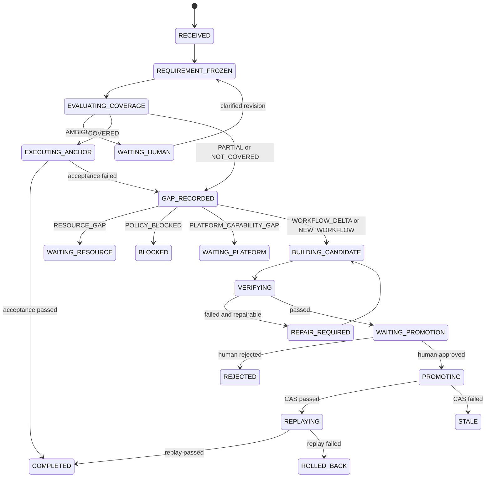

# Design: Demand-driven Workflow evolution Stage1

## Context

The current Create Loop domain is the canonical node-workflow implementation and already owns its editor, runtime, state, capabilities, scheduling, webhook handling, and lifecycle. It must remain the only Workflow execution implementation.

Its present state model is not a release model:

- `WorkflowV1` contains graph definition, enablement, timestamps, status, messages, and run history.
- The persisted settings revision advances for ordinary saves and execution-history updates.
- `runWorkflow(workflowId)` resolves mutable state at call time.
- pending human approvals are held in an in-memory map and are rejected on runtime shutdown.

The Stage1 product contract requires immutable releases, a stable Anchor that remains available while a Candidate is repaired, durable waiting states, independent verification, explicit promotion, stale-Candidate rejection, replay, and rollback. These concerns have two different owners and therefore require two packages.

## Goals

- Make the exact Workflow definition used for verification, promotion, replay, and stable service cryptographically identifiable.
- Keep stable Anchor service available while Candidate work fails or restarts.
- Make all long-lived requirement, document, gate, receipt, and promotion state recoverable after process or application restart.
- Keep Create Loop responsible for Workflow artifacts and execution mechanics.
- Keep Workflow Evolution responsible for requirement lifecycle, routing, evidence, and promotion decisions.
- Let the two packages evolve independently through a small public capability seam.
- Preserve one Capability Broker path and one Create Loop execution engine.

## Non-Goals

- Autonomous modification of SciForge source code.
- Real B_teacher discovery or distillation.
- Model training or reinforcement learning.
- Multiple active Candidates or population search.
- Unattended production promotion.
- A general solution for every scientific domain.
- Refactoring the Domain SDK, Agent Host, Capability Broker, or unrelated domain packages unless a separately approved blocker proves it necessary.
- A compatibility alias or dual runtime for the mutable Workflow production path.

## Decisions

### 1. Split ownership by domain

Create Loop owns:

- canonical Workflow definition normalization;
- immutable releases and catalog revisions;
- Candidate artifacts;
- Anchor pointer and generation;
- Candidate policy validation;
- the single execution engine;
- release-pinned, draft-preview, and isolated Candidate execution;
- CAS writes and rollback mechanics.

Workflow Evolution owns:

- Requirement, Coverage, GapKind, and run lifecycle;
- RequirementSpec, ChangeSpec, and VerificationReport revisions;
- durable state, gates, attempts, decisions, and audit events;
- Teacher policy;
- Builder and independent Verifier orchestration;
- the deterministic decision to request a Create Loop mutation;
- product UI for evolution runs.

The Host owns only generic package activation, Capability Broker policy, Agent execution ports, and existing extension points. It contains no Workflow Evolution ID switch.

### 2. Use a dedicated Create Loop public catalog contract

Create Loop adds a public export such as:

```text
@sciforge/domain-create-loop/catalog-contract
```

It contains only:

- IDs and immutable value types;
- strict input/output schemas;
- capability contract descriptors;
- pure canonicalization helpers or test vectors when they are part of the wire contract.

It does not export the store, service, runner, Electron objects, or mutable runtime.

Workflow Evolution may import this public contract. Its single production `WorkflowCatalogPort` adapter invokes the descriptors through `DomainMainSystemCapabilityInvoker`. Tests use an in-memory fake implementing the same narrow port; no second production service path exists.

The P0 contract starts with these workspace-scoped action IDs:

| Action ID | Effect | Approval | Audience |
| --- | --- | --- | --- |
| `create-loop.catalog.read-anchor` | `read` | none | UI, agent, system |
| `create-loop.catalog.read-catalog` | `read` | none | UI, agent, system |
| `create-loop.catalog.get-release` | `read` | none | UI, agent, system |
| `create-loop.catalog.read-operation` | `read` | none | system |
| `create-loop.catalog.stage-candidate` | `workspace-write` | none | system |
| `create-loop.catalog.execute-release` | `external-write` | confirmation/current grant | UI, agent, system |
| `create-loop.catalog.execute-candidate` | `external-write` | confirmation/current grant | system |
| `create-loop.catalog.promote` | `destructive` | confirmation/current grant | system |
| `create-loop.catalog.rollback` | `destructive` | confirmation/current grant | system |

Workflow Evolution starts with:

| Action ID | Effect | Approval | Audience |
| --- | --- | --- | --- |
| `workflow-evolution.submit-requirement` | `workspace-write` | none | UI, agent |
| `workflow-evolution.get-run` | `read` | none | UI, agent, system |
| `workflow-evolution.list-pending-gates` | `read` | none | UI, system |
| `workflow-evolution.clarify-requirement` | `workspace-write` | none | UI |
| `workflow-evolution.resolve-resource-gate` | `workspace-write` | none | UI |
| `workflow-evolution.record-promotion-decision` | `workspace-write` | confirmation | UI |
| `workflow-evolution.cancel-run` | `destructive` | confirmation | UI |

Every mutating action requires an idempotency key. `system` audience does not bypass effect policy or approval; it only identifies the caller class.

### 3. Use workspace-scoped, immutable Catalog objects

The core objects are:

| Object | Required identity and content | Mutation rule |
| --- | --- | --- |
| `WorkflowDefinitionV1` | graph, nodes, edges, prompts, model/runtime bindings, tool references, policy and budget references | value object |
| `WorkflowReleaseV1` | `releaseId`, `workflowId`, optional parent, definition, `definitionDigest`, creation metadata | append-only |
| `WorkflowCatalogRevisionV1` | `catalogRevisionId`, optional parent, frozen `workflowId -> releaseId` map, `catalogDigest` | append-only |
| `WorkflowCandidateV1` | mode, exact base Catalog/generation, optional base release, proposed release, request/change digest | append-only attempts; terminal disposition recorded separately |
| `AnchorPointerV1` | workspace, current Catalog revision, `generation` | only through CAS |

`WorkflowDefinitionV1` excludes:

- runs, node results, last status/message, and run timestamps;
- enabled/callable service state;
- editor update timestamps;
- secret values;
- database paths and runtime objects.

Secret bindings are references only. A Release never contains credential bytes.

`EXTEND_EXISTING` requires an exact base release. `CREATE_NEW` must not claim an existing base release. Platform, resource, and policy gaps cannot create either mode.

### 4. Freeze one digest algorithm in P0

Digests use UTF-8 canonical JSON followed by SHA-256 lowercase hexadecimal.

Canonical JSON rules:

- validate through the strict versioned schema before hashing;
- sort object keys lexicographically;
- preserve array order because graph and policy arrays may be semantic;
- reject `undefined`, non-finite numbers, unknown keys, functions, and host objects;
- exclude the digest field itself and non-semantic creation metadata;
- include schema version and every behavior-affecting field;
- use shared test vectors to prove equality across process and restart boundaries.

Release IDs and Catalog revision IDs are opaque identities, not substitutes for digests.

### 5. Use separate package-owned SQLite stores

Create Loop owns:

```text
<userData>/domains/create-loop/catalog.sqlite
```

Workflow Evolution owns:

```text
<userData>/domains/workflow-evolution/ledger.sqlite
```

Both databases partition records by workspace identity, enable foreign keys, use explicit schema versions, and perform short transactions. They never share tables, connections, or direct file access.

The existing Create Loop `state.json` may remain the editor/settings/draft store during the implementation sequence, but it is not a Catalog or Ledger source. Stage1 does not silently import it into the Catalog. Any legacy-data migration requires a separate explicit compatibility decision.

### 6. Make cross-package changes a recoverable saga

There is no cross-database transaction.

For every mutating Catalog request, Workflow Evolution:

1. commits a durable command intent and idempotency key to its Ledger;
2. invokes the Create Loop capability;
3. stores the immutable Catalog receipt and resulting IDs/digests;
4. advances the state in the same Ledger transaction as the receipt.

Create Loop stores mutating idempotency keys and payload digests durably. Repeating the same key and payload returns the original receipt; reusing a key with a different payload fails.

On restart, Workflow Evolution reconciles incomplete intents using the idempotency key and read capabilities before retrying. It never infers success from Markdown or mutable UI state.

### 7. Keep one execution engine

Create Loop extracts one internal engine whose input is a frozen definition, execution policy, workspace, and input payload.

Call modes are explicit:

- **draft preview**: non-service editor operation, not promotion evidence;
- **Anchor execution**: pinned `releaseId + definitionDigest`;
- **Candidate execution**: the same engine with a pinned Candidate digest and isolated policy/workspace.

Renderer, agent, scheduler, and webhook stable-service callers migrate to release-pinned execution. After caller migration and regression verification, the mutable `workflowId` production action and any forwarding/fallback path are deleted. There is no permanent dual execution path.

### 8. Use a durable Evolution state machine

The Ledger stores state directly. Legal transitions are versioned and enforced in one transaction.



Only one non-terminal Candidate per workspace is allowed in Stage1. Repair attempts are bounded to 2–3 by frozen policy.

### 9. Store structured documents; render Markdown

The Ledger stores structured revisions for:

- `RequirementSpec`;
- `ChangeSpec`;
- `VerificationReport`.

Every revision has an ID, sequence, schema version, owner, frozen flag, content digest, and creation metadata. A modification creates a new revision; it never overwrites a frozen revision.

Human-readable Markdown under the domain-owned run directory is a deterministic projection. Deleting or editing Markdown does not change state. Export to a user workspace is an explicit capability, not an implicit external write.

### 10. Keep Coverage and GapKind independent

Coverage is one of:

```text
COVERED | AMBIGUOUS | PARTIAL | NOT_COVERED
```

GapKind is one of:

```text
WORKFLOW_DELTA
NEW_WORKFLOW
PLATFORM_CAPABILITY_GAP
RESOURCE_GAP
POLICY_BLOCKED
```

`NEW_WORKFLOW` is allowed only when registered, authorized Stage1 atoms can express the requirement. Missing tools, nodes, connectors, runners, governance, data, credentials, or policy permission cannot be hidden inside generated Bash, Python, Custom, or HTTP nodes.

### 11. Fail closed with a frozen Candidate policy

The initial allowed set is limited to the Stage1 plan:

- manual trigger;
- LLM and bounded AI Agent;
- condition, switch, and filter;
- set fields, template, JSON, and output;
- parameter extractor and question classifier;
- sequential Loop with at most 2–3 iterations.

Everything else is denied unless added by a later reviewed policy revision. In particular, Stage1 defaults deny arbitrary code, Bash/Python, Custom, direct HTTP writes, schedule/webhook activation, production databases, instruments, destructive tools, unknown models/tools/secrets, parallel loops, and unbounded child-agent loops.

Validation binds its policy version and result digest to the Candidate digest. `enabled=false` and `callableByAgent=false` are staging defaults, not security boundaries.

### 12. Separate Builder, Verifier, and promotion authority

- Builder may design and privately execute a Candidate against public acceptance cases.
- Builder cannot read sealed tests, modify frozen specs, change acceptance criteria, or promote.
- Verifier is a sibling principal launched by the Controller, not a Builder child.
- Verifier can read the frozen Candidate and sealed test references but cannot modify the Candidate.
- The deterministic Controller requests promotion only after a frozen VerificationReport.
- Human approval is persisted as a `PromotionDecision`.
- The Controller invokes the one Create Loop CAS capability; no Agent can write the Anchor pointer.

The CAS capability requires:

- exact Candidate and evidence digests;
- promotion decision identity;
- `expectedGeneration`;
- current valid host authorization for the destructive action.

The system invoker cannot manufacture approval.

### 13. Replay and rollback are bound to the promoted revision

After a successful CAS, the Controller replays the original input against the new Anchor release.

If replay fails, rollback:

- uses the same canonical Catalog write authority;
- accepts the promotion receipt and exact current generation;
- can restore only the immediately previous Anchor from that receipt;
- creates a new generation and immutable rollback receipt;
- preserves failed replay evidence.

Rollback is not an unrestricted “set Anchor” operation.

### 14. Stage1 Teacher is always bypassed

`TeacherEvidencePort` exposes `request`, `status`, and `cancel`. The Stage1 adapter returns a stable job reference and `BYPASSED`; cancel is idempotent. The Controller records this evidence and continues. Teacher output is never a promotion authority.

### 15. Add UI last

P0–P2 are backend-first. The first Workflow Evolution manifest has main capability and runtime-lifecycle contributions only. Renderer contributions are added in P6 after:

- Catalog/CAS tests pass;
- restart recovery passes;
- the real capability adapter passes integration tests;
- COVERED and Candidate paths can run without a UI.

This prevents the UI from becoming a second state machine or direct store client.

## Parallel ownership

Developer A owns `packages/domains/create-loop/**`.

Developer B owns `packages/domains/workflow-evolution/**`.

The integration owner alone updates:

- root dependency/lock files;
- generated installed-domain composition;
- generated capability documentation;
- upstream sync commits;
- cross-package integration evidence.

The public catalog contract is frozen in a contract-only PR before the two implementation branches start. Any later breaking change returns to a contract PR first.

## Migration and delivery order

1. Freeze schemas, digests, policies, fixtures, capability descriptors, and state transitions.
2. Build immutable Catalog objects/store and the Evolution Ledger/state machine in parallel.
3. Integrate the one production Catalog adapter.
4. Implement the COVERED path.
5. Implement Candidate staging, private execution, and bounded repair.
6. Implement independent verification, promotion, replay, and rollback.
7. Migrate stable callers to release-pinned execution and delete the superseded mutable production path.
8. Add the scientific pilot, UI, fault injection, audit export, source smoke, and packaged smoke.

## Risks and mitigations

- **Risk: existing settings revision is reused as Anchor generation.** Use a distinct persisted generation changed only by Catalog CAS.
- **Risk: two stores disagree after a crash.** Use durable idempotency records, intent/receipt reconciliation, and no inferred success.
- **Risk: test fake becomes a production fallback.** Keep exactly one production adapter and exclude fakes from package entrypoints.
- **Risk: Candidate can escape through a permissive node.** Validate strict allowlists before every private run and bind policy digest to evidence.
- **Risk: UI duplicates state.** Make it a capability client and add it only after controller acceptance.
- **Risk: cross-domain imports leak implementation.** Export a catalog contract subpath and enforce package boundary tests.
- **Risk: scope expands into platform refactoring.** Treat SDK, Agent Host, CI history, and unrelated documentation debt as separate changes unless a demonstrated blocker is approved.
